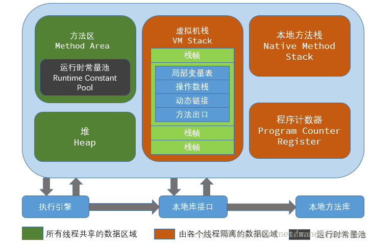
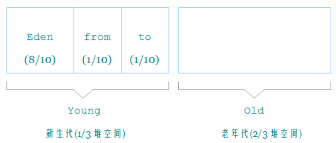

### 1.java虚拟机运行时数据区




- 程序计数器

- Java 虚拟机栈

- 本地方法栈

- Java 堆

- 方法区

- 运行时常量池

- 直接内存

  

### 2.程序计数器（线程私有）

##### 2.1 定义

程序计数器（Program Counter Register） 是一块较小的内存空间，可以看作是当前线程所执行字节码的行号指示器。

#####  2.2 作用

1. 由于 Java 虚拟机的多线程是通过线程轮流切换并分配处理器执行时间的方式实现的。为了线程切换后能恢复到正确的执行位置，**每条线程都需要一个独立的程序计数器**，各线程之间的计数器互不影响，独立存储。

  * 如果线程正在执行的是一个 Java 方法，计数器记录的是正在执行的虚拟机字节码指令的地址；
  * 如果正在执行的是 Native 方法，这个计数器的值为空。

  

2. 程序计数器是唯一一个没有规定任何 OutOfMemoryError 的区域。 


### 3.Java 虚拟机栈（线程私有）

##### 3.1 作用

Java 虚拟机栈（Java Virtual Machine Stacks）是线程私有的，**生命周期与线程相同**。
虚拟机栈描述的是 Java 方法执行的内存模型：每个方法被执行的时候都会创建一个**栈帧**（Stack Frame），存储

- 局部变量表
- 操作栈
- 动态链接
- 方法出口等

每一个方法被调用到执行完成的过程，**就对应着一个栈帧在虚拟机栈中从入栈到出栈的过程。**


##### 3.2 异常情况

- StackOverflowError：线程请求的栈深度大于虚拟机所允许的深度
- OutOfMemoryError：虚拟机栈扩展到无法申请足够的内存时


##### 3.3 什么是局部变量表

- 存放了编译期可知的各种基本数据类型（boolean、byte、char、short、int、float、long、double）、对象引用（reference类型，它不等同于对象本身，可能是一个指向对象起始地址的引用指针，也可能是指向一个代表对象的句柄或其他与此对象相关的位置）和returnAddress类型（指向了一条字节码指令的地址）。
- 64位长度的long和double类型的数据会占用2个局部变量空间（Slot），其余的数据类型只占用1个。
- 局部变量表所需的内存空间在编译期间完成分配，当进入一个方法时，这个方法需要在帧中分配.多大的局部变量空间是完全确定的，在方法运行期间不会改变局部变量表的大小。  


### 4.本地方法栈（线程私有）

##### 4.1 作用 

虚拟机栈为虚拟机执行 Java 方法（字节码）服务。

而本地方法栈（Native Method Stacks）为虚拟机使用到的 Native 方法服务。


##### 3.2 异常情况

- StackOverflowError：线程请求的栈深度大于虚拟机所允许的深度
- OutOfMemoryError：虚拟机栈扩展到无法申请足够的内存时


##### 3.3 **什么是Native 方法:**

简单地讲，一个Native Method就是一个java调用非java代码的接口。一个Native Method是这样一个java的方法：该方法的实现由非java语言实现，比如C。这个特征并非java所特有，很多其它的编程语言都有这一机制，比如在C＋＋中，你可以用extern “C”告知C＋＋编译器去调用一个C的函数。    

```
public final class System {
    private static native void registerNatives();
    static {
        registerNatives();

    }.............

}
```


### 5.Java 堆（线程共享）

##### 5.1 定义

Java堆（Java Heap）是Java虚拟机所管理的内存中**最大的一块**。Java堆是被所有线程共享的一块内存区域，在虚拟机启动时创建。

 

##### 5.2 作用

此内存区域的唯一目的就是存放对象实例，几乎所有的对象实例以及数组都在这里分配内存。

随着JIT编译器的发展与逃逸分析技术逐渐成熟，**栈上分配、标量替换**优化技术将会导致一些微妙的变化发生，所有的对象都分配在堆上也渐渐变得不是那么“绝对”了。


##### 5.3 垃圾回收

Java堆是垃圾收集器管理的主要区域，因此很多时候也被称做“GC堆”。Java堆可以处于物理上不连续的内存空间中，只要逻辑上是连续的即可。

 从内存回收的角度来看，由于现在收集器基本都采用**分代收集算法**，所以Java堆中还可以细分为：**Eden空间、From Survivor空间、To Survivor空间**




##### 5.4 可扩展性

在实现时，既可以实现成固定大小的，也可以是可扩展的，不过当前主流的虚拟机都是按照可扩展来实现的（通过-Xmx和-Xms控制）。如果在堆中没有内存完成实例分配，并且堆也无法再扩展时，将会抛出OutOfMemoryError异常。 


### 6.方法区（线程共享，永久代）

##### 6.1 作用

用于存储已被虚拟机加载的**类信息、常量、静态变量、即时编译器编译后的代码**等数据。

 和 Java 堆一样，不需要连续的内存，可以选择固定的大小，更可以选择不实现垃圾收集。


##### 6.2 垃圾回收

相对而言，垃圾收集行为在这个区域是比较少出现的。这区域的内存回收目标主要是针对**常量池的回收和对类型的卸载**，一般来说，这个区域的回收“成绩”比较难以令人满意，尤其是类型的卸载，条件相当苛刻。


##### 6.3 异常情况

当方法区无法满足内存分配需求时，将抛出OutOfMemoryError异常。 


### 7.常量池

##### 7.1 常量池的划分

- Class 文件常量池
- 运行时常量池
- 字符串常量池


##### 7.2 Class 文件常量池

Class 文件常量池指的是编译生成的 class 字节码文件，其结构中有一项是常量池（Constant Pool Table），用于存放编译期生成的各种字面量和符号引用，这部分内容将在类加载后进入方法区的运行时常量池中存放。

什么是字面量和符号引用？

* 字面量是指**字符串字面量**和**声明为 final 的（基本数据类型）常量值**，这些字符串字面量除了类中所有**双引号括起来的字符串(包括方法体内的)**，还包括所有用到的**类名、方法的名字和这些类与方法的字符串描述、字段(成员变量)的名称和描述符**；方法内的常量值由栈分配，所以并不算是字面量。

* 符号引用，就是指指向 UTF-8 表中向这些字面量的引用，**包括类和接口的全限定名(包括包路径的完整名)、字段的名称和描述符、方法的名称和描述符**。只不过是以一组符号来描述所引用的目标，和内存并无关，所以称为符号引用，**直接指向内存中某一地址的引用称为直接引用。**


##### 7.2 运行时常量池（Run-time Constant Pool）

运行时常量池是方法区的一部分，是一块内存区域。Class 文件常量池将在类加载后进入方法区的运行时常量池中存放。

一个类加载到 JVM 中后对应一个运行时常量池，运行时常量池相对于 Class 文件常量池来说具备**动态性**，Class 文件常量只是一个静态存储结构，里面的引用都是符号引用。而运行时常量池可以在运行期间将符号引用解析为直接引用。

运行时常量池就是用来索引和查找字段和方法名称和描述符的。给定任意一个方法或字段的索引，通过这个索引最终可得到该方法或字段所属的类型信息和名称及描述符信息。


**位置变化**：

Java6和6之前，运行时常量池是存放在方法区中的。

Java7，将运行时常量池是存放到了堆中。

Java8之后，取消了整个永久代区域，取而代之的是元空间。没有再对常量池进行调整。


##### 7.3 字符串常量池（Interned Strings）

在 JDK1.6（含）之前也是方法区的一部分，并且其中存放的是字符串的对象。
在 JDK1.7（含）之后，是在堆内存之中，存储的是字符串对象的引用，字符串实例是在堆中。

字符串常量池是全局的，JVM 中独此一份，因此也称为全局字符串常量池。


##### 7.4 常量池的好处

常量池是为了避免频繁的创建和销毁对象而影响系统性能，其实现了对象的共享。例如字符串常量池，在编译阶段就把所有的字符串文字放到一个常量池中。

（1）节省内存空间：常量池中所有相同的字符串常量被合并，只占用一个空间。

（2）节省运行时间：比较字符串时，==比equals()快。对于两个引用变量，只用==判断引用是否相等，也就可以判断实际值是否相等


### 8.直接内存

##### 8.1 定义

直接内存（Direct Memory）并不是虚拟机运行时数据区的一部分，也不是Java虚拟机规范中定义的内存区域，而是堆外内存。

##### 8.2 运用实例

在JDK 1.4中新加入了NIO（New Input/Output）类，引入了一种基于通道（Channel）与缓冲区（Buffer）的I/O方式，它可以使用Native函数库直接分配堆外内存，然后通过一个存储在Java堆中的DirectByteBuffer对象作为这块内存的引用进行操作。

##### 8.3 优点

显著提高性能，因为避免了在Java堆和Native堆中来回复制数据。 


##### 8.4 内存限制

受到本机总内存（包括RAM以及SWAP区或者分页文件）大小以及处理器寻址空间的限制。


参考博客：https://blog.csdn.net/flyingdog123/article/details/80419911

https://blog.csdn.net/Yano_nankai/article/details/50957578

https://blog.csdn.net/a1102325298/article/details/90106244

