# 🎄 一 

## 1.1 参数类型 

-XX参数也是非标准参数，主要用于jvm的调优和debug操作。
-XX参数的使用有2种方式，一种是boolean类型，一种是非boolean类型：

boolean类型

格式：-XX:[+-]<name> 表示启用或禁用<name>属性
如：-XX:+DisableExplicitGC 表示禁用手动调用gc操作，也就是说调用System.gc()无效


非boolean类型
格式：-XX:<name>=<value> 表示<name>属性的值为<value>
如：-XX:NewRatio=1 表示新生代和老年代的比值


## 1.2 -Xms与-Xmx参数

-Xms与-Xmx分别是设置jvm的堆内存的初始大小和最大大小。
-Xmx2048m：等价于-XX:MaxHeapSize，设置JVM最大堆内存为2048M。
-Xms512m：等价于-XX:InitialHeapSize，设置JVM初始堆内存为512M。
示例：

```shell
[root@node01 test]# java -Xms512m -Xmx2048m TestJVM
```


## 1.3 查看jvm的运行参数

### 1.3.1 运行java命令时打印出运行参数

运行java命令时打印参数，需要添加-XX:+PrintFlagsFinal参数即可

```shell
[root@node01 test]# java -XX:+PrintFlagsFinal -version
[Global flags]
uintx AdaptiveSizeDecrementScaleFactor = 4
{product}
…………………………略…………………………………………
bool VMThreadHintNoPreempt = false
{product}
intx VMThreadPriority = -1
{product}

```

> 参数有boolean类型和数字类型，值的操作符是=或:=，分别代表默认值和被修改的值。


### 1.3.2 查看正在运行的java进程的参数

> jinfo -flags <进程id>

> 进程id可以通过ps-ef | grep  tomcat获取也可以用jps -l获取

```shell
#查看所有的参数，用法：jinfo -flags <进程id>
#通过jps 或者 jps -l 查看java进程
[root@node01 bin]# jps
6346 Jps
6219 Bootstrap
[root@node01 bin]# jps -l
6358 sun.tools.jps.Jps
6219 org.apache.catalina.startup.Bootstrap
[root@node01 bin]#
[root@node01 bin]# jinfo -flags 6219
...
Non-default VM flags: -XX:CICompilerCount=2 -XX:InitialHeapSize=31457280 -
XX:MaxHeapSize=488636416 -XX:MaxNewSize=162529280 -XX:MinHeapDeltaBytes=524288 -
XX:NewSize=10485760 -XX:OldSize=20971520 -XX:+UseCompressedClassPointers -
XX:+UseCompressedOops -XX:+UseFastUnorderedTimeStamps -XX:+UseParallelGC
...
```


```shell
#查看某一参数的值，用法：jinfo -flag <参数名> <进程id>
[root@node01 bin]# jinfo -flag MaxHeapSize 6219
-XX:MaxHeapSize=488636416
```


### 1.4 通过jstat命令进行查看堆内存使用情况

jstat命令可以查看堆内存各部分的使用量，以及加载类的数量。

#### 1.4.1 查看class加载统计

```shell
[root@node01 ~]# jps
7080 Jps
6219 Bootstrap

[root@node01 ~]# jstat -class 6219
Loaded Bytes Unloaded Bytes Time
3273   7122.3    0     0.0  3.98
```

说明：
Loaded：加载class的数量
Bytes：所占用空间大小
Unloaded：未加载数量
Bytes：未加载占用空间
Time：时间


#### 1.4.2 查看编译统计

```shell
[root@node01 ~]# jstat -compiler 6219
Compiled Failed Invalid Time FailedType FailedMethod
2376       1      0     8.04     1     org/apache/tomcat/util/IntrospectionUtils
setProperty
```

说明：
Compiled：编译数量。
Failed：失败数量
Invalid：不可用数量
Time：时间
FailedType：失败类型
FailedMethod：失败的方法


#### 1.4.3 垃圾回收统计

```shell
[root@node01 ~]# jstat -gc 6219
S0C S1C S0U S1U EC EU OC OU MC MU CCSC
CCSU YGC YGCT FGC FGCT GCT
9216.0 8704.0 0.0 6127.3 62976.0 3560.4 33792.0 20434.9 23808.0 23196.1
2560.0 2361.6 7 1.078 1 0.244 1.323
#也可以指定打印的间隔和次数，每1秒中打印一次，共打印5次

[root@node01 ~]# jstat -gc 6219 1000 5
S0C S1C S0U S1U EC EU OC OU MC MU CCSC
CCSU YGC YGCT FGC FGCT GCT
9216.0 8704.0 0.0 6127.3 62976.0 3917.3 33792.0 20434.9 23808.0 23196.1
2560.0 2361.6 7 1.078 1 0.244 1.323
9216.0 8704.0 0.0 6127.3 62976.0 3917.3 33792.0 20434.9 23808.0 23196.1
2560.0 2361.6 7 1.078 1 0.244 1.323
9216.0 8704.0 0.0 6127.3 62976.0 3917.3 33792.0 20434.9 23808.0 23196.1
2560.0 2361.6 7 1.078 1 0.244 1.323
9216.0 8704.0 0.0 6127.3 62976.0 3917.3 33792.0 20434.9 23808.0 23196.1
2560.0 2361.6 7 1.078 1 0.244 1.323
9216.0 8704.0 0.0 6127.3 62976.0 3917.3 33792.0 20434.9 23808.0 23196.1
2560.0 2361.6 7 1.078 1 0.244 1.323
```

说明：
S0C：第一个Survivor区的大小（KB）
S1C：第二个Survivor区的大小（KB）
S0U：第一个Survivor区的使用大小（KB）
S1U：第二个Survivor区的使用大小（KB）
EC：Eden区的大小（KB）
EU：Eden区的使用大小（KB）
OC：Old区大小（KB）
OU：Old使用大小（KB）
MC：方法区大小（KB）
MU：方法区使用大小（KB）
CCSC：压缩类空间大小（KB）
CCSU：压缩类空间使用大小（KB）
YGC：年轻代垃圾回收次数
YGCT：年轻代垃圾回收消耗时间
FGC：老年代垃圾回收次数
FGCT：老年代垃圾回收消耗时间
GCT：垃圾回收消耗总时间


## 1.5  jmap的使用以及内存溢出分析

前面通过jstat可以对jvm堆的内存进行统计分析，而jmap可以获取到更加详细的内容，如：内存使用情况的汇总、
对内存溢出的定位与分析。


### 1.5.1 查看内存使用情况

```shell
[root@node01 ~]# jmap -heap 6219
Attaching to process ID 6219, please wait...
Debugger attached successfully.
Server compiler detected.
JVM version is 25.141-b15
using thread-local object allocation.
Parallel GC with 2 thread(s)
Heap Configuration: #堆内存配置信息
MinHeapFreeRatio 	    = 0
MaxHeapFreeRatio	    = 100
MaxHeapSize 		    = 488636416 (466.0MB)
NewSize 			    = 10485760 (10.0MB)
MaxNewSize 			    = 162529280 (155.0MB)
OldSize 			    = 20971520 (20.0MB)
NewRatio 			    = 2
SurvivorRatio 			= 8
MetaspaceSize			= 21807104 (20.796875MB)
CompressedClassSpaceSize = 1073741824 (1024.0MB)
MaxMetaspaceSize		= 17592186044415 MB
G1HeapRegionSize		= 0 (0.0MB)

Heap Usage: # 堆内存的使用情况
PS Young Generation #年轻代
Eden Space:
capacity = 123731968 (118.0MB)
used = 1384736 (1.320587158203125MB)
free = 122347232 (116.67941284179688MB)
1.1191416594941737% used
From Space:
capacity = 9437184 (9.0MB)
used = 0 (0.0MB)
free = 9437184 (9.0MB)
0.0% used
To Space:
capacity = 9437184 (9.0MB)
used = 0 (0.0MB)
free = 9437184 (9.0MB)
0.0% used
PS Old Generation #年老代
capacity = 28311552 (27.0MB)
used = 13698672 (13.064071655273438MB)
free = 14612880 (13.935928344726562MB)
48.38545057508681% used
13648 interned Strings occupying 1866368 bytes.
```


### 1.5.2 查看内存中对象数量及大小

> 查看所有对象，包括活跃以及非活跃的
>
> jmap -histo <pid> | more


> 查看活跃对象
>
> jmap -histo:live <pid> | more

```
[root@node01 ~]# jmap -histo:live 6219 | more
num 	#instances 	#bytes 	class name
----------------------------------------------
1: 		37437 		7914608 	[C
2: 		34916 		837984 		java.lang.String
3: 		884 		654848 		[B
4: 		17188 		550016 		java.util.HashMap$Node
5: 		3674 		424968 		java.lang.Class
6: 		6322 		395512 		[Ljava.lang.Object;
7: 		3738 		328944 		java.lang.reflect.Method
8: 		1028 		208048 		[Ljava.util.HashMap$Node;
9: 		2247 		144264 		[I
10: 	4305 		137760 		java.util.concurrent.ConcurrentHashMap$Node
11: 	1270 		109080 		[Ljava.lang.String;
12: 	64 			84128 		[Ljava.util.concurrent.ConcurrentHashMap$Node;
13: 	1714 		82272 		java.util.HashMap
14: 	3285 		70072 		[Ljava.lang.Class;
15: 	2888 		69312 		java.util.ArrayList
16: 	3983 		63728 		java.lang.Object
17: 	1271 		61008 		org.apache.tomcat.util.digester.CallMethodRule
18: 	1518 		60720 		java.util.LinkedHashMap$Entry
19: 	1671 		53472 		com.sun.org.apache.xerces.internal.xni.QName
20: 	88 			50880 		[Ljava.util.WeakHashMap$Entry;
21: 	618 		49440 		java.lang.reflect.Constructor
22: 	1545 		49440 		java.util.Hashtable$Entry
23: 	1027 		41080 		java.util.TreeMap$Entry
24: 	846 		40608 		org.apache.tomcat.util.modeler.AttributeInfo
25: 	142 		38032 		[S
26: 	946 		37840 		java.lang.ref.SoftReference
27: 	226 		36816 		[[C
。。。。。。。。。。。。。。。。。。。。。。。。。。。。。。。

```


对象说明

B byte
C char
D double
F float
I int
J long
Z boolean

[ 数组，如[I表示int[]
[L+类名 其他对象


### 1.5.3 将内存使用情况dump到文件中

有些时候我们需要将jvm当前内存中的情况dump到文件中，然后对它进行分析，jmap也是支持dump到文件中
的。

```shell
#用法：
jmap -dump:format=b,file=dumpFileName <pid>
#示例
jmap -dump:format=b,file=/tmp/dump.dat 6219
```

可以看到已经在/tmp下生成了dump.dat的文件。


## 1.6 分析dump文件

### 1.6.1 通过jhat对dump文件进行分析

在上一小节中，我们将jvm的内存dump到文件中，这个文件是一个二进制的文件，不方便查看，这时我们可以借
助于jhat工具进行查看。

> 用法：jhat -port <port> <file>

```shell
#示例：
[root@node01 tmp]# jhat -port 9999 /tmp/dump.dat
Reading from /tmp/dump.dat...
Dump file created Mon Sep 10 01:04:21 CST 2018
Snapshot read, resolving...
Resolving 204094 objects...
Chasing references, expect 40 dots........................................
Eliminating duplicate references........................................
Snapshot resolved.
Started HTTP server on port 9999
Server is ready.
```

打开浏览器访问9999端口


在最后面有OQL查询功能。


### 1.6.2 通过MAT工具对dump文件进行分析定位OOM

MAT(Memory Analyzer Tool)，一个基于Eclipse的内存分析工具，是一个快速、功能丰富的JAVA heap分析工具，
它可以帮助我们查找内存泄漏和减少内存消耗。使用内存分析工具从众多的对象中进行分析，快速的计算出在内存
中对象的占用大小，看看是谁阻止了垃圾收集器的回收工作，并可以通过报表直观的查看到可能造成这种结果的对
象。


**1.编写代码，向List集合中添加100万个字符串，每个字符串由1000个UUID组成，模拟内存溢出。**

>  可以在idea的configurations里面定义VM参数方便快速溢出

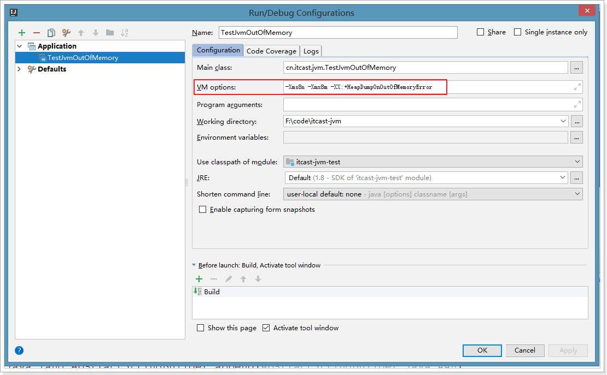

```shell
#参数如下：
#HeapDumpOnOutOfMemoryError：发生堆内存溢出时dump堆内存
-Xms8m -Xmx8m -XX:+HeapDumpOnOutOfMemoryError
```


运行报错如下：可以看到dump了一个文件

```shell
java.lang.OutOfMemoryError: Java heap space
Dumping heap to java_pid5348.hprof ... # dump到了java_pid5348.hprof文件中
Heap dump file created [8137186 bytes in 0.032 secs]
Exception in thread "main" java.lang.OutOfMemoryError: Java heap space
at java.util.Arrays.copyOf(Arrays.java:3332)
at
java.lang.AbstractStringBuilder.ensureCapacityInternal(AbstractStringBuilder.java:124)
at java.lang.AbstractStringBuilder.append(AbstractStringBuilder.java:448)
at java.lang.StringBuilder.append(StringBuilder.java:136)
at cn.itcast.jvm.TestJvmOutOfMemory.main(TestJvmOutOfMemory.java:14)
Process finished with exit code 1
```


**2.将文件导入到MAT工具中进行分析**

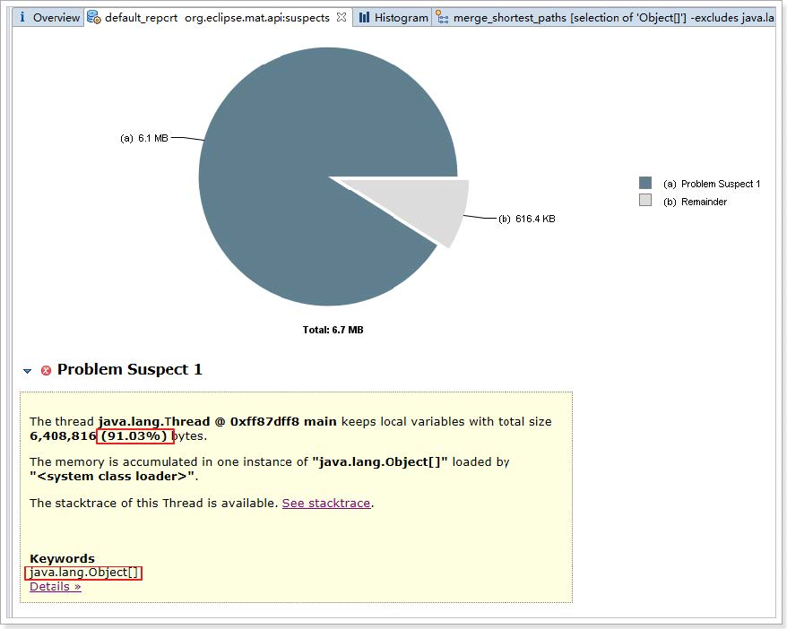

可以看到，有91.03%的内存由Object[]数组占有，所以比较可疑。因为list底层是Object数组实现的。


查看详情：

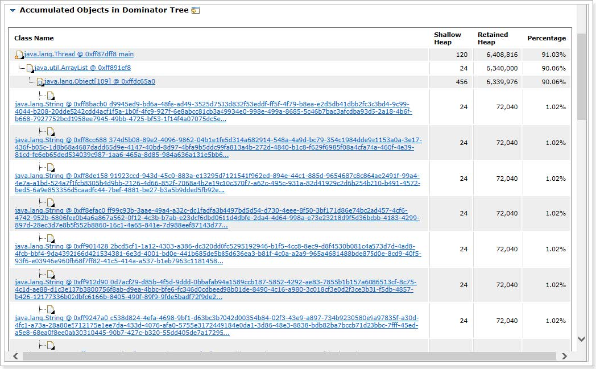

可以看到集合中存储了大量的uuid字符串。


## 1.7 jstack的使用

有些时候我们需要查看下jvm中的线程执行情况，比如，发现服务器的CPU的负载突然增高了、出现了死锁、死循
环等，我们该如何分析呢？
由于程序是正常运行的，没有任何的输出，从日志方面也看不出什么问题，所以就需要看下jvm的内部线程的执行
情况，然后再进行分析查找出原因。
这个时候，就需要借助于jstack命令了，jstack的作用是将正在运行的jvm的线程情况进行快照，并且打印出来：

```shell
#用法：jstack <pid>
[root@node01 bin]# jstack 2203
```


### 1.7.1 线程的状态

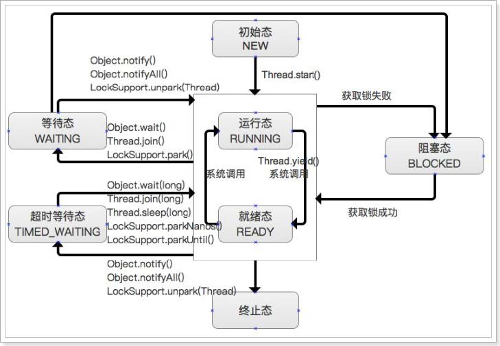


在Java中线程的状态一共被分成6种：

* 初始态（NEW）

  创建一个Thread对象，但还未调用start()启动线程时，线程处于初始态。

* 运行态（RUNNABLE），在Java中，运行态包括 就绪态 和 运行态。

  * 就绪态

    该状态下的线程已经获得执行所需的所有资源，只要CPU分配执行权就能运行。
    所有就绪态的线程存放在就绪队列中。

  * 运行态

    获得CPU执行权，正在执行的线程。
    由于一个CPU同一时刻只能执行一条线程，因此每个CPU每个时刻只有一条运行态的线程。


* 阻塞态（BLOCKED）
  * 当一条正在执行的线程请求某一资源失败时，就会进入阻塞态。
  * 而在Java中，阻塞态专指请求锁失败时进入的状态。
  * 由一个阻塞队列存放所有阻塞态的线程。
  * 处于阻塞态的线程会不断请求资源，一旦请求成功，就会进入就绪队列，等待执行。


* 等待态（WAITING）
  * 当前线程中调用wait、join、park函数时，当前线程就会进入等待态。
  * 也有一个等待队列存放所有等待态的线程。
  * 线程处于等待态表示它需要等待其他线程的指示才能继续运行。
  * 进入等待态的线程会释放CPU执行权，并释放资源（如：锁）


* 超时等待态（TIMED_WAITING）

  当运行中的线程调用sleep(time)、wait、join、parkNanos、parkUntil时，就会进入该状态；
  它和等待态一样，并不是因为请求不到资源，而是主动进入，并且进入后需要其他线程唤醒；
  进入该状态后释放CPU执行权 和 占有的资源。
  与等待态的区别：到了超时时间后自动进入阻塞队列，开始竞争锁。

* 终止态（TERMINATED）

  线程执行结束后的状态。


### 1.7.2 实战：死锁问题

如果在生产环境发生了死锁，我们将看到的是部署的程序没有任何反应了，这个时候我们可以借助jstack进行分
析，下面我们实战下查找死锁的原因。

**1.在linux上运行**

```shell
[root@node01 test]# javac TestDeadLock.java
[root@node01 test]# java TestDeadLock
Thread1 拿到了 obj1 的锁！
Thread2 拿到了 obj2 的锁！
#这里发生了死锁，程序一直将等待下去
```


**2.使用jstack进行分析**

先使用jps -l找到进程id

```shell
[root@node01 ~]# jstack 3256
...
...
Found one Java-level deadlock: #找到死锁
=============================
"Thread-1":
waiting to lock monitor 0x00007f5c080062c8 (object 0x00000000f655dc40, a
java.lang.Object),
which is held by "Thread-0"
"Thread-0":
waiting to lock monitor 0x00007f5c08004e28 (object 0x00000000f655dc50, a
java.lang.Object),
which is held by "Thread-1"
Java stack information for the threads listed above:
===================================================
"Thread-1":  # 死锁涉及线程具体信息
at TestDeadLock$Thread2.run(TestDeadLock.java:47)
- waiting to lock <0x00000000f655dc40> (a java.lang.Object)
- locked <0x00000000f655dc50> (a java.lang.Object)
at java.lang.Thread.run(Thread.java:748)
"Thread-0":# 死锁涉及线程具体信息
at TestDeadLock$Thread1.run(TestDeadLock.java:27)
- waiting to lock <0x00000000f655dc50> (a java.lang.Object)
- locked <0x00000000f655dc40> (a java.lang.Object)
at java.lang.Thread.run(Thread.java:748)
Found 1 deadlock.
```

可以清晰的看到：
Thread2获取了 <0x00000000f655dc50> 的锁，等待获取 <0x00000000f655dc40> 这个锁
Thread1获取了 <0x00000000f655dc40> 的锁，等待获取 <0x00000000f655dc50> 这个锁
由此可见，发生了死锁。


### 1.7 VisualVM工具的使用

VisualVM，能够监控线程，内存情况，查看方法的CPU时间和内存中的对 象，已被GC的对象，反向查看分配的堆
栈(如100个String对象分别由哪几个对象分配出来的)。
VisualVM使用简单，几乎0配置，功能还是比较丰富的，几乎囊括了其它JDK自带命令的所有功能。

- 内存信息

- 线程信息

- Dump堆（本地进程）

- Dump线程（本地进程）

- 打开堆Dump。堆Dump可以用jmap来生成。

- 打开线程Dump

- 生成应用快照（包含内存信息、线程信息等等）

- 性能分析。CPU分析（各个方法调用时间，检查哪些方法耗时多），内存分析（各类对象占用的内存，检查

- 哪些类占用内存多）

  ……


#### 1.7.1 启动

在jdk的安装目录的bin目录下，找到jvisualvm.exe，双击打开即可。

双击inteliJ

**1.查看本地进程**

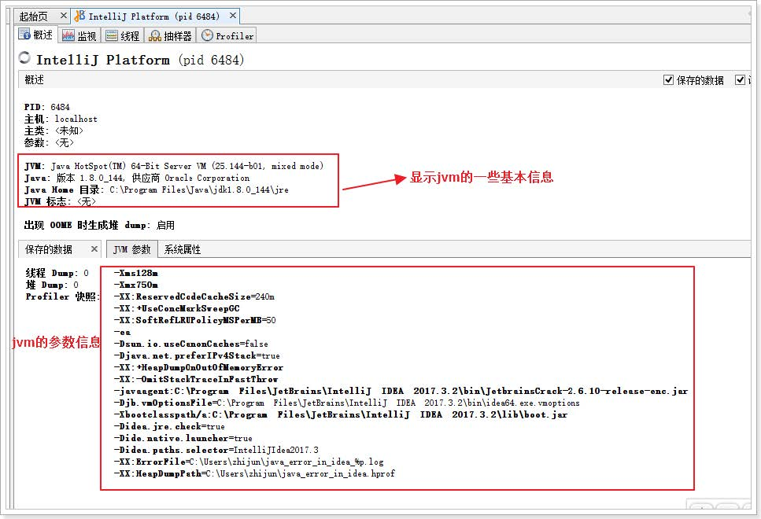


**2.查看CPU、内存、类、线程运行信息**

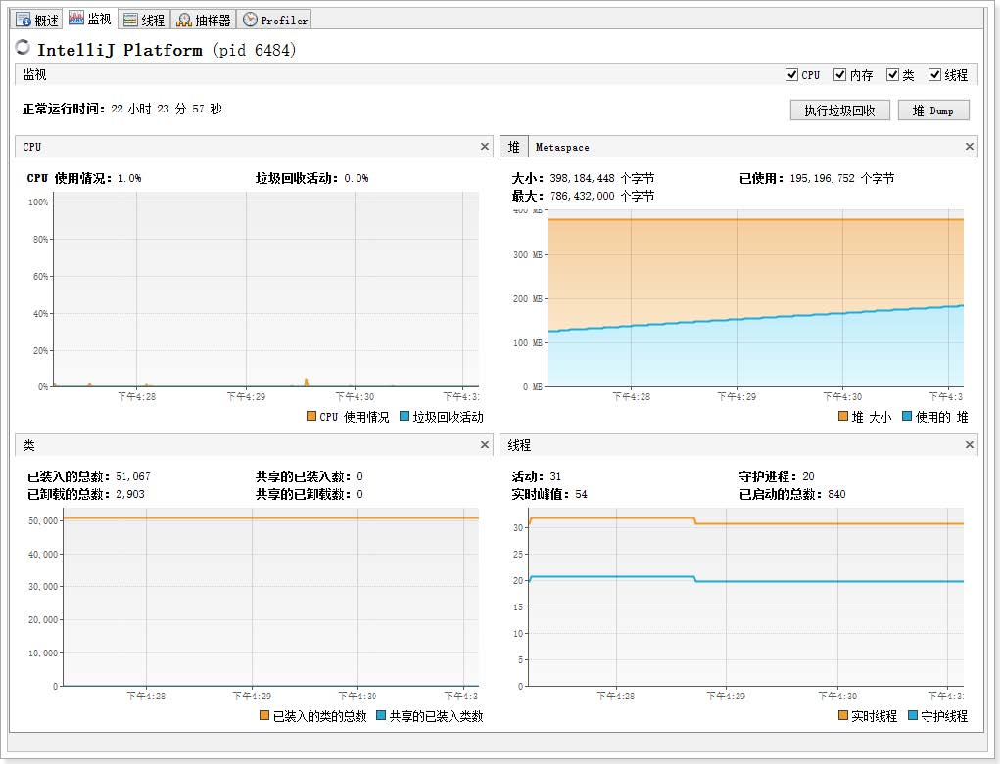


**3.查看线程详情**


也可以点击右上角Dump按钮，将线程的信息导出，其实就是执行的jstack命令。

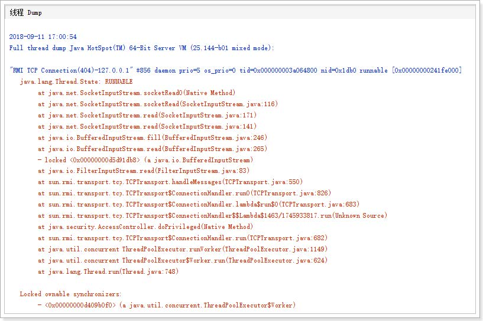


**4.抽样器**
抽样器可以对CPU、内存在一段时间内进行抽样，以供分析。

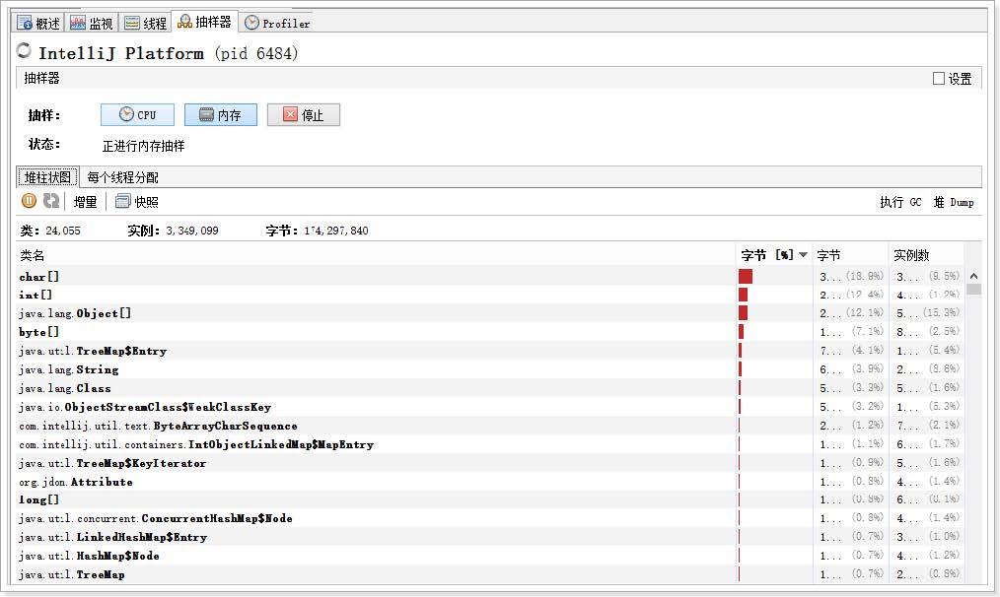


#### 1.7.2 监控远程的jvm

VisualJVM不仅是可以监控本地jvm进程，还可以监控远程的jvm进程，需要借助于JMX技术实现。

**1.监控远程的tomcat**
想要监控远程的tomcat，就需要在远程的tomcat进行对JMX配置，方法如下：

```shell
#在tomcat的bin目录下，修改catalina.sh，添加如下的参数
JAVA_OPTS="-Dcom.sun.management.jmxremote -Dcom.sun.management.jmxremote.port=9999 -
Dcom.sun.management.jmxremote.authenticate=false -
Dcom.sun.management.jmxremote.ssl=false"
#这几个参数的意思是：
#-Dcom.sun.management.jmxremote ：允许使用JMX远程管理
#-Dcom.sun.management.jmxremote.port=9999 ：JMX远程连接端口
#-Dcom.sun.management.jmxremote.authenticate=false ：不进行身份认证，任何用户都可以连接
#-Dcom.sun.management.jmxremote.ssl=false ：不使用ssl
```


**2.使用VisualJVM连接远程tomcat**

添加远程主机：


在一个主机下可能会有很多的jvm需要监控，所以接下来要在该主机上添加需要监控的jvm：

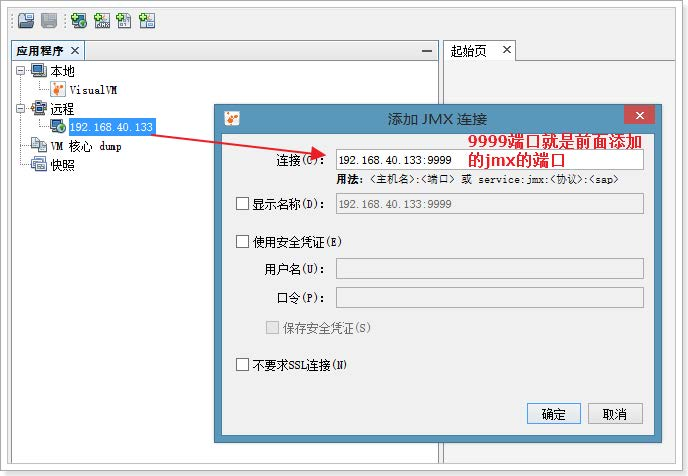

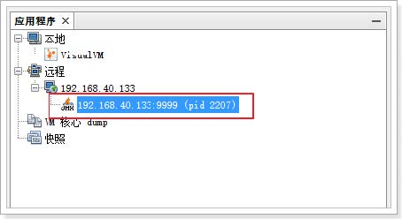

连接成功。使用方法和前面就一样了，就可以和监控本地jvm进程一样，监控远程的tomcat进程。


#  :ice_cream:二

## 2.1 年轻代回收方式

1. 在GC开始的时候，对象只会存在于Eden区和名为“From”的Survivor区，Survivor区“To”是空的。
2. 紧接着进行GC，Eden区中所有存活的对象都会被复制到“To”，而在“From”区中，仍存活的对象会根据他们的
  年龄值来决定去向。年龄达到一定值(年龄阈值，可以通过-XX:MaxTenuringThreshold来设置)的对象会被移
  动到年老代中，没有达到阈值的对象会被复制到“To”区域。
3. 经过这次GC后，Eden区和From区已经被清空。这个时候，“From”和“To”会交换他们的角色，也就是新
  的“To”就是上次GC前的“From”，新的“From”就是上次GC前的“To”。不管怎样，都会保证名为To的Survivor区
  域是空的。
4. GC会一直重复这样的过程，直到“To”区被填满，“To”区被填满之后，会将所有对象移动到年老代中。


## 2.2 垃圾回收器&内存分配

### 2.2.1 串行回收器

串行垃圾收集器，是指使用单线程进行垃圾回收，垃圾回收时，只有一个线程在工作，并且java应用中的所有线程
都要暂停，等待垃圾回收的完成。这种现象称之为STW。


**1.设置垃圾回收为串行收集器**

在程序运行参数中添加2个参数，如下：

> -XX:+UseSerialGC：指定年轻代和老年代都使用串行垃圾收集器
>
> -XX:+PrintGCDetails：打印垃圾回收的详细信息


```shell
# 为了测试GC，将堆的初始和最大内存都设置为16M
-XX:+UseSerialGC -XX:+PrintGCDetails -Xms16m -Xmx16m
```


启动程序，可以看到下面信息：

```shell
[GC (Allocation Failure) [DefNew: 4416K->512K(4928K), 0.0046102 secs] 4416K-
>1973K(15872K), 0.0046533 secs] [Times: user=0.00 sys=0.00, real=0.00 secs]
[Full GC (Allocation Failure) [Tenured: 10944K->3107K(10944K), 0.0085637 secs] 15871K-
>3107K(15872K), [Metaspace: 3496K->3496K(1056768K)], 0.0085974 secs] [Times: user=0.02
sys=0.00, real=0.01 secs]
```


>  GC日志信息解读

年轻代的内存GC前后的大小：

* DefNew

  表示使用的是串行垃圾收集器。

* 4416K->512K(4928K)

  表示，年轻代GC前，占有4416K内存，GC后，占有512K内存，总大小4928K

* 0.0046102 secs

  表示，GC所用的时间，单位为毫秒。

* 4416K->1973K(15872K)

  表示，GC前，堆内存占有4416K，GC后，占有1973K，总大小为15872K

* Full GC

  表示，内存空间全部进行GC


### 2.2.2 并行回收器

并行垃圾收集器在串行垃圾收集器的基础之上做了改进，将单线程改为了多线程进行垃圾回收

#### 2.2.2.1 ParNew垃圾收集器

ParNew垃圾收集器是工作在年轻代上的，只是将串行的垃圾收集器改为了并行。
通过-XX:+UseParNewGC参数设置年轻代使用ParNew回收器，老年代使用的依然是串行收集器。


```shell
#参数
-XX:+UseParNewGC -XX:+PrintGCDetails -Xms16m -Xmx16m
#打印出的信息
[GC (Allocation Failure) [ParNew: 4416K->512K(4928K), 0.0032106 secs] 4416K-
>1988K(15872K), 0.0032697 secs] [Times: user=0.00 sys=0.00, real=0.00 secs]
```

> 由以上信息可以看出， ParNew: 使用的是ParNew收集器。其他信息和串行收集器一致。


#### 2.2.2.2 ParallelGC垃圾收集器

ParallelGC收集器工作机制和ParNewGC收集器一样，只是在此基础之上，新增了两个和系统吞吐量相关的参数，
使得其使用起来更加的灵活和高效。

> 相关参数如下

* -XX:+UseParallelGC

  年轻代使用ParallelGC垃圾回收器，老年代使用串行回收器。

* -XX:+UseParallelOldGC

  年轻代使用ParallelGC垃圾回收器，老年代使用ParallelOldGC垃圾回收器。

* -XX:MaxGCPauseMillis

  设置最大的垃圾收集时的停顿时间，单位为毫秒

  需要注意的时，ParallelGC为了达到设置的停顿时间，可能会调整堆大小或其他的参数，如果堆的大小
  设置的较小，就会导致GC工作变得很频繁，反而可能会影响到性能。
  该参数使用需谨慎。

* -XX:GCTimeRatio

  设置垃圾回收时间占程序运行时间的百分比，公式为1/(1+n)。
  它的值为0~100之间的数字，默认值为99，也就是垃圾回收时间不能超过1%

* -XX:UseAdaptiveSizePolicy

  自适应GC模式，垃圾回收器将自动调整年轻代、老年代等参数，达到吞吐量、堆大小、停顿时间之间的
  平衡。
  一般用于，手动调整参数比较困难的场景，让收集器自动进行调整。

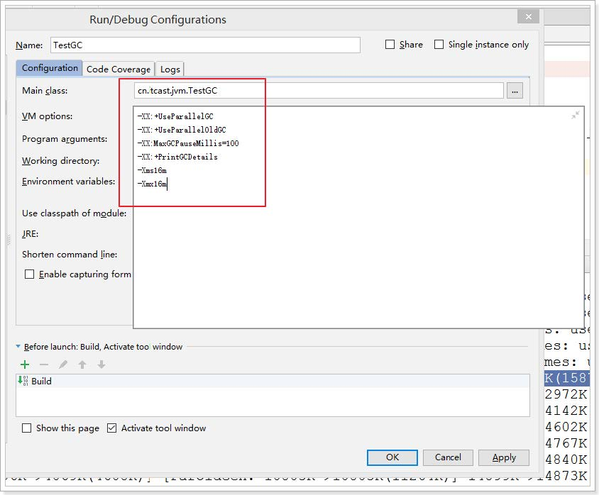

```shell
#参数
-XX:+UseParallelGC -XX:+UseParallelOldGC -XX:MaxGCPauseMillis=100 -XX:+PrintGCDetails -
Xms16m -Xmx16m
#打印的信息
[GC (Allocation Failure) [PSYoungGen: 4096K->480K(4608K)] 4096K->1840K(15872K),
0.0034307 secs] [Times: user=0.00 sys=0.00, real=0.00 secs]
[Full GC (Ergonomics) [PSYoungGen: 505K->0K(4608K)] [ParOldGen: 10332K->10751K(11264K)]
10837K->10751K(15872K), [Metaspace: 3491K->3491K(1056768K)], 0.0793622 secs] [Times:
user=0.13 sys=0.00, real=0.08 secs]
```

> 由以上信息可以看出，年轻代和老年代都使用了ParallelGC垃圾回收器。


### 2.2.3 并发回收器

#### 2.2.3.1 CMS

通过参数-XX:+UseConcMarkSweepGC进行设置。

CMS垃圾回收器的执行过程如下：

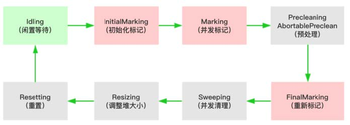

- 初始化标记(CMS-initial-mark) ,标记root，会导致stw；
- 并发标记(CMS-concurrent-mark)，与用户线程同时运行；
- 预清理（CMS-concurrent-preclean），与用户线程同时运行；
- 重新标记(CMS-remark) ，会导致stw；
- 并发清除(CMS-concurrent-sweep)，与用户线程同时运行；
- 调整堆大小，设置CMS在清理之后进行内存压缩，目的是清理内存中的碎片；
- 并发重置状态等待下次CMS的触发(CMS-concurrent-reset)，与用户线程同时运行；

测试：

```shell
#设置启动参数
-XX:+UseConcMarkSweepGC -XX:+PrintGCDetails -Xms16m -Xmx16m
#运行日志
[GC (Allocation Failure) [ParNew: 4926K->512K(4928K), 0.0041843 secs] 9424K-
>6736K(15872K), 0.0042168 secs] [Times: user=0.00 sys=0.00, real=0.00 secs]
#第一步，初始标记
[GC (CMS Initial Mark) [1 CMS-initial-mark: 6224K(10944K)] 6824K(15872K), 0.0004209
secs] [Times: user=0.00 sys=0.00, real=0.00 secs]
#第二步，并发标记
[CMS-concurrent-mark-start]
[CMS-concurrent-mark: 0.002/0.002 secs] [Times: user=0.00 sys=0.00, real=0.00 secs]
#第三步，预处理
[CMS-concurrent-preclean-start]
[CMS-concurrent-preclean: 0.000/0.000 secs] [Times: user=0.00 sys=0.00, real=0.00 secs]
#第四步，重新标记
[GC (CMS Final Remark) [YG occupancy: 1657 K (4928 K)][Rescan (parallel) , 0.0005811
secs][weak refs processing, 0.0000136 secs][class unloading, 0.0003671 secs][scrub
symbol table, 0.0006813 secs][scrub string table, 0.0001216 secs][1 CMS-remark:
6224K(10944K)] 7881K(15872K), 0.0018324 secs] [Times: user=0.00 sys=0.00, real=0.00
secs]
#第五步，并发清理
[CMS-concurrent-sweep-start]
[CMS-concurrent-sweep: 0.004/0.004 secs] [Times: user=0.00 sys=0.00, real=0.00 secs]
#第六步，重置
[CMS-concurrent-reset-start]
[CMS-concurrent-reset: 0.000/0.000 secs] [Times: user=0.00 sys=0.00, real=0.00 secs]
```

> 由以上日志信息，可以看出CMS执行的过程。


#### 2.2.3.2 G1

G1垃圾收集器是在jdk1.7中正式使用的全新的垃圾收集器，oracle官方计划在jdk9中将G1变成默认的垃圾收集器，以替代CMS。
G1的设计原则就是简化JVM性能调优，开发人员只需要简单的三步即可完成调优：

1. 第一步，开启G1垃圾收集器
2. 第二步，设置堆的最大内存
3. 第三步，设置最大的停顿时间

G1中提供了三种模式垃圾回收模式，Young GC、Mixed GC 和 Full GC，在不同的条件下被触发。

##### **2.2.3.2.1原理**

G1垃圾收集器相对比其他收集器而言，最大的区别在于它取消了年轻代、老年代的物理划分，取而代之的是将堆
划分为若干个区域（Region），这些区域中包含了有逻辑上的年轻代、老年代区域。
这样做的好处就是，我们再也不用单独的空间对每个代进行设置了，不用担心每个代内存是否足够。


在G1划分的区域中，年轻代的垃圾收集依然采用暂停所有应用线程的方式，将存活对象拷贝到老年代或者Survivor
空间，G1收集器通过将对象从一个区域复制到另外一个区域，完成了清理工作。
这就意味着，在正常的处理过程中，G1完成了堆的压缩（至少是部分堆的压缩），这样也就不会有cms内存碎片问
题的存在了。


在G1中，有一种特殊的区域，叫Humongous区域。
如果一个对象占用的空间超过了分区容量50%以上，G1收集器就认为这是一个巨型对象。
这些巨型对象，默认直接会被分配在老年代，但是如果它是一个短期存在的巨型对象，就会对垃圾收集器造
成负面影响。
为了解决这个问题，G1划分了一个Humongous区，它用来专门存放巨型对象。如果一个H区装不下一个巨型
对象，那么G1会寻找连续的H分区来存储。为了能找到连续的H区，有时候不得不启动Full GC。


##### **2.2.3.2.2 Young GC**

Young GC主要是对Eden区进行GC，它在Eden空间耗尽时会被触发。

- Eden空间的数据移动到Survivor空间中，如果Survivor空间不够，Eden空间的部分数据会直接晋升到年老代
- 空间。
- Survivor区的数据移动到新的Survivor区中，也有部分数据晋升到老年代空间中。
- 最终Eden空间的数据为空，GC停止工作，应用线程继续执行。


> Remembered Set（已记忆集合）

 新生代 GC（发生得非常频繁）。一般来说，  GC过程是这样的：首先枚举根节点。根节点有可能在新生代中，也有可能在老年代中。这里由于我们只想收集新生代（换句话说，不想收集老年代），所以没有必要对位于老年代的 GC Roots 做全面的可达性分析。但问题是，确实可能存在位于老年代的某个 GC  Root，它引用了新生代的某个对象，这个对象你是不能清除的。所以“老年代对象引用新生代对象”这种关系，会在引用关系发生时，在新生代边上专门开辟一块空间记录下来，这就是RememberedSet， 

而G1 收集器使用的是化整为零的思想，把一块大的内存划分成很多个域（ Region ）。但问题是，难免有一个 Region 中的对象引用另一个  Region 中对象的情况。为了达到可以以 Region 为单位进行垃圾回收的目的， G1 收集器也使用了 RememberedSet  这种技术。G1中每个Region都有一个与之对应的RememberedSet ，在各个 Region 上记录自家的对象被外面对象引用的情况。 


每个Region默认按照512Kb划分成多个Card，所以RSet需要记录的东西应该是 xx Region的 xx Card。

**如图，Region1和Region3引用了Region2，进行垃圾回收时，会发现Region1有根对象A引用了Region2中的B，所以Region2中的B对象不回收。避免整个堆进行扫描**

 


##### **2.2.3.2.3 Mixed GC**

当越来越多的对象晋升到老年代old region时，为了避免堆内存被耗尽，虚拟机会触发一个混合的垃圾收集器，即
Mixed GC，该算法并不是一个Old GC，除了回收整个Young Region，还会回收一部分的Old Region，这里需要注
意：是一部分老年代，而不是全部老年代，可以选择哪些old region进行收集，从而可以对垃圾回收的耗时时间进
行控制。也要注意的是Mixed GC 并不是 Full GC。
MixedGC什么时候触发？ 由参数 -XX:InitiatingHeapOccupancyPercent=n 决定。默认：45%，该参数的意思是：
当老年代大小占整个堆大小百分比达到该阀值时触发。

它的GC步骤分2步：

1. 全局并发标记（global concurrent marking）
2. 拷贝存活对象（evacuation）


**1.全局并发标记**
全局并发标记，执行过程分为五个步骤：

* 初始标记（initial mark，STW）

  标记从根节点直接可达的对象，这个阶段会执行一次年轻代GC，会产生全局停顿。

* 根区域扫描（root region scan）

  * G1 GC 在初始标记的存活区扫描对老年代的引用，并标记被引用的对象。
  * 该阶段与应用程序（非 STW）同时运行，并且只有完成该阶段后，才能开始下一次 STW 年轻代垃圾回

  收。

* 并发标记（Concurrent Marking）

  G1 GC 在整个堆中查找可访问的（存活的）对象。该阶段与应用程序同时运行，可以被 STW 年轻代垃
  圾回收中断。

* 重新标记（Remark，STW）

  该阶段是 STW 回收，因为程序在运行，针对上一次的标记进行修正。

* 清除垃圾（Cleanup，STW）

  清点和重置标记状态，该阶段会STW，这个阶段并不会实际上去做垃圾的收集，等待evacuation阶段来
  回收。


**2.拷贝存活对象**
Evacuation阶段是全暂停的。该阶段把一部分Region里的活对象拷贝到另一部分Region中，从而实现垃圾的回收
清理。


##### 2.2.3.2.4 G1收集器相关参数

* -XX:+UseG1GC

  使用 G1 垃圾收集器

* -XX:MaxGCPauseMillis

  设置期望达到的最大GC停顿时间指标（JVM会尽力实现，但不保证达到），默认值是 200 毫秒。

* -XX:G1HeapRegionSize=n

  设置的 G1 区域的大小。值是 2 的幂，范围是 1 MB 到 32 MB 之间。目标是根据最小的 Java 堆大小划
  分出约 2048 个区域。
  默认是堆内存的1/2000。

* -XX:ParallelGCThreads=n

  设置 STW 工作线程数的值。将 n 的值设置为逻辑处理器的数量。n 的值与逻辑处理器的数量相同，最多
  为 8。

* -XX:ConcGCThreads=n

  设置并行标记的线程数。将 n 设置为并行垃圾回收线程数 (ParallelGCThreads) 的 1/4 左右。

* -XX:InitiatingHeapOccupancyPercent=n

  MIXED GC的触发值，默认老年代占用率是整个 Java 堆的 45%。

 

> 测试

```shell
-XX:+UseG1GC -XX:MaxGCPauseMillis=100 -XX:+PrintGCDetails -Xmx256m
#日志
[GC pause (G1 Evacuation Pause) (young), 0.0044882 secs]
[Parallel Time: 3.7 ms, GC Workers: 3]
[GC Worker Start (ms): Min: 14763.7, Avg: 14763.8, Max: 14763.8, Diff: 0.1]
#扫描根节点
[Ext Root Scanning (ms): Min: 0.2, Avg: 0.3, Max: 0.3, Diff: 0.1, Sum: 0.8]
#更新RS区域所消耗的时间
[Update RS (ms): Min: 1.8, Avg: 1.9, Max: 1.9, Diff: 0.2, Sum: 5.6]
[Processed Buffers: Min: 1, Avg: 1.7, Max: 3, Diff: 2, Sum: 5]
[Scan RS (ms): Min: 0.0, Avg: 0.0, Max: 0.0, Diff: 0.0, Sum: 0.0]
[Code Root Scanning (ms): Min: 0.0, Avg: 0.0, Max: 0.0, Diff: 0.0, Sum: 0.0]
#对象拷贝
[Object Copy (ms): Min: 1.1, Avg: 1.2, Max: 1.3, Diff: 0.2, Sum: 3.6]
[Termination (ms): Min: 0.0, Avg: 0.1, Max: 0.2, Diff: 0.2, Sum: 0.2]
[Termination Attempts: Min: 1, Avg: 1.0, Max: 1, Diff: 0, Sum: 3]
[GC Worker Other (ms): Min: 0.0, Avg: 0.0, Max: 0.0, Diff: 0.0, Sum: 0.0]
[GC Worker Total (ms): Min: 3.4, Avg: 3.4, Max: 3.5, Diff: 0.1, Sum: 10.3]
[GC Worker End (ms): Min: 14767.2, Avg: 14767.2, Max: 14767.3, Diff: 0.1]
[Code Root Fixup: 0.0 ms]
[Code Root Purge: 0.0 ms]
[Clear CT: 0.0 ms] #清空CardTable
[Other: 0.7 ms]
[Choose CSet: 0.0 ms] #选取CSet
[Ref Proc: 0.5 ms] #弱引用、软引用的处理耗时
[Ref Enq: 0.0 ms] #弱引用、软引用的入队耗时
[Redirty Cards: 0.0 ms]
[Humongous Register: 0.0 ms] #大对象区域注册耗时
[Humongous Reclaim: 0.0 ms] #大对象区域回收耗时
[Free CSet: 0.0 ms]
[Eden: 7168.0K(7168.0K)->0.0B(13.0M) Survivors: 2048.0K->2048.0K Heap:
55.5M(192.0M)->48.5M(192.0M)] #年轻代的大小统计
[Times: user=0.00 sys=0.00, real=0.00 secs]
```

 

##### 2.2.3.2.5 对于G1垃圾收集器优化建议

* 年轻代大小

  * 避免使用 -Xmn 选项或 -XX:NewRatio 等其他相关选项显式设置年轻代大小。
  * 固定年轻代的大小会覆盖暂停时间目标。

* 暂停时间目标不要太过严苛

  * G1 GC 的吞吐量目标是 90% 的应用程序时间和 10%的垃圾回收时间。
  * 评估 G1 GC 的吞吐量时，暂停时间目标不要太严苛。目标太过严苛表示您愿意承受更多的垃圾回收开

  销，而这会直接影响到吞吐量。


## 2.3 可视化GC日志分析工具

### 2.3.1 日志设置参数

前面通过-XX:+PrintGCDetails可以对GC日志进行打印，我们就可以在控制台查看，这样虽然可以查看GC的信息，
但是并不直观，可以借助于第三方的GC日志分析工具进行查看。

在日志打印输出涉及到的参数如下：

```shell
-XX:+PrintGC 输出GC日志
-XX:+PrintGCDetails 输出GC的详细日志
-XX:+PrintGCTimeStamps 输出GC的时间戳（以基准时间的形式）
-XX:+PrintGCDateStamps 输出GC的时间戳（以日期的形式，如 2013-05-04T21:53:59.234+0800）
-XX:+PrintHeapAtGC 在进行GC的前后打印出堆的信息
-Xloggc:../logs/gc.log 日志文件的输出路径
```

测试：

```shell
-XX:+UseG1GC -XX:MaxGCPauseMillis=100 -Xmx256m -XX:+PrintGCDetails -
XX:+PrintGCTimeStamps -XX:+PrintGCDateStamps -XX:+PrintHeapAtGC -
Xloggc:F://test//gc.log
```

运行后就可以在F盘下生成gc.log文件。


### 2.3.2 GC Easy 可视化工具

GC Easy是一款在线的可视化工具，易用、功能强大，网站：
http://gceasy.io/

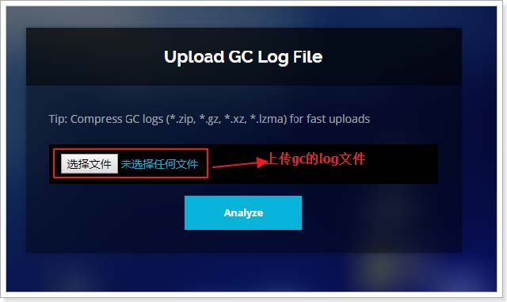


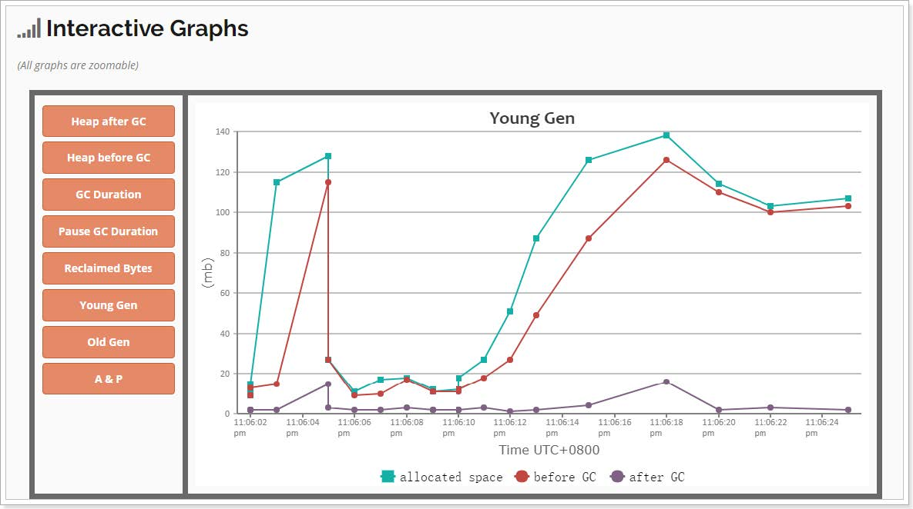

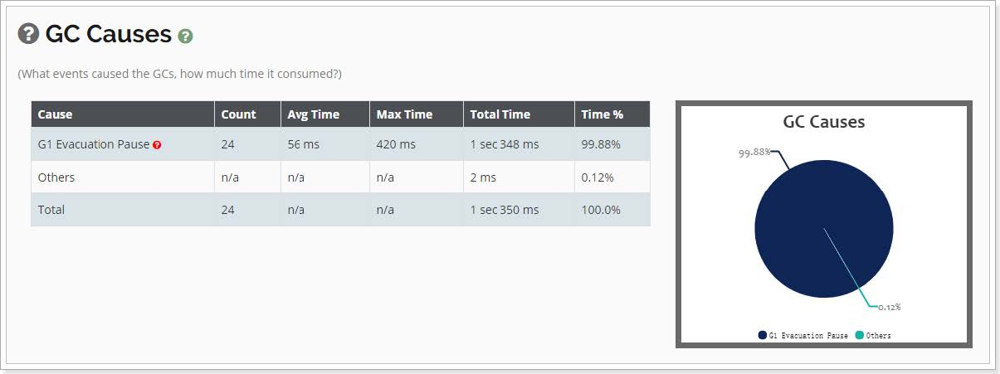


# :tada:  三

## 1 Tomcat8优化

tomcat服务器在JavaEE项目中使用率非常高，所以在生产环境对tomcat的优化也变得非常重要了。
对于tomcat的优化，主要是从2个方面入手，一是，tomcat自身的配置，另一个是tomcat所运行的jvm虚拟机的调优。
下面我们将从这2个方面进行讲解。

### 1.1 Tomcat配置优化

:cloud:todo...day3-第二节


## 2 JVM字节码