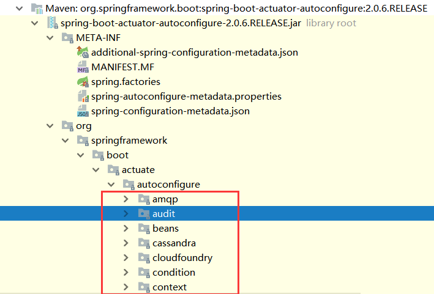
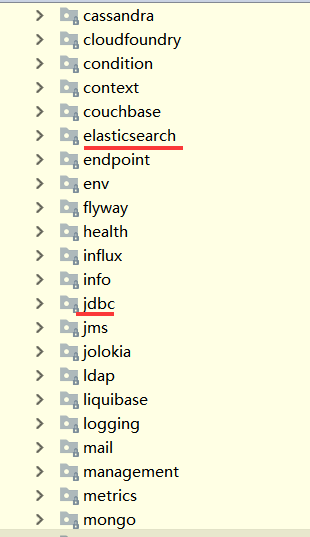

# 1 自动配置原理

> 自动配置类

```java
@SpringBootConfiguration
public class Java3yApplication {

    public static void main(String[] args) {
        SpringApplication.run(Java3yApplication.class, args);
    }
}
```


## 1.1 SpringBootConfiguration

是一个组合注解，其中比较重要的注解：

- `@SpringBootConfiguration`：我们点进去以后可以发现底层是**Configuration**注解，说白了就是支持**JavaConfig**的方式来进行配置(**使用Configuration配置类等同于XML文件**)。
- `@EnableAutoConfiguration`：开启**自动配置**功能(后文详解)
- `@ComponentScan`：这个注解，学过Spring的同学应该对它不会陌生，就是**扫描**注解，默认是扫描**当前类下**的package。将`@Controller/@Service/@Component/@Repository`等注解加载到IOC容器中。


#### 1.1.1 Configuration

`@Configuration`：这个注解的作用就是声明当前类是一个配置类，然后Spring会自动扫描到添加了`@Configuration`的类，并且读取其中的配置信息。


#### 1.1.2 @EnableAutoConfiguration 

这个注解可以帮助我们**自动载入**应用程序所需要的所有**默认配置**。比如我们引入了spring-boot-starter-web，而这个启动器中帮我们添加了tomcat、SpringMVC的依赖。此时自动配置就知道你是要开发一个web应用，所以就帮你完成了web及SpringMVC的默认配置。

我们点进去看一下，发现有**两个**比较重要的注解：

```java
@Target(ElementType.TYPE)
@Retention(RetentionPolicy.RUNTIME)
@Documented
@Inherited
@AutoConfigurationPackage
@Import(AutoConfigurationImportSelector.class)
public @interface EnableAutoConfiguration {
	... ... ...
}
```

- `@AutoConfigurationPackage`：自动配置包
- `@Import`：给IOC容器导入组件


##### 1.1.2.1 @AutoConfigurationPackage

在**默认**的情况下就是将：主配置类(`@SpringBootApplication`)的所在包及其子包里边的组件扫描到Spring容器中。 

与ComponentScan的区别：扫描对象不同

比如说，你用了Spring Data JPA，可能会在实体类上写`@Entity`注解。这个`@Entity`注解由`@AutoConfigurationPackage`扫描并加载，而我们平时开发用的`@Controller/@Service/@Component/@Repository`这些注解是由`ComponentScan`来扫描并加载的。 


##### 1.1.2.2 Import

找到所有JavaConfig自动配置类的全限定名对应的class，然后将所有自动配置类加载到Spring容器中。 

查看AutoConfigurationImportSelector源码：

```java
public String[] selectImports(AnnotationMetadata annotationMetadata) {
        ... ... ...
        List<String> configurations = getCandidateConfigurations(annotationMetadata,
                                                                   attributes);
        configurations = removeDuplicates(configurations);
        Set<String> exclusions = getExclusions(annotationMetadata, attributes);
        checkExcludedClasses(configurations, exclusions);
        configurations.removeAll(exclusions);
        configurations = filter(configurations, autoConfigurationMetadata);
        fireAutoConfigurationImportEvents(configurations, exclusions);
        return StringUtils.toStringArray(configurations);
}


protected List<String> getCandidateConfigurations(AnnotationMetadata metadata,
			AnnotationAttributes attributes) {
    		//从META-INF/spring.factories文件中读取指定类对应的类名称列表 
		List<String> configurations = SpringFactoriesLoader.loadFactoryNames(
				getSpringFactoriesLoaderFactoryClass(), getBeanClassLoader());
		
		return configurations;
}

```

其中，SpringFactoriesLoader.loadFactoryNames 方法的作用就是从META-INF/spring.factories文件中读取指定类对应的类名称列表 ：


spring.factories 文件中有关自动配置的配置信息如下：

```
... ... ...

org.springframework.boot.autoconfigure.web.reactive.function.client.WebClientAutoConfiguration,\
org.springframework.boot.autoconfigure.web.servlet.DispatcherServletAutoConfiguration,\
org.springframework.boot.autoconfigure.web.servlet.ServletWebServerFactoryAutoConfiguration,\
org.springframework.boot.autoconfigure.web.servlet.error.ErrorMvcAutoConfiguration,\
org.springframework.boot.autoconfigure.web.servlet.HttpEncodingAutoConfiguration,\
org.springframework.boot.autoconfigure.web.servlet.MultipartAutoConfiguration,\

... ... ...
```

上面配置文件存在大量的以Configuration为结尾的类名称，这些类就是存有自动配置信息的类，而SpringApplication在获取这些类名后再加载。


> 那么spring.factories 文件存放的自动配置类名代表的类从哪里加载呢？

其实在我们的项目中，已经引入了一个依赖：`spring-boot-autoconfigure`，其中定义了大量自动配置类：

可以看到，spring.factories和这些自动配置类都在这个spring-boot-actuator-autoconfigure这个maven依赖下






非常多，几乎涵盖了现在主流的开源框架，例如：

- redis
- jms
- amqp
- jdbc
- jackson
- mongodb
- jpa
- solr
- elasticsearch

... 等等


> 我们选取其中几个来做一下分析

1.我们以spring.factories中的ServletWebServerFactoryAutoConfiguration为例来分析源码：

```java
@Configuration
@AutoConfigureOrder(Ordered.HIGHEST_PRECEDENCE)
@ConditionalOnClass(ServletRequest.class)
@ConditionalOnWebApplication(type = Type.SERVLET)
@EnableConfigurationProperties(ServerProperties.class)
@Import({ ServletWebServerFactoryAutoConfiguration.BeanPostProcessorsRegistrar.class,
		ServletWebServerFactoryConfiguration.EmbeddedTomcat.class,
		ServletWebServerFactoryConfiguration.EmbeddedJetty.class,
		ServletWebServerFactoryConfiguration.EmbeddedUndertow.class })
public class ServletWebServerFactoryAutoConfiguration {
	... ... ...
}

```

其中，

@EnableConfigurationProperties(ServerProperties.class) 代表加载ServerProperties服务器配置属性类

进入ServerProperties.class源码如下：

```java
@ConfigurationProperties(prefix = "server", ignoreUnknownFields = true)
public class ServerProperties {

	/**
	 * Server HTTP port.
	 */
	private Integer port;

	/**
	 * Network address to which the server should bind.
	 */
	private InetAddress address;
  
  	... ... ...
  
}
```

其中，prefix = "server" 表示SpringBoot配置文件中的前缀，SpringBoot会将配置文件中以server开始的属性映射到该类的字段中。映射关系如下：


2.再来看一个我们熟悉的，例如SpringMVC，查看mvc 的自动配置类：WebMVCAutoConfiguration（在spring.factories中加载）

  /Marie(2019)/programming/08%E6%80%BB%E7%AC%94%E8%AE%B0/Spring%E7%B3%BB%E5%88%97/springboot/assets/1527933162533.png)

打开WebMvcAutoConfiguration：

/Marie(2019)/programming/08%E6%80%BB%E7%AC%94%E8%AE%B0/Spring%E7%B3%BB%E5%88%97/springboot/assets/1527933633048.png)

我们看到这个类上的4个注解：

- `@Configuration`：声明这个类是一个配置类

- `@ConditionalOnWebApplication(type = Type.SERVLET)`

  ConditionalOn，翻译就是在某个条件下，此处就是满足项目的类是是Type.SERVLET类型，也就是一个普通web工程，显然我们就是

- `@ConditionalOnClass({ Servlet.class, DispatcherServlet.class, WebMvcConfigurer.class })`

  这里的条件是OnClass，也就是满足以下类存在：Servlet、DispatcherServlet、WebMvcConfigurer，其中Servlet只要引入了tomcat依赖自然会有，后两个需要引入SpringMVC才会有。这里就是判断你是否引入了相关依赖，引入依赖后该条件成立，当前类的配置才会生效！

- `@ConditionalOnMissingBean(WebMvcConfigurationSupport.class)`

  这个条件与上面不同，OnMissingBean，是说环境中没有指定的Bean这个才生效。其实这就是自定义配置的入口，也就是说，如果我们自己配置了一个WebMVCConfigurationSupport的类，那么这个默认配置就会失效！

接着，我们查看该类中定义了什么：

视图解析器：

/Marie(2019)/programming/08%E6%80%BB%E7%AC%94%E8%AE%B0/Spring%E7%B3%BB%E5%88%97/springboot/assets/1527933646831.png)

处理器适配器（HandlerAdapter）：

/Marie(2019)/programming/08%E6%80%BB%E7%AC%94%E8%AE%B0/Spring%E7%B3%BB%E5%88%97/springboot/assets/1527933659948.png)

还有很多，这里就不一一截图了。


另外，这些默认配置的属性来自哪里呢？

/Marie(2019)/programming/08%E6%80%BB%E7%AC%94%E8%AE%B0/Spring%E7%B3%BB%E5%88%97/springboot/assets/1528096733440.png)

我们看到，这里通过@EnableAutoConfiguration注解引入了两个属性：WebMvcProperties和ResourceProperties。

我们查看这两个属性类：

/Marie(2019)/programming/08%E6%80%BB%E7%AC%94%E8%AE%B0/Spring%E7%B3%BB%E5%88%97/springboot/assets/1528096851318.png)

找到了内部资源视图解析器的prefix和suffix属性。

ResourceProperties中主要定义了静态资源（.js,.html,.css等)的路径：

/Marie(2019)/programming/08%E6%80%BB%E7%AC%94%E8%AE%B0/Spring%E7%B3%BB%E5%88%97/springboot/assets/1528096892588.png)

如果我们要覆盖这些默认属性，只需要在application.properties中定义与其前缀prefix和字段名一致的属性即可。


# 2  起步依赖原理分析

### 3.1.1 分析spring-boot-starter-parent

按住Ctrl点击pom.xml中的spring-boot-starter-parent，跳转到了spring-boot-starter-parent的pom.xml，xml配置如下（只摘抄了部分重点配置）：

```xml
<parent>
  <groupId>org.springframework.boot</groupId>
  <artifactId>spring-boot-dependencies</artifactId>
  <version>2.0.1.RELEASE</version>
  <relativePath>../../spring-boot-dependencies</relativePath>
</parent>
```

按住Ctrl点击pom.xml中的spring-boot-starter-dependencies，跳转到了spring-boot-starter-dependencies的pom.xml，xml配置如下（只摘抄了部分重点配置）：

```xml
<properties>
  	<activemq.version>5.15.3</activemq.version>
  	<antlr2.version>2.7.7</antlr2.version>
  	<appengine-sdk.version>1.9.63</appengine-sdk.version>
  	<artemis.version>2.4.0</artemis.version>
  	<aspectj.version>1.8.13</aspectj.version>
  	<assertj.version>3.9.1</assertj.version>
  	<atomikos.version>4.0.6</atomikos.version>
  	<bitronix.version>2.1.4</bitronix.version>
  	<build-helper-maven-plugin.version>3.0.0</build-helper-maven-plugin.version>
  	<byte-buddy.version>1.7.11</byte-buddy.version>
  	... ... ...
</properties>
<dependencyManagement>
  	<dependencies>
      	<dependency>
        	<groupId>org.springframework.boot</groupId>
        	<artifactId>spring-boot</artifactId>
        	<version>2.0.1.RELEASE</version>
      	</dependency>
      	<dependency>
        	<groupId>org.springframework.boot</groupId>
        	<artifactId>spring-boot-test</artifactId>
        	<version>2.0.1.RELEASE</version>
      	</dependency>
      	... ... ...
	</dependencies>
</dependencyManagement>
<build>
  	<pluginManagement>
    	<plugins>
      		<plugin>
        		<groupId>org.jetbrains.kotlin</groupId>
        		<artifactId>kotlin-maven-plugin</artifactId>
        		<version>${kotlin.version}</version>
      		</plugin>
      		<plugin>
        		<groupId>org.jooq</groupId>
        		<artifactId>jooq-codegen-maven</artifactId>
        		<version>${jooq.version}</version>
      		</plugin>
      		<plugin>
        		<groupId>org.springframework.boot</groupId>
        		<artifactId>spring-boot-maven-plugin</artifactId>
        		<version>2.0.1.RELEASE</version>
      		</plugin>
          	... ... ...
    	</plugins>
  	</pluginManagement>
</build>
```

从上面的spring-boot-starter-dependencies的pom.xml中我们可以发现，一部分坐标的版本、依赖管理、插件管理已经定义好，所以我们的SpringBoot工程继承spring-boot-starter-parent后已经具备版本锁定等配置了。所以起步依赖的作用就是进行依赖的传递。

### 3.1.2 分析spring-boot-starter-web

按住Ctrl点击pom.xml中的spring-boot-starter-web，跳转到了spring-boot-starter-web的pom.xml，xml配置如下（只摘抄了部分重点配置）：

```xml
<?xml version="1.0" encoding="UTF-8"?>
<project xsi:schemaLocation="http://maven.apache.org/POM/4.0.0 http://maven.apache.org/xsd/maven-4.0.0.xsd" xmlns="http://maven.apache.org/POM/4.0.0"
    xmlns:xsi="http://www.w3.org/2001/XMLSchema-instance">
  	<modelVersion>4.0.0</modelVersion>
  	<parent>
    	<groupId>org.springframework.boot</groupId>
    	<artifactId>spring-boot-starters</artifactId>
    	<version>2.0.1.RELEASE</version>
  	</parent>
  	<groupId>org.springframework.boot</groupId>
  	<artifactId>spring-boot-starter-web</artifactId>
  	<version>2.0.1.RELEASE</version>
  	<name>Spring Boot Web Starter</name>
  
  	<dependencies>
    	<dependency>
      		<groupId>org.springframework.boot</groupId>
      		<artifactId>spring-boot-starter</artifactId>
      		<version>2.0.1.RELEASE</version>
      		<scope>compile</scope>
    	</dependency>
    	<dependency>
      		<groupId>org.springframework.boot</groupId>
      		<artifactId>spring-boot-starter-json</artifactId>
      		<version>2.0.1.RELEASE</version>
      		<scope>compile</scope>
    	</dependency>
    	<dependency>
      		<groupId>org.springframework.boot</groupId>
      		<artifactId>spring-boot-starter-tomcat</artifactId>
      		<version>2.0.1.RELEASE</version>
      		<scope>compile</scope>
    	</dependency>
    	<dependency>
      		<groupId>org.hibernate.validator</groupId>
      		<artifactId>hibernate-validator</artifactId>
      		<version>6.0.9.Final</version>
      		<scope>compile</scope>
    	</dependency>
    	<dependency>
      		<groupId>org.springframework</groupId>
      		<artifactId>spring-web</artifactId>
      		<version>5.0.5.RELEASE</version>
      		<scope>compile</scope>
    	</dependency>
    	<dependency>
      		<groupId>org.springframework</groupId>
      		<artifactId>spring-webmvc</artifactId>
      		<version>5.0.5.RELEASE</version>
      		<scope>compile</scope>
    	</dependency>
  	</dependencies>
</project>

```

从上面的spring-boot-starter-web的pom.xml中我们可以发现，spring-boot-starter-web就是将web开发要使用的spring-web、spring-webmvc等坐标进行了“打包”，这样我们的工程只要引入spring-boot-starter-web起步依赖的坐标就可以进行web开发了，同样体现了依赖传递的作用。

