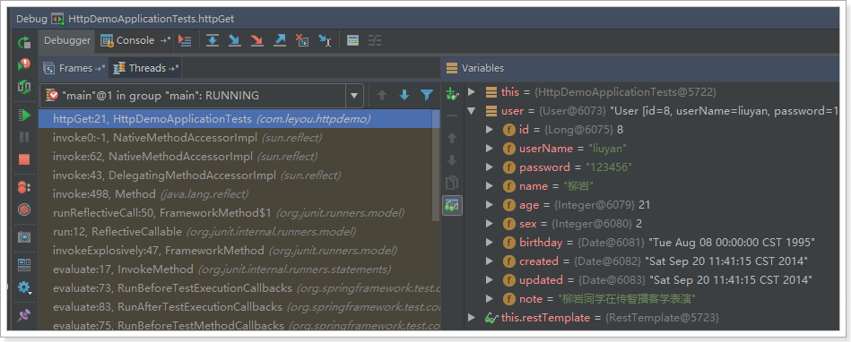
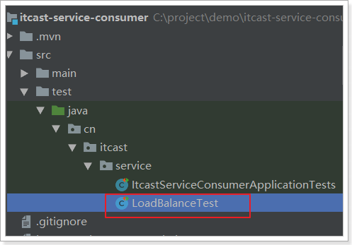

# 1 微服务

前面说的SOA，英文翻译过来是面向服务。微服务，似乎也是服务，都是对系统进行拆分。因此两者非常容易混淆，但其实却有一些差别：

**微服务的特点：**

- 单一职责：微服务中每一个服务都对应唯一的业务能力，做到单一职责
- 微：微服务的服务拆分粒度很小，例如一个用户管理就可以作为一个服务。每个服务虽小，但“五脏俱全”。
- 面向服务：面向服务是说每个服务都要对外暴露Rest风格服务接口API。并不关心服务的技术实现，做到与平台和语言无关，也不限定用什么技术实现，只要提供Rest的接口即可。
- 自治：自治是说服务间互相独立，互不干扰
  - 团队独立：每个服务都是一个独立的开发团队，人数不能过多。
  - 技术独立：因为是面向服务，提供Rest接口，使用什么技术没有别人干涉
  - 前后端分离：采用前后端分离开发，提供统一Rest接口，后端不用再为PC、移动段开发不同接口
  - 数据库分离：每个服务都使用自己的数据源
  - 部署独立，服务间虽然有调用，但要做到服务重启不影响其它服务。有利于持续集成和持续交付。每个服务都是独立的组件，可复用，可替换，降低耦合，易维护


微服务结构图：


# 2.服务调用方式

## 2.1.RPC和HTTP

无论是微服务还是SOA，都面临着服务间的远程调用。那么服务间的远程调用方式有哪些呢？

常见的远程调用方式有以下2种：

- RPC：Remote Produce Call远程过程调用。自定义数据格式，基于原生TCP通信，速度快，效率高。现在热门的dubbo，用的就是RPC

- Http：http其实是一种网络传输协议，基于TCP，规定了数据传输的格式。现在客户端浏览器与服务端通信基本都是采用Http协议，也可以用来进行远程服务调用。缺点是消息封装臃肿，优势是对服务的提供和调用方没有任何技术限定，自由灵活，更符合微服务理念。

  现在热门的Rest风格，就可以通过http协议来实现。


## 2.2.Http客户端工具

既然微服务选择了Http，那么我们就需要考虑自己来实现对请求和响应的处理。不过开源世界已经有很多的http客户端工具，能够帮助我们做这些事情，例如：

- HttpClient
- OKHttp
- URLConnection

接下来，不过这些不同的客户端，API各不相同


## 2.3.Spring的RestTemplate

Spring提供了一个RestTemplate模板工具类，对基于Http的客户端进行了封装，并且实现了对象与json的序列化和反序列化，非常方便。RestTemplate并没有限定Http的客户端类型，而是进行了抽象，目前常用的3种都有支持：

- HttpClient
- OkHttp
- JDK原生的URLConnection（默认的）


我们导入课前资料提供的demo工程：


首先在项目中注册一个`RestTemplate`对象，可以在启动类位置注册：

```java
@SpringBootApplication
public class HttpDemoApplication {

	public static void main(String[] args) {
		SpringApplication.run(HttpDemoApplication.class, args);
	}

	@Bean
	public RestTemplate restTemplate() {
   
		return new RestTemplate();
	}
}
```


在测试类中直接`@Autowired`注入：

```java
@RunWith(SpringRunner.class)
@SpringBootTest(classes = HttpDemoApplication.class)
public class HttpDemoApplicationTests {

	@Autowired
	private RestTemplate restTemplate;

	@Test
	public void httpGet() {
        // 调用springboot案例中的rest接口
		User user = this.restTemplate.getForObject("http://localhost/user/1", User.class);
		System.out.println(user);
	}
}
```

- 通过RestTemplate的getForObject()方法，传递url地址及实体类的字节码，RestTemplate会自动发起请求，接收响应，并且帮我们对响应结果进行反序列化。



学习完了Http客户端工具，接下来就可以正式学习微服务了。


# 3.初识SpringCloud

微服务是一种架构方式，最终肯定需要技术架构去实施。

SpringCloud完全支持SpringBoot的开发，用很少的配置就能完成微服务框架的搭建。


## 3.1.简介

SpringCloud实现了诸如：配置管理，服务发现，智能路由，负载均衡，熔断器，控制总线，集群状态等等功能。其主要涉及的组件包括：

- Eureka：服务治理组件，包含服务注册中心，服务注册与发现机制的实现。（服务治理，服务注册/发现） 
- Zuul：网关组件，提供智能路由，访问过滤功能 
- Ribbon：客户端负载均衡的服务调用组件（客户端负载） 
- Feign：服务调用，给予Ribbon和Hystrix的声明式服务调用组件 （声明式服务调用） 
- Hystrix：容错管理组件，实现断路器模式，帮助服务依赖中出现的延迟和为故障提供强大的容错能力。(熔断、断路器，容错) 

架构图：

 

以上只是其中一部分。


## 3.2.版本

因为Spring Cloud不同其他独立项目，它拥有很多子项目的大项目。所以它的版本是版本名+版本号 （如Angel.SR6）。  

版本名：是伦敦的地铁名  

我们在项目中，用Finchley的版本。


# 4.Eureka注册中心

## 4.1.认识Eureka

负责管理、记录服务提供者的信息。服务调用者无需自己寻找服务，而是把自己的需求告诉Eureka，然后Eureka会把符合你需求的服务告诉你。

同时，服务提供方与Eureka之间通过`“心跳”`机制进行监控，当某个服务提供方出现问题，Eureka自然会把它从服务列表中剔除。

这就实现了服务的自动注册、发现、状态监控。


## 4.2.原理图

> 基本架构：

 


- Eureka：就是服务注册中心（可以是一个集群），对外暴露自己的地址
- 提供者：启动后向Eureka注册自己信息（地址，提供什么服务）
- 消费者：向Eureka订阅服务，Eureka会将对应服务的所有提供者地址列表发送给消费者，并且定期更新
- 心跳(续约)：提供者定期通过http方式向Eureka刷新自己的状态


## 4.3.demo

### 4.3.1.搭建EurekaServer

启动一个EurekaServer：

编写application.yml配置：

```yaml
server:
  port: 10086 # 端口
spring:
  application:
    name: eureka-server # 应用名称，会在Eureka中显示
eureka:
  client:
    service-url: # EurekaServer的地址，现在是自己的地址，如果是集群，需要加上其它Server的地址。
      defaultZone: http://127.0.0.1:${server.port}/eureka
```

修改引导类，在类上添加@EnableEurekaServer注解：

```java
@SpringBootApplication
@EnableEurekaServer // 声明当前springboot应用是一个eureka服务中心
public class ItcastEurekaApplication {

    public static void main(String[] args) {
        SpringApplication.run(ItcastEurekaApplication.class, args);
    }
}
```

启动服务，并访问：http://127.0.0.1:10086


### 4.3.2 注册到Eureka

注册服务，就是在服务上添加Eureka的客户端依赖，客户端代码会自动把服务注册到EurekaServer中。


**1.application.yml**

```yaml
server:
  port: 8081
spring:
  datasource:
    url: jdbc:mysql://localhost:3306/heima
    username: root
    password: root
    driverClassName: com.mysql.jdbc.Driver
  application:
    name: service-provider # 应用名称，注册到eureka后的服务名称
mybatis:
  type-aliases-package: cn.itcast.service.pojo
eureka:
  client:
    service-url: # EurekaServer地址
      defaultZone: http://127.0.0.1:10086/eureka
```


**2.引导类**

通过添加`@EnableDiscoveryClient`来开启Eureka客户端功能

```java
@SpringBootApplication
@EnableDiscoveryClient //开启Eureka客户端功能
public class ItcastServiceProviderApplication {

    public static void main(String[] args) {
        SpringApplication.run(ItcastServiceApplication.class, args);
    }
}
```


### 4.3.3 从Eureka获取服务

1.配置

```yaml
server:
  port: 80
spring:
  application:
    name: service-consumer
eureka:
  client:
    service-url:
      defaultZone: http://localhost:10086/eureka
```


2.在启动类开启Eureka客户端

```java
@SpringBootApplication
@EnableDiscoveryClient // 开启Eureka客户端
public class ItcastServiceConsumerApplication {

    @Bean
    public RestTemplate restTemplate(){
        return new RestTemplate();
    }

    public static void main(String[] args) {
        SpringApplication.run(ItcastServiceConsumerApplication.class, args);
    }
}
```

3.修改UserController代码，用DiscoveryClient类的方法，根据服务名称，获取服务实例：

```java
@Controller
@RequestMapping("consumer/user")
public class UserController {

    @Autowired
    private RestTemplate restTemplate;

    @Autowired
    private DiscoveryClient discoveryClient; // eureka客户端，可以获取到eureka中服务的信息

    @GetMapping
    @ResponseBody
    public User queryUserById(@RequestParam("id") Long id){
        // 根据服务名称，获取服务实例。有可能是集群，所以是service实例集合
        List<ServiceInstance> instances = discoveryClient.getInstances("service-provider");
        // 因为只有一个Service-provider。所以获取第一个实例
        ServiceInstance instance = instances.get(0);
        // 获取ip和端口信息，拼接成服务地址
        String baseUrl = "http://" + instance.getHost() + ":" + instance.getPort() + "/user/" + id;
        User user = this.restTemplate.getForObject(baseUrl, User.class);
        return user;
    }
}
```


5）Debug跟踪运行：


生成的URL：


访问结果：


## 4.4.Eureka详解

Eureka的原理及配置。


### 4.4.1.高可用的Eureka Server

在刚才的案例中，我们只有一个EurekaServer，事实上EurekaServer也可以是一个集群，形成高可用的Eureka中心。

> 服务同步

多个Eureka Server之间也会互相注册为服务，当服务提供者注册到Eureka Server集群中的某个节点时，该节点会把服务的信息同步给集群中的每个节点，从而实现**数据同步**。因此，无论客户端访问到Eureka Server集群中的任意一个节点，都可以获取到完整的服务列表信息。


> 动手搭建高可用的EurekaServer

我们假设要运行两个EurekaServer的集群，端口分别为：10086和10087。只需要把itcast-eureka启动两次即可。

1）启动第一个eurekaServer，我们修改原来的EurekaServer配置：

```yaml
server:
  port: 10086 # 端口
spring:
  application:
    name: eureka-server # 应用名称，会在Eureka中显示
eureka:
  client:
    service-url: # 配置其他Eureka服务的地址，而不是自己，比如10087
      defaultZone: http://127.0.0.1:10087/eureka
```


所谓的高可用注册中心，其实就是把EurekaServer自己也作为一个服务进行注册，这样多个EurekaServer之间就能互相发现对方，从而形成集群。因此我们做了以下修改：

- 把service-url的值改成了另外一台EurekaServer的地址，而不是自己

启动报错，很正常。因为10087服务没有启动：


2）启动第二个eurekaServer，再次修改itcast-eureka的配置：

```yaml
server:
  port: 10087 # 端口
spring:
  application:
    name: eureka-server # 应用名称，会在Eureka中显示
eureka:
  client:
    service-url: # 配置其他Eureka服务的地址，而不是自己，比如10087
      defaultZone: http://127.0.0.1:10086/eureka
```

注意：idea中一个应用不能启动两次，我们需要重新配置一个启动器，然后启动即可。


3）客户端注册服务到集群

因为EurekaServer不止一个，因此注册服务的时候，service-url参数需要变化：

```yaml
eureka:
  client:
    service-url: # EurekaServer地址,多个地址以','隔开
      defaultZone: http://127.0.0.1:10086/eureka,http://127.0.0.1:10087/eureka
```


### 4.4.2.服务提供者

服务提供者要向EurekaServer注册服务，并且完成服务续约等工作。

> 服务续约

在注册服务完成以后，服务提供者会维持一个心跳（定时向EurekaServer发起Rest请求），告诉EurekaServer：“我还活着”。这个我们称为服务的续约（renew）；

有两个重要参数可以修改服务续约的行为：

```yaml
eureka:
  instance:
    lease-expiration-duration-in-seconds: 90
    lease-renewal-interval-in-seconds: 30
```

- lease-renewal-interval-in-seconds：服务续约(renew)的间隔，默认为30秒
- lease-expiration-duration-in-seconds：服务失效时间，默认值90秒

也就是说，默认情况下每个30秒服务会向注册中心发送一次心跳，证明自己还活着。如果超过90秒没有发送心跳，EurekaServer就会认为该服务宕机，会从服务列表中移除，这两个值在生产环境不要修改，默认即可。

但是在开发时，这个值有点太长了，经常我们关掉一个服务，会发现Eureka依然认为服务在活着。所以我们在开发阶段可以适当调小。

```yaml
eureka:
  instance:
    lease-expiration-duration-in-seconds: 10 # 10秒即过期
    lease-renewal-interval-in-seconds: 5 # 5秒一次心跳
```


### 4.4.3.服务消费者

> 获取服务列表

当服务消费者启动时，会检测`eureka.client.fetch-registry=true`参数的值，如果为true，则会拉取Eureka Server服务的列表只读备份，然后缓存在本地。并且`每隔30秒`会重新获取并更新数据。我们可以通过下面的参数来修改：

```yaml
eureka:
  client:
    registry-fetch-interval-seconds: 5
```

生产环境中，我们不需要修改这个值。

**开发环境下，为了能够快速得到服务的最新状态，我们可以将其设置小一点。**


### 4.4.4.失效剔除和自我保护

> 服务下线

当服务进行正常关闭操作时，它会触发一个服务下线的REST请求给Eureka Server，告诉服务注册中心：“我要下线了”。服务中心接受到请求之后，将该服务置为下线状态。

> 失效剔除

有些时候，我们的服务提供方并不一定会正常下线，可能因为内存溢出、网络故障等原因导致服务无法正常工作。Eureka Server需要将这样的服务剔除出服务列表。因此它会开启一个定时任务，每隔60秒对所有失效的服务（超过90秒未响应）进行剔除。

可以通过`eureka.server.eviction-interval-timer-in-ms`参数对其进行修改，单位是毫秒，生产环境不要修改。

开发阶段可以适当调整，比如：10秒


> 自我保护

我们关停一个服务，就会在Eureka面板看到一条警告：


这是触发了Eureka的自我保护机制。当一个服务未按时进行心跳续约时，Eureka会统计最近15分钟心跳失败的服务实例的比例是否超过了85%。在生产环境下，因为网络延迟等原因，心跳失败实例的比例很有可能超标，但是此时就把服务剔除列表并不妥当，因为服务可能没有宕机。Eureka就会把当前实例的注册信息保护起来，不予剔除。生产环境下这很有效，保证了大多数服务依然可用。

但是这给我们的开发带来了麻烦， 因此开发阶段我们都会关闭自我保护模式：（itcast-eureka）

```yaml
eureka:
  server:
    enable-self-preservation: false # 关闭自我保护模式（缺省为打开）
    eviction-interval-timer-in-ms: 1000 # 失效剔除的间隔时间（缺省为60*1000ms）
```


# 5.负载均衡Ribbon

实际环境中，我们往往会开启很多个itcast-service-provider的集群。这时候，就需要一个协调者，来均衡的分配用户的请求，负载均衡可以让用户的可以均匀的分派到不同的服务器上。 

Eureka中已经帮我们集成了负载均衡组件：Ribbon，简单修改代码即可使用。

什么是Ribbon：


## 5.1.启动两个服务实例

首先参照itcast-eureka启动两个ItcastServiceProviderApplication实例，一个8081，一个8082。

 

Eureka监控面板：


## 5.2.开启负载均衡

因为Eureka中已经集成了Ribbon，所以我们无需引入新的依赖，直接修改代码。

修改itcast-service-consumer的引导类，在RestTemplate的配置方法上添加`@LoadBalanced`注解：

```java
@Bean
@LoadBalanced  //开启负载平衡
public RestTemplate restTemplate() {
    return new RestTemplate();
}
```


修改调用方式，不再手动获取ip和端口，而是直接通过服务名称调用：

```java
@Controller
@RequestMapping("consumer/user")
public class UserController {

    @Autowired
    private RestTemplate restTemplate;

    //@Autowired
    //private DiscoveryClient discoveryClient; // 注入discoveryClient，通过该客户端获取服务列表

    @GetMapping
    @ResponseBody
    public User queryUserById(@RequestParam("id") Long id){
        // 通过client获取服务提供方的服务列表，这里我们只有一个
        // ServiceInstance instance = discoveryClient.getInstances("service-provider").get(0);
        String baseUrl = "http://service-provider/user/" + id;
        User user = this.restTemplate.getForObject(baseUrl, User.class);
        return user;
    }

}
```

访问页面，查看结果：


## 5.3.源码跟踪

为什么我们只输入了service名称就可以访问了呢？之前还要获取ip和端口。

显然有人帮我们根据service名称，获取到了服务实例的ip和端口。它就是`LoadBalancerInterceptor`

在如下代码打断点：


一路源码跟踪：RestTemplate.getForObject --> RestTemplate.execute --> RestTemplate.doExecute：


点击进入AbstractClientHttpRequest.execute --> AbstractBufferingClientHttpRequest.executeInternal --> InterceptingClientHttpRequest.executeInternal --> InterceptingClientHttpRequest.execute:


继续跟入：LoadBalancerInterceptor.intercept方法


继续跟入execute方法：发现获取了8082端口的服务


再跟下一次，发现获取的是8081：


## 5.4.负载均衡策略

Ribbon默认的负载均衡策略是简单的轮询，我们可以测试一下：

编写测试类，在刚才的源码中我们看到拦截中是使用RibbonLoadBalanceClient来进行负载均衡的，其中有一个choose方法，找到choose方法的接口方法，是这样介绍的：

 

现在这个就是负载均衡获取实例的方法。

我们注入这个类的对象，然后对其测试：

 

测试内容：

```java
@RunWith(SpringRunner.class)
@SpringBootTest(classes = ItcastServiceConsumerApplication.class)
public class LoadBalanceTest {

    @Autowired
    private RibbonLoadBalancerClient client;

    @Test
    public void testLoadBalance(){
        for (int i = 0; i < 100; i++) {
            ServiceInstance instance = this.client.choose("service-provider");
            System.out.println(instance.getHost() + ":" +instance.getPort());
        }
    }
}

```

结果：


符合了我们的预期推测，确实是轮询方式。


我们是否可以修改负载均衡的策略呢？

继续跟踪源码，发现这么一段代码：

 

我们看看这个rule是谁：

 

这里的rule默认值是一个`RoundRobinRule`，看类的介绍：

 

这不就是轮询的意思嘛。

我们注意到，这个类其实是实现了接口IRule的，查看一下：

 

定义负载均衡的规则接口。

它有以下实现：

 

**SpringBoot也帮我们提供了修改负载均衡规则的配置入口，在itcast-service-consumer的application.yml中添加如下配置：**

```yaml
server:
  port: 80
spring:
  application:
    name: service-consumer
eureka:
  client:
    service-url:
      defaultZone: http://127.0.0.1:10086/eureka
service-provider:
  ribbon:
    NFLoadBalancerRuleClassName: com.netflix.loadbalancer.RandomRule
```

格式是：`{服务名称}.ribbon.NFLoadBalancerRuleClassName`，值就是IRule的实现类。


再次测试，发现结果变成了随机：


