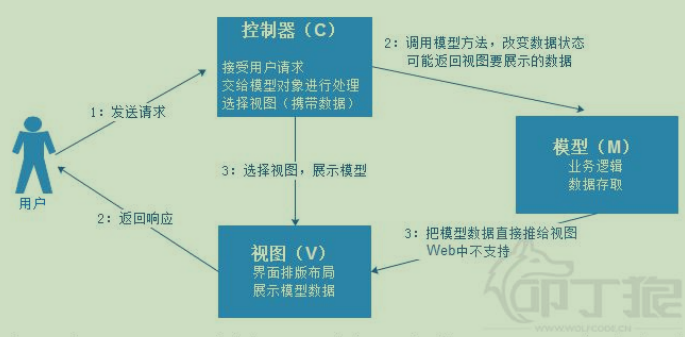
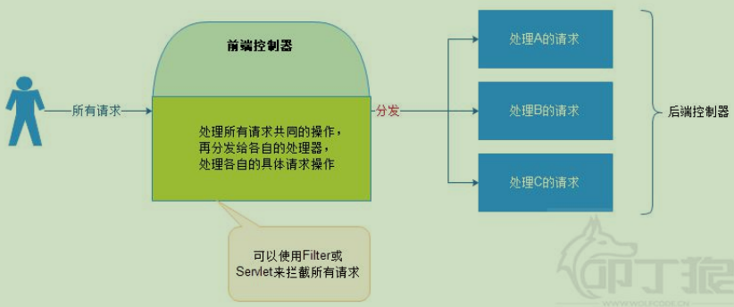
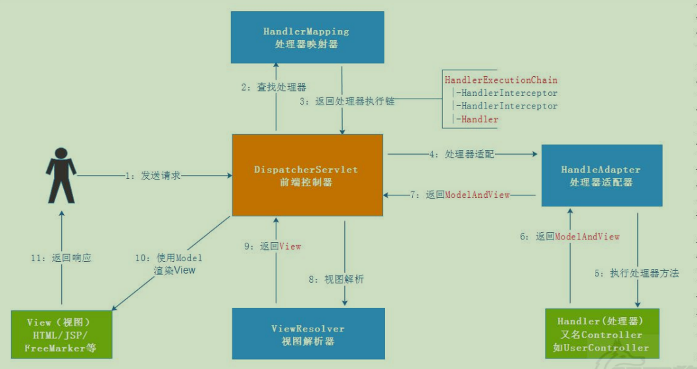

# 1 概念

M（model）V（view）C（controller）模型图

MVC 框架，它解决 WEB 开发中常见的问题(参数接收、文件上传、表单验证、国际化、等等)，使用简单，与 Spring 无缝集成。




### 1.1 前端控制器  

用来提供一个集中的请求处理机制，所有的请求都被发往该控制器统一处理，然后把请求分发给各自相应的处理程序。  一般用来做一个共同的处理，如权限检查，授权，日志记录等。 

MVC 框架必须在 web.xml 中配置前端控制器，一般的要么是要 Filter，要么是 Servlet。

> Struts2 基于 Filter、SpringMVC 基于 Servlet




# 2 代码示例


### 2.1 xml开发

> webapp/web.xml

```xml
<?xml version="1.0" encoding="UTF-8"?>
<web-app xmlns="http://xmlns.jcp.org/xml/ns/javaee" xmlns:xsi="http://www.w3.org/2001/XMLSchema-instance"
	xsi:schemaLocation="http://xmlns.jcp.org/xml/ns/javaee
                      http://xmlns.jcp.org/xml/ns/javaee/web-app_4_0.xsd"
	version="4.0">

	<servlet>
		<servlet-name>springMVC</servlet-name>
		<servlet-class>org.springframework.web.servlet.DispatcherServlet</servlet-class>
	
	 	<init-param>
			<param-name>contextConfigLocation</param-name>
			<param-value>classpath:mvc.xml</param-value>
		</init-param> 
		<load-on-startup>1</load-on-startup>
	</servlet>
    
	<servlet-mapping>
		<servlet-name>springMVC</servlet-name>
		<url-pattern>/</url-pattern>
	</servlet-mapping>
</web-app>

```

load-on-startup 元素是可选的，如果存在，则随着 Web 服务器的启动而构建并调用 init 方法做初始化操作，如不存在，则在第一次请求该 Servlet才加载。


> src/cn.wolfcode.hello/HelloController.java

```java
//处理器
public class HelloController implements Controller{
	public ModelAndView handleRequest(HttpServletRequest request, HttpServletResponse response) throws Exception {
		System.out.println("hello.......");
		ModelAndView mv = new ModelAndView();
		//设置视图名称
		mv.setViewName("/WEB-INF/views/welcome.jsp");
		//设置共享数据
		mv.addObject("msg", "你好SpringMVC");
		return mv;
	}

}
```


> webapp/mvc.xml

```xml
<?xml version="1.0" encoding="UTF-8"?>
<beans xmlns="http://www.springframework.org/schema/beans" xmlns:xsi="http://www.w3.org/2001/XMLSchema-instance"
	xsi:schemaLocation="http://www.springframework.org/schema/beans 
	http://www.springframework.org/schema/beans/spring-beans.xsd">

	<!--1:处理器映射器  -->
	<!-- 
		目的:选择哪一个处理器(Controller)来处理当前请求
		BeanNameUrlHandlerMapping:
		根据请求的URL去寻找对应的bean,根据bean的id/name
		
		/hello   去匹配id或name为/hello的bean
	 -->
	<bean class="org.springframework.web.servlet.handler.BeanNameUrlHandlerMapping"/>
	
    
    <!--2:处理器适配器  -->
	<!-- 
		目的:调用处理器(Controller)的处理请求的方法
			1:所有的适配器都实现HandlerAdapter接口
			2:处理器(Controller)类必须实现org.springframework.web.servlet.mvc.Controller接口
	 -->
	<bean class="org.springframework.web.servlet.mvc.SimpleControllerHandlerAdapter"/>
	
   
    <!--3:视图解析器  -->
	<!-- 处理视图 -->
	<bean class="org.springframework.web.servlet.view.InternalResourceViewResolver"/>
	
    
    <!--4:处理器
		在SpringMVC中Handler(框架)和Controller(自己)是同一个东西.
	 -->
	<bean id="/hello" class="cn.wolfcode.hello.HelloController"/>
	<bean id="/hello2" class="cn.wolfcode.hello.HelloController2"/>
</beans>

```


### 2.2 注解开发


> HelloControler.java

使用了注解处理器就不需要继承Controller类了

```java
//处理器
@Controller
public class HelloController {
	@RequestMapping("/hello")
	public ModelAndView sayHello() {
		System.out.println("HelloController.sayhello()");
		ModelAndView mv = new ModelAndView();
		mv.setViewName("/WEB-INF/views/welcome.jsp");
		mv.addObject("msg","使用注解方式开发SpringMVC");
		return mv;
	}
	
	@RequestMapping("/hello2")
	public ModelAndView sayHello2() {
		System.out.println("HelloController.sayhello2()");
		ModelAndView mv = new ModelAndView();
		mv.setViewName("/WEB-INF/views/welcome.jsp");
		mv.addObject("msg","使用注解方式开发SpringMVC2");
		return mv;
	}
}

```


> mvc.xml

```xml
<!-- IOC注解解析器 -->
<context:component-scan base-package="cn.wolfcode"/>

<!-- MVC注解解析器 -->
<mvc:annotation-driven/>

```


> web.xml

```xml
<servlet>
    <servlet-name>springMVC</servlet-name>
    <servlet-class>org.springframework.web.servlet.DispatcherServlet</servlet-class>

    <init-param>
        <param-name>contextConfigLocation</param-name>
        <param-value>classpath:mvc.xml</param-value>
    </init-param> 
    <load-on-startup>1</load-on-startup>
</servlet>
<servlet-mapping>
    <servlet-name>springMVC</servlet-name>
    <url-pattern>/</url-pattern>
</servlet-mapping>
</web-app>

```


# 3 工作流程

### 3.1 xml配置的工作流程




> 1.处理映射器

（1）用户发送出请求到前端控制器 DispatcherServlet。 

（2）DispatcherServlet 收到请求调用 HandlerMapping（处理器映射器）。 

* 处理器映射器：配置在mvc.xml中。

（3）HandlerMapping 找到具体的处理器(通过 XML 或注解配置)，生成处理器对象及处理器拦截器(如果 

有)，再一起返回给 DispatcherServlet。 

```xml
<!--1.处理器映射器-->	
<!-- 
  目的:选择哪一个处理器(Controller)来处理当前请求
  BeanNameUrlHandlerMapping:
  根据请求的URL去寻找对应的bean,根据bean的id/name
  /hello   去匹配id或name为/hello的bean
-->
<bean class="org.springframework.web.servlet.handler.BeanNameUrlHandlerMapping"/>

<!--2.处理器-->
<bean id="/hello" class="cn.wolfcode.hello.HelloController"/>
<bean id="/hello2" class="cn.wolfcode.hello.HelloController2"/>
```


> 2.处理器适配器

（1）DispatcherServlet 调用 HandlerAdapter（处理器适配器）。 

```xml
<!--处理器适配器  -->

<!-- 
  目的:调用处理器(Controller)的处理请求的方法
   1:所有的适配器都实现HandlerAdapter接口
   2:处理器(Controller)类必须实现org.springframework.web.servlet.mvc.Controller接口
  -->

<bean class="org.springframework.web.servlet.mvc.SimpleControllerHandlerAdapter"/>
```

（2）HandlerAdapter 经过适配调用具体的处理器的某个方法（Handler/Controller）。 

（3）Controller 执行完成返回 ModelAndView 对象。 

（4）HandlerAdapter 将 Controller 返回的 ModelAndView 再返回给 DispatcherServlet。 


> 3.视图解析器

（1）DispatcherServlet 将 ModelAndView 传给 ViewReslover（视图解析器）。 

（2）ViewReslover 解析后返回具体 View（视图）。 

```xml
<!--3:视图解析器  -->
<!-- 处理视图 -->
<bean class="org.springframework.web.servlet.view.InternalResourceViewResolver"/>
```

（3）DispatcherServlet 根据 View 进行渲染视图（即将模型数据填充至视图中）。 

（4）DispatcherServlet 响应用户。


### 3.2 注解配置的工作流程

> mvc.xml

```xml
<!-- IOC注解解析器 -->
<context:component-scan base-package="cn.wolfcode"/>

<!-- MVC注解解析器 -->
<mvc:annotation-driven/>

```

会自动注册 RequestMappingHandlerMapping （处理映射器），RequestMappingHandlerAdapter（处理适配器），ExceptionHandlerExceptionResolver （处理解析器）三个 bean。 

除此之外，还支持： 

- 支持使用 ConversionService 实例对表单参数进行类型转换. 
- 支持使用 @NumberFormat、@DateTimeFormat 注解完成数据格式化操作. 
- 支持使用 @Valid 注解对 JavaBean 实例进行 JSR303 验证. 
- 支持使用 @RequestBody 和@ResponseBody 注解读写 JSON.


> RequestMapping 注解  

RequestMapping 是一个用来处理请求地址映射的注解，可用于类或方法上。用于类上，表示类中的所有响应请求的方法都是以该地址作为父路径。


### 3.3 常用注解

> SpringMVC-常用注解

- @Controller  ：标记处理器
- @RequestMapping：标注处理的url地址
- @RequestBody ：用于读取http请求的内容（字符串），把json格式的数据转换为java对象 
- @ResponseBody    
- @RequestParam   ：绑定参数， `@RequestParam(value="username",defaultValue ="haha",required=false)`
- @PathVariable  :绑定URL占位符
- @Autowired  
- @RestController：相当于@ResponseBody ＋ @Controller合在一起的作用，如果只是使用@RestController注解Controller，则Controller中的方法无法返回jsp页面，例如：本来应该到success.jsp页面的，则其显示success。但使用@RestController这个注解，就不能返回jsp,html页面，视图解析器无法解析jsp,html页面 


> Spring-常用注解

1.声明bean的注解 

- @Component 组件，没有明确的角色
- @Service 在业务逻辑层使用（service层）
- @Repository 在数据访问层使用（dao层）
- @Controller 在展现层使用，控制器的声明（C）


2.注入bean的注解

- @Autowired：由Spring提供
- @Resource：由JSR-250提供

都可以注解在set方法和属性上，推荐注解在属性上（一目了然，少写代码）。


3.java配置类相关注解

@Configuration 声明当前类为配置类，相当于xml形式的Spring配置（类上）

@Bean 注解在方法上，声明当前方法的返回值为一个bean，替代xml中的方式（方法上）

@Configuration 声明当前类为配置类，其中内部组合了@Component注解，表明这个类是一个bean（类上）

@ComponentScan 用于对Component进行扫描，相当于xml中的（类上）