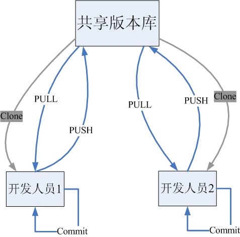

# 1 三种版本控制系统

### 1.1 为什么要版本控制

有了它你就可以将某个文件回溯到之前的状态，甚至将整个项目都回退到过去某个时间点的状态，你可以比较文件的变化细节，查出最后是谁修改了哪个地方，从而找出导致怪异问题出现的原因，又是谁在何时报告了某个功能缺陷等等。


### 1.2 本地版本控制系统

人们很久以前就开发了许多种本地版本控制系统，大多都是采用某种简单的数据库来记录文件的历次更新差异。


### 1.3 集中化的版本控制系统

接下来人们又遇到一个问题，如何让在不同系统上的开发者协同工作？ 

集中化的版本控制系统都有一个单一的集中管理的服务器，保存所有文件的修订版本，而协同工作的人们都通过客户端连到这台服务器，取出最新的文件或者提交更新。

集中式版本控制系统是必须联网才能工作，如果在局域网还可以，带宽够大，速度够快，如果在互联网下，如果网速慢的话，就郁闷了。

> SVN就是集中式版本控制系统


这么做虽然解决了本地版本控制系统无法让在不同系统上的开发者协同工作的诟病，但也还是存在下面的问题：

- **单点故障：** 中央服务器宕机，则其他人无法使用；如果中心数据库磁盘损坏有没有进行备份，你将丢失所有数据。本地版本控制系统也存在类似问题，只要整个项目的历史记录被保存在单一位置，就有丢失所有历史更新记录的风险。
- **必须联网才能工作：** 受网络状况、带宽影响。


### 1.4 分布式版本控制系统

Git是分布式版本控制系统，它没有中央服务器，每个人的电脑就是一个完整的版本库，这样，工作的时候就不需要联网了，因为版本都是在自己的电脑上。

这类系统，**客户端并不只提取最新版本的文件快照，而是把代码仓库完整地镜像下来**。 这么一来，任何一处协同工作用的服务器发生故障，事后都可以用任何一个镜像出来的本地仓库恢复。 因为每一次的克隆操作，实际上都是一次对代码仓库的完整备份。



分布式版本控制系统可以不用联网就可以工作，因为**每个人的电脑上都是完整的版本库，当你修改了某个文件后，你只需要将自己的修改推送给别人就可以了**。但是，**在实际使用分布式版本控制系统的时候，很少会直接进行推送修改，而是使用一台充当“中央服务器”的东西**。这个服务器的作用仅仅是用来方便“交换”大家的修改，没有它大家也一样干活，只是交换修改不方便而已。

分布式版本控制系统的优势不单是不必联网这么简单，后面我们还会看到 Git 极其强大的分支管理等功能。


# 2 Git 与其他版本管理系统的主要区别

 Git 在保存和对待各种信息的时候与其它版本控制系统有很大差异，尽管操作起来的命令形式非常相近，理解这些差异将有助于防止你使用中的困惑。

下面我们主要说一个关于 Git 其他版本管理系统的主要差别：**对待数据的方式**。

**Git采用的是直接记录快照的方式，而非差异比较。**

大部分版本控制系统（CVS、Subversion、Perforce、Bazaar 等等）都是以文件变更列表的方式存储信息，这类系统**将它们保存的信息看作是一组基本文件和每个文件随时间逐步累积的差异。**

具体原理如下图所示，理解起来其实很简单，每个我们对提交更新一个文件之后，系统记录都会记录这个文件做了哪些更新，以增量符号Δ(Delta)表示。

    

**我们怎样才能得到一个文件的最终版本呢？**

很简单，高中数学的基本知识，我们只需要将这些原文件和这些增加进行相加就行了。

**这种方式有什么问题呢？**

比如我们的增量特别特别多的话，如果我们要得到最终的文件是不是会耗费时间和性能。

Git  不按照以上方式对待或保存数据。 反之，Git 更像是把数据看作是对小型文件系统的一组快照。 每次你提交更新，或在 Git  中保存项目状态时，它主要对当时的全部文件制作一个快照并保存这个快照的索引。 为了高效，如果文件没有修改，Git  不再重新存储该文件，而是只保留一个链接指向之前存储的文件。 Git 对待数据更像是一个 **快照流**。

    


# 3 Git 的三种状态

Git 有三种状态，你的文件可能处于其中之一：

1. **已提交（committed）**：数据已经安全的保存在本地数据库中。
2. **已修改（modified）**：已修改表示修改了文件，但还没保存到数据库中。
3. **已暂存（staged）**：表示对一个已修改文件的当前版本做了标记，使之包含在下次提交的快照中。

由此引入 Git 项目的三个工作区域的概念：**Git 仓库(.git directoty)**、**工作目录(Working Directory)** 以及 **暂存区域(Staging Area)** 。

    

**基本的 Git 工作流程如下：**

1. 在工作目录中修改文件。

2. 暂存文件，将文件的快照放入暂存区域。 

   > git add .

3. 提交更新，找到暂存区域的文件，将快照永久性存储到 Git 本地仓库目录。

   > git commit -m ""  

4. 将本地仓库的数据提交到远程仓库

   > git remote add origin git@github.com:cristinejssssss/leyou.git 
   > git push -u origin master


# 4 相关操作

### 4.1 获取 Git 仓库

有两种取得 Git 项目仓库的方法。

1.   `git init`  命令
2.  `git clone [url]` 


### 4.2 记录每次更新到仓库

1. **检测当前文件状态** : `git status`
2. **提出更改（把它们添加到暂存区**）：`git add filename` (针对特定文件)、`git add .`(所有文件)、`git add *.txt`（支持通配符，所有 .txt 文件）
3. **忽略文件**：`.gitignore` 文件
4. **提交更新:** `git commit -m "代码提交信息"` 
5. **跳过使用暂存区域更新的方式** : `git commit -a -m "代码提交信息"`。 `git commit` 加上 `-a` 选项，Git 就会自动把所有已经跟踪过的文件暂存起来一并提交，从而跳过 `git add` 步骤。
6. **移除文件** ：`git rm filename`  （从暂存区域移除，然后提交。）
7. **对文件重命名** ：`git mv README.md README`(这个命令相当于`mv README.md README`、`git rm README.md`、`git add README` 这三条命令的集合)


### 4.3 推送改动到远程仓库

- git remote add origin git@github.com:cristinejssssss/leyou.git  #刚创建仓库的时候要写，是写明push地址的命令
- git push -u origin master


### 4.4 远程仓库的移除与重命名

- 将 test 重命名位 test1：`git remote rename test test1`
- 移除远程仓库 test1:`git remote rm test1`


### 4.5 查看提交历史

 `git log` 命令

**可以添加一些参数来查看自己希望看到的内容：**

只看某个人的提交记录：

```
git log --author=bob
```


### 4.6 撤销操作

有时候我们提交完了才发现漏掉了几个文件没有添加，或者提交信息写错了。 此时，可以运行带有 `--amend` 选项的提交命令尝试重新提交：

```
git commit --amend
```

取消暂存的文件

```
git reset filename
```

撤消对文件的修改:

```
git checkout -- filename
```

假如你想丢弃你在本地的所有改动与提交，可以到服务器上获取最新的版本历史，并将你本地主分支指向它：

```
git fetch origin
git reset --hard origin/master
```


### 4.7 分支

分支是用来将特性开发绝缘开来的。在你创建仓库的时候，*master* 是“默认的”分支。在其他分支上进行开发，完成后再将它们合并到主分支上。

我们通常在开发新功能、修复一个紧急 bug 等等时候会选择创建分支。单分支开发好还是多分支开发好，还是要看具体场景来说。

创建一个名字叫做 test 的分支

```
git branch test
```

切换当前分支到 test（当你切换分支的时候，Git 会重置你的工作目录，使其看起来像回到了你在那个分支上最后一次提交的样子。 Git 会自动添加、删除、修改文件以确保此时你的工作目录和这个分支最后一次提交时的样子一模一样）

```
git checkout test
```

    

你也可以直接这样创建分支并切换过去(上面两条命令的合写)

```
git checkout -b feature_x
```

切换到主分支

```
git checkout master
```

合并分支(可能会有冲突)

```
 git merge test
```

把新建的分支删掉

```
git branch -d feature_x
```

将分支推送到远端仓库（推送成功后其他人可见）：

```
git push origin 
```