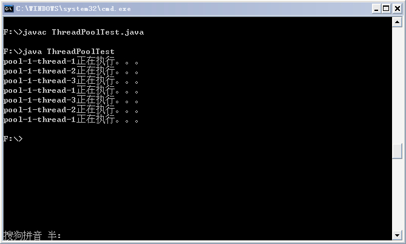
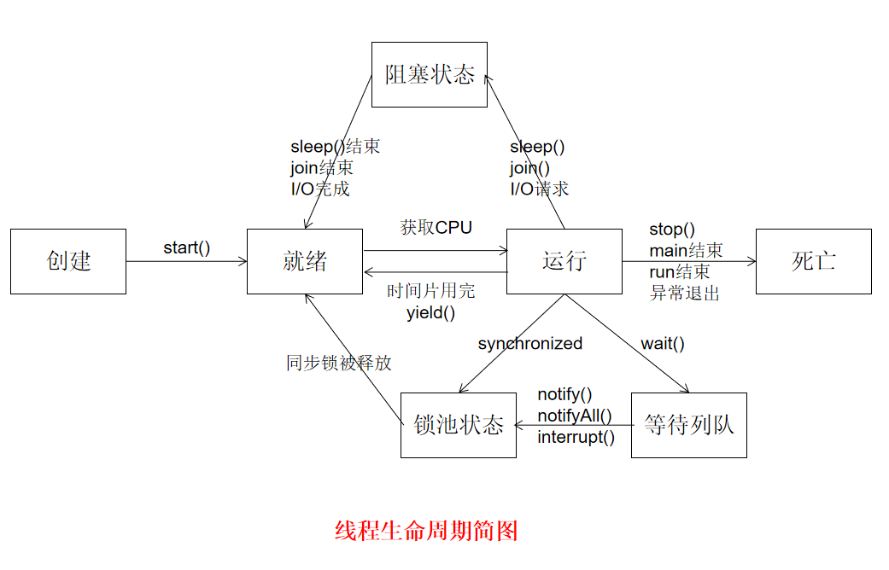

# 1 线程创建方式

Java使用Thread类代表线程，所有的线程对象都必须是Thread类或其子类的实例。Java可以用四种方式来创建线程，如下所示：

1）继承Thread类创建线程

2）实现Runnable接口创建线程

3）使用Callable和Future创建线程

4）使用线程池例如用Executor框架


### 1.1 实现 Runnable 接口

需要实现接口中的 run() 方法。

```java
public class MyRunnable implements Runnable {
    @Override
    public void run() {
        // ...
    }
}
```

使用 Runnable 实例再创建一个 Thread 实例，然后调用 Thread 实例的 start() 方法来启动线程。

```java
public static void main(String[] args) {
    MyRunnable instance = new MyRunnable();
    Thread thread = new Thread(instance);
    thread.start();
}
```


### 1.2 继承 Thread 类

同样也是需要实现 run() 方法，因为 Thread 类也实现了 Runable 接口。

当调用 start() 方法启动一个线程时，虚拟机会将该线程放入就绪队列中等待被调度，当一个线程被调度时会执行该线程的 run() 方法。

```java
public class MyThread extends Thread {
    public void run() {
        // ...
    }
}
```

```java
public static void main(String[] args) {
    MyThread mt = new MyThread();
    mt.start();
}
```


### 1.3 使用Callable和Future

与 Runnable 相比，Callable 可以有返回值，返回值通过 FutureTask 进行封装。

```java
public class MyCallable implements Callable<Integer> {
    public Integer call() {
        return 123;
    }
}
```

```java
public static void main(String[] args) throws ExecutionException, InterruptedException {
    MyCallable mc = new MyCallable();
    FutureTask<Integer> ft = new FutureTask<>(mc);
    Thread thread = new Thread(ft);
    thread.start();
    System.out.println(ft.get());
}
```


### 1.4 Executor 

##### 1.4.1 简介

优点：1.5后引入的Executor框架的最大优点是把任务的提交和执行解耦。

流程： 具体点讲，提交一个Callable对象给ExecutorService（如最常用的线程池ThreadPoolExecutor），将得到一个Future对象，调用Future对象的get方法等待执行结果就好了。

原理：Executor框架的内部使用了线程池机制，它在java.util.cocurrent 包下，通过该框架来控制线程的启动、执行和关闭，可以简化并发编程的操作。

因此，在Java 5之后，通过Executor来启动线程比使用Thread的start方法更好，除了更易管理，效率更好（用线程池实现，节约开销）外，还有关键的一点：有助于避免this逃逸问题——如果我们在构造器中启动一个线程，因为另一个任务可能会在构造器结束之前开始执行，此时可能会访问到初始化了一半的对象用Executor在构造器中。


##### 1.4.2 Executor执行Runnable任务

```java
[java] view pl
 
import java.util.concurrent.ExecutorService;   
import java.util.concurrent.Executors;   
  
public class TestCachedThreadPool{   
    public static void main(String[] args){   
        ExecutorService executorService = Executors.newCachedThreadPool();   
//      ExecutorService executorService = Executors.newFixedThreadPool(5);  
//      ExecutorService executorService = Executors.newSingleThreadExecutor();  
        for (int i = 0; i < 5; i++){   
            executorService.execute(new TestRunnable());   
            System.out.println("************* a" + i + " *************");   
        }   
        executorService.shutdown();   
    }   
}   
  
class TestRunnable implements Runnable{   
    public void run(){   
        System.out.println(Thread.currentThread().getName() + "线程被调用了。");   
    }   
}  
```

execute会首先在线程池中选择一个已有空闲线程来执行任务，如果线程池中没有空闲线程，它便会创建一个新的线程来执行任务。 


##### 1.4.3 Executor执行Callable任务

```java
import java.util.ArrayList;   
import java.util.List;   
import java.util.concurrent.*;   
  
public class CallableDemo{   
    public static void main(String[] args){   
        ExecutorService executorService = Executors.newCachedThreadPool();   
        List<Future<String>> resultList = new ArrayList<Future<String>>();   
  
        //创建10个任务并执行   
        for (int i = 0; i < 10; i++){   
            //使用ExecutorService执行Callable类型的任务，并将结果保存在future变量中   
            Future<String> future = executorService.submit(new TaskWithResult(i));   
            //将任务执行结果存储到List中   
            resultList.add(future);   
        }   
  
        //遍历任务的结果   
        for (Future<String> fs : resultList){   
                try{   
                    while(!fs.isDone);//Future返回如果没有完成，则一直循环等待，直到Future返回完成  
                    System.out.println(fs.get());     //打印各个线程（任务）执行的结果   
                }catch(InterruptedException e){   
                    e.printStackTrace();   
                }catch(ExecutionException e){   
                    e.printStackTrace();   
                }finally{   
                    //启动一次顺序关闭，执行以前提交的任务，但不接受新任务  
                    executorService.shutdown();   
                }   
        }   
    }   
}   
  
  
class TaskWithResult implements Callable<String>{   
    private int id;   
  
    public TaskWithResult(int id){   
        this.id = id;   
    }   
  
    /**  
     * 任务的具体过程，一旦任务传给ExecutorService的submit方法， 
     * 则该方法自动在一个线程上执行 
     */   
    public String call() throws Exception {  
        System.out.println("call()方法被自动调用！！！    " + Thread.currentThread().getName());   
        //该返回结果将被Future的get方法得到  
        return "call()方法被自动调用，任务返回的结果是：" + id + "    " + Thread.currentThread().getName();   
    }   
}  
```

submit也是首先选择空闲线程来执行任务，如果没有，才会创建新的线程来执行任务。另外，需要注意：如果Future的返回尚未完成，则get（）方法会阻塞等待，直到Future完成返回，可以通过调用isDone（）方法判断Future是否完成了返回。 


### 1.5 自定义线程池

##### 1.5.1 代码

自定义线程池，可以用ThreadPoolExecutor类创建。

```java
import java.util.concurrent.ArrayBlockingQueue;   
import java.util.concurrent.BlockingQueue;   
import java.util.concurrent.ThreadPoolExecutor;   
import java.util.concurrent.TimeUnit;   
  
public class ThreadPoolTest{   
    public static void main(String[] args){   
        //创建等待队列   
        BlockingQueue<Runnable> bqueue = new ArrayBlockingQueue<Runnable>(20);   
        //创建线程池，池中保存的线程数为3，允许的最大线程数为5,  
        ThreadPoolExecutor pool = new ThreadPoolExecutor(3,5,50,TimeUnit.MILLISECONDS,bqueue);   
        //创建七个任务   
        Runnable t1 = new MyThread();   
        Runnable t2 = new MyThread();   
        Runnable t3 = new MyThread();   
        Runnable t4 = new MyThread();   
        Runnable t5 = new MyThread();   
        Runnable t6 = new MyThread();   
        Runnable t7 = new MyThread();   
        //每个任务会在一个线程上执行  
        pool.execute(t1);   
        pool.execute(t2);   
        pool.execute(t3);   
        pool.execute(t4);   
        pool.execute(t5);   
        pool.execute(t6);   
        pool.execute(t7);   
        //关闭线程池   
        pool.shutdown();   
    }   
}   
  
class MyThread implements Runnable{   
    @Override   
    public void run(){   
        System.out.println(Thread.currentThread().getName() + "正在执行。。。");   
        try{   
            Thread.sleep(100);   
        }catch(InterruptedException e){   
            e.printStackTrace();   
        }   
    }   
}  
```

 运行结果如下： 




##### 1.5.2  参数

```java
//创建等待队列   
BlockingQueue<Runnable> bqueue = new ArrayBlockingQueue<Runnable>(20);   
ThreadPoolExecutor pool = new ThreadPoolExecutor(3,5,50,TimeUnit.MILLISECONDS,bqueue);   
```

- 3：线程池中所保存的线程数，包括空闲线程。
- 5：池中允许的最大线程数。

- 50：当线程数大于核心数时，该参数为所有的任务终止前，多余的空闲线程等待新任务的最长时间。

- TimeUnit.MILLISECONDS：等待时间的单位。


### 1.6 总结

实现Runnable和实现Callable接口的方式基本相同，不过是后者执行call()方法有返回值，后者线程执行体run()方法无返回值，因此可以把这两种方式归为一种这种方式与继承Thread类的方法之间的差别如下：

1、线程只是实现Runnable或实现Callable接口，还可以继承其他类。

2、这种方式下，多个线程可以共享一个target对象，非常适合多线程处理同一份资源的情形。

3、但是编程稍微复杂，如果需要访问当前线程，必须调用Thread.currentThread()方法。

4、继承Thread类的线程类不能再继承其他父类（Java单继承决定）。

5、前三种的线程如果创建关闭频繁会消耗系统资源影响性能，而使用线程池可以不用线程的时候放回线程池，用的时候再从线程池取，项目开发中主要使用线程池

注：在前三种中一般推荐采用实现接口的方式来创建多线程


# 2 4种线程池

Java通过Executors提供四种线程池，分别为：

- newCachedThreadPool：

  创建一个可缓存线程池，如果线程池长度超过处理需要，可灵活回收空闲线程，若无可回收，则新建线程。

- newFixedThreadPool ：

  创建一个定长线程池，可控制线程最大并发数，超出的线程会在队列中等待。

- newScheduledThreadPool：

   创建一个定长线程池，支持定时及周期性任务执行。

- newSingleThreadExecutor：

   创建一个单线程化的线程池，它只会用唯一的工作线程来执行任务，保证所有任务按照指定顺序(FIFO, LIFO, 优先级)执行。,这个线程池可以在线程死后（或发生异常时）重新启动一个线程来替代原来的线程继续执行下去


##### 2.1 new thread和线程池的比较

**new Thread的弊端如下** ：

- 每次new Thread新建对象性能差。
- b线程缺乏统一管理，可能无限制新建线程，相互之间竞争，及可能占用过多系统资源导致死机或oom。
- 缺乏更多功能，如定时执行、定期执行、线程中断。

**Java提供的四种线程池的好处在于：**

-  减少了创建和销毁线程的次数，每个工作线程都可以被重复利用，可执行多个任务。 
- 可有效控制最大并发线程数，提高系统资源的使用率，同时避免过多资源竞争，避免堵塞。
- 提供定时执行、定期执行、单线程、并发数控制等功能。


##### 2.2 重要的类

Java里面线程池的顶级接口是**Executor**，但是严格意义上讲Executor并不是一个线程池，而只是一个执行线程的工具。真正的线程池接口是ExecutorService。 

比较重要的几个类：

- **ExecutorService： 真正的线程池接口。**

- ScheduledExecutorService： 能和Timer/TimerTask类似，解决那些需要任务重复执行的问题。

- ThreadPoolExecutor： ExecutorService的默认实现。

- ScheduledThreadPoolExecutor： 继承ThreadPoolExecutor的ScheduledExecutorService接口实现，周期性任务调度的类实现。


要配置一个线程池是比较复杂的，尤其是对于线程池的原理不是很清楚的情况下，很有可能配置的线程池不是较优的，因此在Executors类里面提供了一些静态工厂，生成一些常用的线程池，如上面介绍的四种线程池。


##### 2.3 代码

```java
package app.executors;  

import java.util.concurrent.Executors;  
import java.util.concurrent.ExecutorService;  

/** 
 * Java线程：线程池 
 *  
 * @author xiho
 */  
public class Test {  
    public static void main(String[] args) {  
        ExecutorService pool = Executors.newFixedThreadPool(2);  
        //ExecutorService pool = Executors.newCachedThreadPool();
        //xecutorService pool = Executors.newSingleThreadExecutor(); 
        //
        
        // 创建线程  
        Thread t1 = new MyThread();  
        Thread t2 = new MyThread();  
        Thread t3 = new MyThread();  
        Thread t4 = new MyThread();  
        Thread t5 = new MyThread();  
        // 将线程放入池中进行执行  
        pool.execute(t1);  
        pool.execute(t2);  
        pool.execute(t3);  
        pool.execute(t4);  
        pool.execute(t5);  
        // 关闭线程池  
        pool.shutdown();  
    }  
}  

class MyThread extends Thread {  
    @Override  
    public void run() {  
        System.out.println(Thread.currentThread().getName() + "正在执行。。。");  
    }  
}  
```


# 3 线程生命周期状态




### 3.1 新建

当程序使用new关键字创建了一个线程之后，该线程就处于新建状态，此时仅由 JVM 为其分配内存，并初始化其成员变量的值

 

### 3.2 就绪

当线程对象调用了 start()方法之后，该线程处于就绪状态。Java 虚拟机会为其创建方法调用栈和程序计数器，等待调度运行.


### 3.3 运行 Running

如果处于就绪状态的线程获得了CPU资源，就开始执行run方法的线程执行体，则该线程处于运行状态。run方法的那里呢？其实run也是在native线程中。


### 3.4 阻塞 Blocked

阻塞状态是线程因为某种原因放弃CPU使用权，暂时停止运行。直到线程进入就绪状态，才有机会转到运行状态。阻塞的情况大概三种：

1. **等待阻塞：**运行的线程执行wait()方法，JVM会把该线程放入等待池中。(wait会释放持有的锁)
2. **同步阻塞：**运行的线程在获取对象的同步锁时，若该同步锁被别的线程占用，则JVM会把该线程放入锁池中。
3. **其他阻塞：**运行的线程执行sleep()或join()方法，或者发出了I/O请求时，JVM会把该线程置为阻塞状态。当sleep()状态超时、join()等待线程终止或者超时、或者I/O处理完毕时，线程重新转入就绪状态。（注意,sleep是不会释放持有的锁）。

**线程睡眠：**Thread.sleep(long millis)方法，使线程转到阻塞状态。millis参数设定睡眠的时间，以毫秒为单位。当睡眠结束后，就转为就绪（Runnable）状态。sleep()平台移植性好。
 **线程等待：**Object类中的wait()方法，导致当前的线程等待，直到其他线程调用此对象的 notify() 方法或 notifyAll() 唤醒方法。这个两个唤醒方法也是Object类中的方法，行为等价于调用 wait(0) 一样。唤醒线程后，就转为就绪（Runnable）状态。
 **线程让步：**Thread.yield() 方法，暂停当前正在执行的线程对象，把执行机会让给相同或者更高优先级的线程。
 **线程加入：**join()方法，等待其他线程终止。在当前线程中调用另一个线程的join()方法，则当前线程转入阻塞状态，直到另一个进程运行结束，当前线程再由阻塞转为就绪状态。
 **线程I/O：**线程执行某些IO操作，因为等待相关的资源而进入了阻塞状态。比如说监听system.in，但是尚且没有收到键盘的输入，则进入阻塞状态。
 **线程唤醒：**Object类中的notify()方法，唤醒在此对象监视器上等待的单个线程。如果所有线程都在此对象上等待，则会选择唤醒其中一个线程，选择是任意性的，并在对实现做出决定时发生。类似的方法还有一个notifyAll()，唤醒在此对象监视器上等待的所有线程。


### 3.5 死亡 Dead

线程会以以下三种方式之一结束，结束后就处于死亡状态:

1. run()方法执行完成，线程正常结束。
2. 线程抛出一个未捕获的Exception或Error。
3. 直接调用该线程的stop()方法来结束该线程——该方法容易导致死锁，通常不推荐使用。

 

# 4 终止线程4种方式

### 4.1 正常运行结束

程序运行结束，线程自动结束。 


### 4.2 使用退出标志退出线程 

一般 run()方法执行完，线程就会正常结束，然而，常常有些线程是伺服线程。它们需要长时间的运行，只有在外部某些条件满足的情况下，才能关闭这些线程。使用一个变量来控制循环，例如： 

最直接的方法就是设一个 boolean 类型的标志，并通过设置这个标志为 true 或 false 来控制 while循环是否退出，代码示例：

```java
public class ThreadSafe extends Thread {
 public volatile boolean exit = false; 
 public void run() { 
 while (!exit){
 //do something
 }
 } 
}
```

定义了一个退出标志 exit，当 exit 为 true 时，while 循环退出，exit 的默认值为 false.在定义 exit时，使用了一个 Java 关键字 volatile，这个关键字的目的是使exit同步，也就是说在同一时刻只能由一个线程来修改 exit的值，一个线程修改了exit为true，所有线程看到的exit都为true。


### 4.3 Interrupt 方法结束线程 

使用 interrupt()方法来中断线程有两种情况：

1. **线程处于阻塞状态：**如使用了 sleep,同步锁的 wait,socket 中的 receiver,accept 等方法时，会使线程处于阻塞状态。当调用线程的 interrupt()方法时，会抛出 InterruptException 异常。 阻塞中的那个方法抛出这个异常，通过代码捕获该异常，然后 break 跳出循环状态，从而让我们有机会结束这个线程的执行。

   通常很多人认为只要调用 interrupt 方法线程就会结束，实际上是错的， 一定要先捕获 InterruptedException 异常之后通过 break 来跳出循环，才能正常结束 run 方法。 

2. **线程未处于阻塞状态：**使用 isInterrupted()判断线程的中断标志来退出循环。当使用interrupt()方法时，中断标志就会置 true，和使用自定义的标志来控制循环是一样的道理。

```java
public class ThreadSafe extends Thread {
	 public void run() { 
 		while (!isInterrupted()){ //非阻塞过程中通过判断中断标志来退出
 		try{
			 Thread.sleep(5*1000);//阻塞过程捕获中断异常来退出
		 }catch(InterruptedException e){
			 e.printStackTrace();
			 break;//捕获到异常之后，执行 break 跳出循环
		 }
	 }
   } 
}
```


### 4.4 stop 方法终止线程（线程不安全） 

程序中可以直接使用 thread.stop()来强行终止线程，但是 stop 方法是很危险的，就象突然关闭计算机电源，而不是按正常程序关机一样，可能会产生不可预料的结果，不安全主要是： 

thread.stop()调用之后，创建子线程的线程就会抛出 ThreadDeatherror 的错误，并且会释放子线程所持有的所有锁。一般任何进行加锁的代码块，都是为了保护数据的一致性，如果在调用thread.stop()后导致了该线程所持有的所有锁的突然释放(不可控制)，那么被保护数据就有可能呈现不一致性，其他线程在使用这些被破坏的数据时，有可能导致一些很奇怪的应用程序错误。因此，并不推荐使用 stop 方法来终止线程。


# 5 多线程之间的协作方法

### 5.1 sleep()方法

1. sleep()方法是**线程类（Thread）的静态方法**，让调用的线程进入指定时间睡眠状态，使得当前线程进入阻塞状态，告诉系统至少在指定时间内不需要为线程调度器为该线程分配执行时间片，给执行机会给其他线程（实际上，调用sleep()方法时并不要求持有任何锁，即sleep()可在任何地方使用。），但是监控状态依然保持，到时后会自动恢复。
2. 当线程处于上锁时，sleep()方法**不会释放对象锁**，即睡眠时也持有对象锁。只会让出CPU执行时间片，并不会释放同步资源锁。
3. sleep()休眠时间满后，该线程不一定会立即执行，这是因为其他线程可能正在运行而起没有被调度为放弃执行，除非此线程具有更高的优先级。
4. sleep()必须捕获异常，在sleep的过程中过程中有可能被其他对象调用它的interrupt(),产生InterruptedException异常，如果你的程序不捕获这个异常，线程就会异常终止，进入TERMINATED状态，如果你的程序捕获了这个异常，那么程序就会继续执行catch语句块(可能还有finally语句块)以及以后的代码。

在没有锁的情况下，sleep()可以使低优先级的线程得到执行的机会，当然也可以让同优先级、高优先级的线程有执行的机会。


### 5.2 wait() notify() notifyAll()

##### 5.2.1 简介

1. wait()方法是**Object类里的方法**，当一个线程执行wait()方法时，它就进入到一个和该对象相关的等待池中（进入等待队列，也就是阻塞的一种，叫等待阻塞），**同时释放对象锁，并让出CPU资源**，待指定时间结束后返还得到对象锁。
2. wait()使用**notify()方法、notiftAll()方法**或者等待指定时间来唤醒当前等待池中的线程。等待的线程只是被激活，但是必须得再次获得锁才能继续往下执行，也就是说只要锁没被释放，原等待线程因为为获取锁仍然无法继续执行。notify的作用只负责唤醒线程，线程被唤醒后有权利重新参与线程的调度。

wait()方法、notify()方法和notiftAll()方法用于协调**多线程对共享数据的存取**，所以**只能在同步方法或者同步块中**使用，否则抛出IllegalMonitorStateException。


##### 5.2.2 代码

使用 wait() 挂起期间，线程会释放锁。这是因为，如果没有释放锁，那么其它线程就无法进入对象的同步方法或者同步控制块中，那么就无法执行 notify() 或者 notifyAll() 来唤醒挂起的线程，造成死锁。

```java
public class WaitNotifyExample {

    public synchronized void before() {
        System.out.println("before");
        notifyAll();
    }

    public synchronized void after() {
        try {
            wait();
        } catch (InterruptedException e) {
            e.printStackTrace();
        }
        System.out.println("after");
    }
}
```

```java
public static void main(String[] args) {
    ExecutorService executorService = Executors.newCachedThreadPool();
    WaitNotifyExample example = new WaitNotifyExample();
    executorService.execute(() -> example.after());
    executorService.execute(() -> example.before());
}
```

```html
before
after
```


##### 5.2.3 wait&sleep的区别

   （1）属于不同的两个类，sleep()方法是线程类（Thread）的静态方法，wait()方法是Object类里的方法。

   （2）sleep()方法不会释放锁，wait()方法释放对象锁。

   （3）sleep()方法可以在任何地方使用，wait()方法则只能在同步方法或同步块中使用。

   （4）sleep()使线程进入阻塞状态（线程睡眠），wait()方法使线程进入等待队列（线程挂起），也就是阻塞类别不同。


### 5.3 join()方法

   join()方法使调用该方法的线程在此之前执行完毕，也就是等待该方法的线程执行完毕后再往下继续执行。注意该方法也需要捕捉异常。

满足需求：主线程创建子线程并启动后，有可能子线程中存在比较耗时的操作（但耗时多少不确定），主线程往往会早于子线程结束，如果我们想要在子线程完成后再结束主线程，可执行使用join。

eg：a.join()会无限阻塞当前线程，直到a执行完毕并销毁，达到目的效果 

```java
ThreadA a = new ThreadA();
a.start();//假设a会执行50s
a.join();
System.out.println("我要在a执行完后打印");
```


### 5.4 yield()方法

   yield() 方法和 sleep() 方法类似，也不会释放“锁标志”，区别在于，它没有参数，即 yield()  方法只是使当前线程重新回到可执行状态，所以执行 yield() 的线程有可能在进入到可执行状态后马上又被执行，另外 yield()  方法只能使同优先级或者高优先级的线程得到执行机会，这也和 sleep() 方法不同。 

 

### 5.5 await() signal() signalAll()

java.util.concurrent 类库中提供了 Condition 类来实现线程之间的协调，可以在 Condition 上调用 await() 方法使线程等待，其它线程调用 signal() 或 signalAll() 方法唤醒等待的线程。

相比于 wait() 这种等待方式，await() 可以指定等待的条件，因此更加灵活。

使用 Lock 来获取一个 Condition 对象。

```java
public class AwaitSignalExample {

    private Lock lock = new ReentrantLock();
    private Condition condition = lock.newCondition();

    public void before() {
        lock.lock();
        try {
            System.out.println("before");
            condition.signalAll();
        } finally {
            lock.unlock();
        }
    }

    public void after() {
        lock.lock();
        try {
            condition.await();
            System.out.println("after");
        } catch (InterruptedException e) {
            e.printStackTrace();
        } finally {
            lock.unlock();
        }
    }
}
```

```java
public static void main(String[] args) {
    ExecutorService executorService = Executors.newCachedThreadPool();
    AwaitSignalExample example = new AwaitSignalExample();
    executorService.execute(() -> example.after());
    executorService.execute(() -> example.before());
}
```

```html
before
after
```


# 6 start()&run()

1.run方法是Runnable接口中定义的，start方法是Thread类定义的。    所有实现Runnable的接口的类都需要重写run方法，run方法是线程默认要执行的方法，有底层源码可知是绑定操作系统的，也是线程执行的入口。     

start方法是Thread类的默认执行入口，Thread又是实现Runnable接口的。要使线程Thread启动起来，需要通过start方法，表示线程可执行状态，调用start方法后，则表示Thread开始执行，此时run变成了Thread的默认要执行普通方法。

2.通过start(）方法，直接调用run()方法可以达到多线程的目的    通常，系统通过调用线程类的start()方法来启动一个线程，此时该线程处于就绪状态，而非运行状态，这也就意味着这个线程可以被JVM来调度执行。在调度过程中，JVM会通过调用线程类的run()方法来完成试机的操作，当run()方法结束之后，此线程就会终止。       如果直接调用线程类的run()方法，它就会被当做一个普通的函数调用，程序中任然只有主线程这一个线程。也就是说，star()方法可以异步地调用run()方法，但是直接调用run()方法确实同步的，因此也就不能达到多线程的目的。     run()和start()的区别可以用一句话概括：单独调用run()方法，是同步执行；通过start()调用run()，是异步执行。


简而言之：

t1.run();  只是调用了一个普通方法，并没有启动另一个线程，程序还是会按照顺序执行相应的代码。

t1.start();  则表示，重新开启一个线程，不必等待其他线程运行完，只要得到cpu就可以运行该线程。

```java
public class demo1 {
	public static void main(String args[]) {  
        Thread t = new Thread() {  
            public void run() {  
                pong();  
            }  
        };  
        t.start();  //，重新开启一个线程，不必等待其他线程运行完，只要得到cpu就可以运行该线程
//        t.run();
        System.out.print("ping");  
    }  
    static void pong() {  
        System.out.print("pong");  
    }
}
```

输出：

```
pingpong
```


```java
public class demo2 {
	public static void main(String args[]) {  
        Thread t = new Thread() {  
            public void run() {  
                pong();  
            }  
        };  
 //       t.start();  
          t.run(); //  只是调用了一个普通方法，并没有启动另一个线程
        System.out.print("ping");  
    }  
    static void pong() {  
        System.out.print("pong");  
    }
}
```

输出：

```
pongping
```


# 8 守护线程-Daemon

### 8.1 简介

在Java中有两类线程：User Thread(用户线程)、Daemon Thread(守护线程) 

用个比较通俗的比如，任何一个守护线程都是整个JVM中所有非守护线程的保姆：

只要当前JVM实例中尚存在任何一个非守护线程没有结束，守护线程就全部工作；只有当最后一个非守护线程结束时，守护线程随着JVM一同结束工作。

值得一提的是，守护线程并非只有虚拟机内部提供，用户在编写程序时也可以自己设置守护线程。下面的方法就是用来设置守护线程的。  

```java
Thread daemonTread = new Thread();
 
  // 设定 daemonThread 为 守护线程，default false(非守护线程)
 daemonThread.setDaemon(true);
 
 // 验证当前线程是否为守护线程，返回 true 则为守护线程
 daemonThread.isDaemon();
```


### 8.2 注意点

(1) thread.setDaemon(true)必须在thread.start()之前设置，否则会跑出一个IllegalThreadStateException异常。你不能把正在运行的常规线程设置为守护线程。

 (2) 在Daemon线程中产生的新线程也是Daemon的。 

 (3) 不要认为所有的应用都可以分配给Daemon来进行服务，比如读写操作或者计算逻辑。  

因为你不可能知道在所有的User完成之前，Daemon是否已经完成了预期的服务任务。一旦User退出了，可能大量数据还没有来得及读入或写出，计算任务也可能多次运行结果不一样。 

```java
//完成文件输出的守护线程任务
import java.io.*;   
  
class TestRunnable implements Runnable{   
    public void run(){   
               try{   
                  Thread.sleep(1000);//守护线程阻塞1秒后运行   
                  File f=new File("daemon.txt");   
                  FileOutputStream os=new FileOutputStream(f,true);   
                  os.write("daemon".getBytes());   
           }   
               catch(IOException e1){   
          e1.printStackTrace();   
               }   
               catch(InterruptedException e2){   
                  e2.printStackTrace();   
           }   
    }   
}   
public class TestDemo2{   
    public static void main(String[] args) throws InterruptedException   
    {   
        Runnable tr=new TestRunnable();   
        Thread thread=new Thread(tr);   
                thread.setDaemon(true); //设置守护线程   
        thread.start(); //开始执行分进程   
    }   
}   
//运行结果：文件daemon.txt中没有"daemon"字符串。
```


### 8.3 总结

1. **定义：**守护线程--也称“服务线程”，他是后台线程，它有一个特性，即为用户线程提供公共服务，在没有用户线程可服务时会自动离开。 

2. 优先级：守护线程的优先级比较低，用于为系统中的其它对象和线程提供服务。 
3. **设置：**通过 setDaemon(true)来设置线程为“守护线程”；将一个用户线程设置为守护线程的方式是在 线程对象创建 之前 用线程对象的 setDaemon 方法。 
4. 在 Daemon 线程中产生的新线程也是 Daemon 的。 
5. **线程则是 JVM 级别的，**以 Tomcat 为例，如果你在 Web 应用中启动一个线程，这个线程的生命周期并不会和Web 应用程序保持同步。也就是说，即使你停止了 Web 应用，这个线程依旧是活跃的。 

6. **example:** 垃圾回收线程就是一个经典的守护线程，当我们的程序中不再有任何运行的Thread, 程序就不会再产生垃圾，垃圾回收器也就无事可做，所以当垃圾回收线程是 JVM 上仅剩的线程时，垃圾回收线程会自动离开。它始终在低级别的状态中运行，用于实时监控和管理系统中的可回收资源。 

7. **生命周期：**守护进程（Daemon）是运行在后台的一种特殊进程。它独立于控制终端并且周期性地执行某种任务或等待处理某些发生的事件。也就是说守护线程不依赖于终端，但是依赖于系统，与系统“同生共死”。当 JVM 中所有的线程都是守护线程的时候，JVM 就可以退出了；如果还有一个或以上的非守护线程则 JVM 不会退出。


# 9 java锁

见jvm笔记第十三章线程优化与锁安全


# 10 线程数控制&原子操作

### 10.1 Semaphore 信号量 

Semaphore是一种在多线程环境下使用的设施，该设施负责协调各个线程，以保证它们能够正确、合理的使用公共资源的设施，也是操作系统中用于控制进程同步互斥的量。Semaphore是一种**计数信号量，用于管理一组资源**，内部是基于AQS的共享模式。它**相当于给线程规定一个量从而控制允许活动的线程数。**


##### 10.1.1 代码讲解

```java
package concurrent;
import java.util.concurrent.Semaphore;
import java.util.concurrent.ThreadPoolExecutor;
import java.util.concurrent.TimeUnit;
import java.util.concurrent.LinkedBlockingQueue;
public class SemaphoreDemo {
	private static final Semaphore semaphore=new Semaphore(3);
	private static final ThreadPoolExecutor threadPool=new ThreadPoolExecutor(5,10,60,TimeUnit.SECONDS,new LinkedBlockingQueue<Runnable>());
	
	private static class InformationThread extends Thread{
		private final String name;
		private final int age;
		public InformationThread(String name,int age)
		{
			this.name=name;
			this.age=age;
		}
		
		public void run()
		{
			try
			{
                //获取一个线程
				semaphore.acquire();
				System.out.println(Thread.currentThread().getName()+":大家好，我是"+name+"我今年"+age+"岁当前时间为："+System.currentTimeMillis());
				Thread.sleep(1000);
				System.out.println(name+"要准备释放许可证了，当前时间为："+System.currentTimeMillis());
				System.out.println("当前可使用的许可数为："+semaphore.availablePermits());
                //释放这个线程
				semaphore.release();
				
			}
			catch(InterruptedException e)
			{
				e.printStackTrace();
			}
		}
	}
	public static void main(String[] args)
	{
		String[] name= {"李明","王五","张杰","王强","赵二","李四","张三"};
		int[] age= {26,27,33,45,19,23,41};
		for(int i=0;i<7;i++)
		{
			Thread t1=new InformationThread(name[i],age[i]);
			threadPool.execute(t1);
		}
	}
 
}
```


**运行结果：可以看出，每次只能限制三个线程运行。只有某个线程被释放了，才能开启另一个线程。**

```java
pool-1-thread-3:大家好，我是张杰我今年33岁当前时间为：1520424000186
pool-1-thread-1:大家好，我是李明我今年26岁当前时间为：1520424000186
pool-1-thread-2:大家好，我是王五我今年27岁当前时间为：1520424000186
张杰要准备释放许可证了，当前时间为：1520424001187
李明要准备释放许可证了，当前时间为：1520424001187
王五要准备释放许可证了，当前时间为：1520424001187
当前可使用的许可数为：0
当前可使用的许可数为：0
当前可使用的许可数为：0
pool-1-thread-4:大家好，我是王强我今年45岁当前时间为：1520424001187
pool-1-thread-2:大家好，我是张三我今年41岁当前时间为：1520424001187
pool-1-thread-1:大家好，我是李四我今年23岁当前时间为：1520424001187
李四要准备释放许可证了，当前时间为：1520424002187
王强要准备释放许可证了，当前时间为：1520424002187
当前可使用的许可数为：0
张三要准备释放许可证了，当前时间为：1520424002187
pool-1-thread-5:大家好，我是赵二我今年19岁当前时间为：1520424002187
当前可使用的许可数为：0
当前可使用的许可数为：0
赵二要准备释放许可证了，当前时间为：1520424003188
当前可使用的许可数为：2
```


### 10.2 AtomicInteger 

**AtomicInteger**是一个提供原子操作的**Integer**类，通过线程安全的方式操作加减，因此十分适合高并发情况下的使用。 


##### 10.2.1 integer

可以看出，integer想要达到AtomicInteger必须加上锁

integer:

```java
public class Sample1 {

    private static Integer count = 0;

    synchronized public static void increment() {
        count++;
    }

}
```

AtomicInteger:

```java
public class Sample2 {

    private static AtomicInteger count = new AtomicInteger(0);

    public static void increment() {
        count.getAndIncrement();
    }

}
```


##### 10.2.2 源码分析

```java
public class AtomicInteger extends Number implements java.io.Serializable {
    private static final long serialVersionUID = 6214790243416807050L;

    // setup to use Unsafe.compareAndSwapInt for updates
    private static final Unsafe unsafe = Unsafe.getUnsafe();
    private static final long valueOffset;

    static {
        try {
            valueOffset = unsafe.objectFieldOffset
                (AtomicInteger.class.getDeclaredField("value"));
        } catch (Exception ex) { throw new Error(ex); }
    }

    private volatile int value;
```

以上为AtomicInteger中的部分源码，这里value使用了volatile关键字，volatile在这里可以做到的作用是使得多个线程可以共享变量，但是问题在于使用volatile将使得VM优化失去作用，导致效率较低，所以要在必要的时候使用，因此AtomicInteger类不要随意使用，要在使用场景下使用。


# 11 线程的上下文切换

CPU通过分配时间片来执行任务，当一个任务的时间片用完，就会切换到另一个任务。在切换之前会保存上一个任务的状态，当下次再切换到该任务，就会加载这个状态。
**任务从保存到再加载的过程就是一次上下文切换。**


### 11.1 基础概念介绍

**上下文** ：是指某一时间点 CPU 寄存器和程序计数器的内容。 

寄存器 ：是 CPU 内部的数量较少但是速度很快的内存（与之对应的是 CPU 外部相对较慢的 RAM 主内 

存）。寄存器通过对常用值（通常是运算的中间值）的快速访问来提高计算机程序运行的速度。 

**程序计数器** ：是一个专用的寄存器，用于表明指令序列中 CPU 正在执行的位置，存的值为正在执行的指令的位置或者下一个将要被执行的指令的位置，具体依赖于特定的系统。 

 **PCB-“切换桢**” ：上下文切换可以认为是内核（操作系统的核心）在 CPU 上对于进程（包括线程）进行切换，上下 

文切换过程中的信息是保存在进程控制块（PCB, process control block）中的。信息会一直保存到 CPU 的内存中，直到他们被再次使用。


### 11.2  上下文切换过程

1. 挂起一个进程，将这个进程在 CPU 中的状态（上下文）存储于内存中的某处。 
2. 在内存中检索下一个进程的上下文并将其在 CPU 的寄存器中恢复。 
3. 跳转到程序计数器所指向的位置（即跳转到进程被中断时的代码行），以恢复该进程在程序中。 


### 11.3  引起线程上下文切换的原因 

1. 当前执行任务的时间片用完之后，系统 CPU 正常调度下一个任务； 
2. 当前执行任务碰到 IO 阻塞，调度器将此任务挂起，继续下一任务； 
3. 多个任务抢占锁资源，当前任务没有抢到锁资源，被调度器挂起，继续下一任务； 
4. 用户代码挂起当前任务，让出 CPU 时间； 
5. 硬件中断；


博客参考：https://blog.csdn.net/m0_37840000/article/details/79756932

https://blog.csdn.net/qq_34490018/article/details/81609147

https://blog.csdn.net/kapukpk/article/details/53008516

https://blog.csdn.net/carson0408/article/details/79475723

https://blog.csdn.net/u012734441/article/details/51619751

https://blog.csdn.net/dh554112075/article/details/90696768

