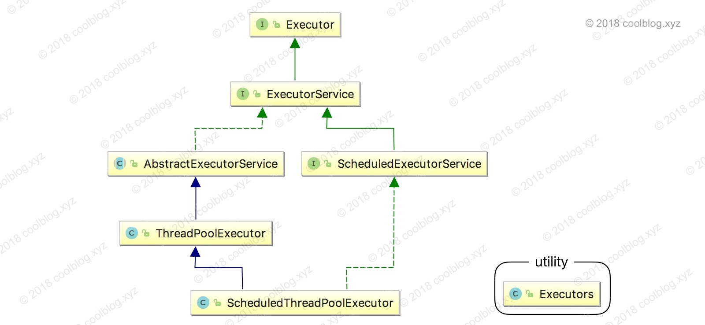
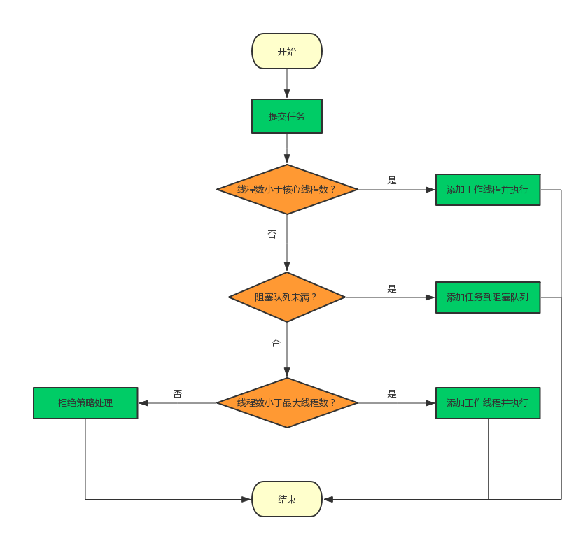

[源码分析](https://www.jianshu.com/p/d2729853c4da)

# 1 基础特性

## 1.1 线程池组成&优势

线程池可以看错一些线程的集合，用于管理线程。

new thread和线程池的比较：

**new Thread的弊端如下** ：

- 每次new Thread新建对象性能差。
- b线程缺乏统一管理，可能无限制新建线程，相互之间竞争，及可能占用过多系统资源导致死机或oom。
- 缺乏更多功能，如定时执行、定期执行、线程中断。

**Java提供的四种线程池的好处在于：**

- 减少了创建和销毁线程的次数，每个工作线程都可以被重复利用，可执行多个任务。 
- 可有效控制最大并发线程数，提高系统资源的使用率，同时避免过多资源竞争，避免堵塞。
- 提供定时执行、定期执行、单线程、并发数控制等功能。


## 1.2 执行流程

创建函数：

```java
public ThreadPoolExecutor(int corePoolSize,    //核心线程的数量
                          int maximumPoolSize,    //最大线程数量
                          long keepAliveTime,    //超出核心线程数量以外的线程空余存活时间
                          TimeUnit unit,    //存活时间的单位
                          BlockingQueue<Runnable> workQueue,    //保存待执行任务的队列
                          ThreadFactory threadFactory,    //创建新线程使用的工厂
                          RejectedExecutionHandler handler // 当任务无法执行时的处理器
                          ) {...}

```


1.线程池刚创建时，里面没有一个线程。任务队列是作为参数传进来的。不过，就算队列里面有任务，线程池也不会马上执行它们。 

2.当调用 **execute() 方法**添加一个任务时，线程池会做如下判断： 

- 如果正在运行的线程数量小于 corePoolSize，那么马上创建线程运行这个任务； 
- 如果正在运行的线程数量大于或等于 corePoolSize，那么将这个任务放入队列； 
- 如果这时候队列满了，而且正在运行的线程数量小于 maximumPoolSize，那么还是要创建非核心线程立刻运行这个任务； 
- 如果队列满了，而且正在运行的线程数量大于或等于 maximumPoolSize，那么线程池会抛出异常 RejectExecutionException。 

3.当一个线程完成任务时，它会从队列中取下一个任务来执行。 

 4.当一个线程无事可做，超过一定的时间（keepAliveTime）时，线程池会判断，如果当前运行的线程数大于 corePoolSize，那么这个线程就被停掉。所以线程池的所有任务完成后，它最终会收缩到 corePoolSize 的大小。

/Marie(2019)/programming/08%E6%80%BB%E7%AC%94%E8%AE%B0/java%E5%9F%BA%E7%A1%80/assets/3.5.jpg)


## 1.3 状态

关于线程池的状态，有5种：

1. RUNNING, 运行状态，值也是最小的，刚创建的线程池就是此状态。
2. SHUTDOWN，停工状态，不再接收新任务，已经接收的会继续执行
3. STOP，停止状态，不再接收新任务，已经接收正在执行的，也会中断
4. 清空状态，所有任务都停止了，工作的线程也全部结束了
5. TERMINATED，终止状态，线程池已销毁

 /Marie(2019)/programming/08%E6%80%BB%E7%AC%94%E8%AE%B0/java%E5%9F%BA%E7%A1%80/assets/3.6.png)


## 1.4 四种线程池

| 静态构造方法                             | 说明                                                         |
| ---------------------------------------- | ------------------------------------------------------------ |
| newFixedThreadPool(int nThreads)         | 创建一个定长线程池，可控制线程最大并发数，超出的线程会在队列中等待。 |
| newCachedThreadPool()                    | 构建线程数不定的线程池，线程数量随任务量变动，空闲线程存活时间超过60秒后会被回收 |
| newSingleThreadExecutor()                | 构建线程数为1的线程池，等价于 newFixedThreadPool(1) 所构造出的线程池 |
| newScheduledThreadPool(int corePoolSize) | 构建核心线程数为 corePoolSize，可执行定时任务的线程池        |
| newSingleThreadScheduledExecutor()       | 创建一个单线程化的线程池，它只会用唯一的工作线程来执行任务，保证所有任务按照指定顺序(FIFO, LIFO, 优先级)执行。,这个线程池可以在线程死后（或发生异常时）重新启动一个线程来替代原来的线程继续执行下去，等价于 newScheduledThreadPool(1) |


## 1.5 拒绝策略

1. 什么是线程策略

   等待队列也已经排满了，再也塞不下新任务了，同时线程池中的max线程也达到了，无法继续为新任务服务。这时我们就需要拒绝策略机制合理的处理这个问题。

| 实现类              | 说明                                          |
| ------------------- | --------------------------------------------- |
| AbortPolicy         | 丢弃新任务，并抛出 RejectedExecutionException |
| DiscardPolicy       | 不做任何操作，直接丢弃新任务                  |
| DiscardOldestPolicy | 丢弃队列队首的元素，并执行新任务              |
| CallerRunsPolicy    | 由调用线程执行新任务                          |


## 1.6 排队策略

当线程数量大于等于 corePoolSize，workQueue 未满时，则缓存新任务。这里要考虑使用什么类型的容器缓存新任务，通过 JDK 文档介绍，我们可知道有3中类型的容器可供使用，分别是`同步队列`，`有界队列`和`无界队列`。对于有优先级的任务，这里还可以增加`优先级队列`。以上所介绍的4中类型的队列，对应的实现类如下： 

| 实现类                | 类型       | 说明                                                         |
| --------------------- | ---------- | ------------------------------------------------------------ |
| SynchronousQueue      | 同步队列   | 该队列不存储元素，每个插入操作必须等待另一个线程调用移除操作，否则插入操作会一直阻塞 |
| ArrayBlockingQueue    | 有界队列   | 基于数组的阻塞队列，按照 FIFO 原则对元素进行排序             |
| LinkedBlockingQueue   | 无界队列   | 基于链表的阻塞队列，按照 FIFO 原则对元素进行排序             |
| PriorityBlockingQueue | 优先级队列 | 具有优先级的阻塞队列                                         |


## 1.7 生产上你如何设置合理参数

你在工作中单一的/固定数的/可变的三种创建线程池的方法，用哪个多？

**一个都不用，我们生产上只能使用自定义的！！！！**

为什么？

线程池不允许使用Executors创建，试试通过ThreadPoolExecutor的方式，规避资源耗尽风险

* FixedThreadPool和SingleThreadPool允许请求队列长度为Integer.MAX_VALUE，可能会堆积大量请求；
* CachedThreadPool和ScheduledThreadPool允许的创建线程数量为Integer.MAX_VALUE，可能会创建大量线程，导致OOM


 在工作中时如何使用线程池的：

```java
package com.jian8.juc.thread;

import java.util.concurrent.*;

/**
 * 第四种获得java多线程的方式--线程池
 */
public class MyThreadPoolDemo {
    public static void main(String[] args) {
        ExecutorService threadPool = new ThreadPoolExecutor(3, 5, 1L,
                							TimeUnit.SECONDS,
                							new LinkedBlockingDeque<>(3),
                                            Executors.defaultThreadFactory(), 
                                            new ThreadPoolExecutor.DiscardPolicy())
        try {
            for (int i = 1; i <= 10; i++) {
                threadPool.execute(() -> {
                    System.out.println(Thread.currentThread().getName() + "\t办理业务");
                });
            }
        } catch (Exception e) {
            e.printStackTrace();
        } finally {
            threadPool.shutdown();
        }
    }
}

```


### 1.7.1 合理配置线程池你是如何考虑的？

1. **CPU密集型**

   CPU密集的意思是该任务需要大量的运算，而没有阻塞，CPU一直全速运行

   CPU密集任务只有在真正多核CPU上才可能得到加速（通过多线程）

   而在单核CPU上，无论你开几个模拟的多线程该任务都不可能得到加速，因为CPU总的运算能力就那些

   CPU密集型任务配置尽可能少的线程数量：

   ==**一般公式：CPU核数+1个线程的线程池**==

2. **IO密集型**

   - 由于IO密集型任务线程并不是一直在执行任务，则应配置经可能多的线程，如CPU核数 * 2

   - IO密集型，即该任务需要大量的IO，即大量的阻塞。

     在单线程上运行IO密集型的任务会导致浪费大量的 CPU运算能力浪费在等待。

     所以在IO密集型任务中使用多线程可以大大的加速程序运行，即使在单核CPU上，这种加速主要就是利用了被浪费掉的阻塞时间。

     IO密集型时，大部分线程都阻塞，故需要多配置线程数：

     参考公式：==CPU核数/（1-阻塞系数） 阻塞系数在0.8~0.9之间==

     八核CPU：8/（1-0.9）=80


# 2 源码




JDK中线程池的核心实现类是ThreadPoolExecutor，先看这个类的第一个成员变量ctl，AtomicInteger这个类可以通过CAS达到无锁并发，效率比较高，这个变量有双重身份，它的高三位表示线程池的状态，低29位表示线程池中现有的线程数，用最少的变量来减少锁竞争，提高并发效率

> 看整个线程池的工作流程，有以下几个需要特别关注的并发点.

 ①: 线程池状态和工作线程数量的变更。这个由一个AtomicInteger变量 ctl来解决原子性问题。
 ②: 向工作Worker容器workers中添加新的Worker的时候。这个线程池本身已经加锁了。
 ③: 工作线程Worker从等待队列中取任务的时候。这个由工作队列本身来保证线程安全，比如LinkedBlockingQueue等。


> 源码当前先着重看一下2.1 2.2

## 2.1 execute()

> 提交任务 

1. 如果`workerCount < corePoolSize`，则创建并启动一个线程来执行新提交的任务；
2. 如果`workerCount >= corePoolSize`，且线程池内的阻塞队列未满，则将任务添加到该阻塞队列中；
3. 如果`workerCount >= corePoolSize && workerCount < maximumPoolSize`，且线程池内的阻塞队列已满，则创建并启动一个线程来执行新提交的任务；
4. 如果`workerCount >= maximumPoolSize`，并且线程池内的阻塞队列已满, 则根据拒绝策略来处理该任务, 默认的处理方式是直接抛异常。

这里要注意一下`addWorker(null, false);`，也就是创建一个线程，但并没有传入任务，因为任务已经被添加到workQueue中了，所以worker在执行的时候，会直接从workQueue中获取任务。所以，在`workerCountOf(recheck) == 0`时执行`addWorker(null, false);`也是为了保证线程池在RUNNING状态下必须要有一个线程来执行任务。

 



```java
public void execute(Runnable command) {
    if (command == null)
        throw new NullPointerException();
    /*
     * clt记录着runState和workerCount
     */
    int c = ctl.get();
    /*
     * workerCountOf方法取出低29位的值，表示当前活动的线程数；
     * 如果当前活动线程数小于corePoolSize，则新建一个线程放入线程池中；
     * 并把任务添加到该线程中。
     */
    if (workerCountOf(c) < corePoolSize) {
        /*
         * addWorker中的第二个参数表示限制添加线程的数量是根据corePoolSize来判断还是maximumPoolSize来判断；
         * 如果为true，根据corePoolSize来判断；
         * 如果为false，则根据maximumPoolSize来判断
         */
        if (addWorker(command, true))
            return;
        /*
         * 如果添加失败，则重新获取ctl值
         */
        c = ctl.get();
    }
    /*
     * 如果当前线程池是运行状态并且任务添加到队列成功
     */
    if (isRunning(c) && workQueue.offer(command)) {
        // 重新获取ctl值
        int recheck = ctl.get();
        // 再次判断线程池的运行状态，如果不是运行状态，由于之前已经把command添加到workQueue中了，
        // 这时需要移除该command
        // 执行过后通过handler使用拒绝策略对该任务进行处理，整个方法返回
        if (! isRunning(recheck) && remove(command))
            reject(command);
        /*
         * 获取线程池中的有效线程数，如果数量是0，则执行addWorker方法
         * 这里传入的参数表示：
         * 1. 第一个参数为null，表示在线程池中创建一个线程，但不去启动；
         * 2. 第二个参数为false，将线程池的有限线程数量的上限设置为maximumPoolSize，添加线程时根据maximumPoolSize来判断；
         * 如果判断workerCount大于0，则直接返回，在workQueue中新增的command会在将来的某个时刻被执行。
         */
        else if (workerCountOf(recheck) == 0)
            addWorker(null, false);
    }
    /*
     * 如果执行到这里，有两种情况：
     * 1. 线程池已经不是RUNNING状态；
     * 2. 线程池是RUNNING状态，但workerCount >= corePoolSize并且workQueue已满。
     * 这时，再次调用addWorker方法，但第二个参数传入为false，将线程池的有限线程数量的上限设置为maximumPoolSize；
     * 如果失败则拒绝该任务
     */
    else if (!addWorker(command, false))
        reject(command);
}
```


## 2.2 addWorker()

> addWorker方法的主要工作是在线程池中创建一个新的线程并执行，firstTask参数 用于指定新增的线程执行的第一个任务，core参数为true表示在新增线程时会判断当前活动线程数是否少于corePoolSize，false表示新增线程前需要判断当前活动线程数是否少于maximumPoolSize

1.开始自旋，获取ctl，根据ctl获取运行状态。判断，如果当前状态为SHUTDOWN或者firstTask == null或者 workQueue.isEmpty()，就return掉。

2.否则进入第二个自旋，根据ctl获取线程数，尝试通过CAS增加workerCount，如果成功，则跳出第一个for循环，失败的话就重新获取ctl，根据ctl获取运行状态，判断运行状态是否改变，改变了就跳出当前自旋，否则继续自旋。

3.在2中的自旋成功更新workerCount后，添加work，用 workers.add(w)，（workers是一个hashset），添加过程使用ReentrantLock加锁
                   

```java
private boolean addWorker(Runnable firstTask, boolean core) {
    retry:
    for (;;) {
        int c = ctl.get();
        // 获取运行状态
        int rs = runStateOf(c);
        
        /*
         * 这个if判断
         * 如果rs >= SHUTDOWN，则表示此时不再接收新任务；
         * 接着判断以下3个条件，只要有1个不满足，则返回false：
         * 1. rs == SHUTDOWN，这时表示关闭状态，不再接受新提交的任务，但却可以继续处理阻塞队列中已保存的任务
         * 2. firsTask为空
         * 3. 阻塞队列不为空
         * 
         * 首先考虑rs == SHUTDOWN的情况
         * 这种情况下不会接受新提交的任务，所以在firstTask不为空的时候会返回false；
         * 然后，如果firstTask为空，并且workQueue也为空，则返回false，
         * 因为队列中已经没有任务了，不需要再添加线程了
         */
        // Check if queue empty only if necessary.
        if (rs >= SHUTDOWN &&
            ! (rs == SHUTDOWN &&
               firstTask == null &&
               ! workQueue.isEmpty()))
            return false;

        for (;;) {
            // 获取线程数
            int wc = workerCountOf(c);
            // 如果wc超过CAPACITY，也就是ctl的低29位的最大值（二进制是29个1），返回false；
            // 这里的core是addWorker方法的第二个参数，如果为true表示根据corePoolSize来比较，
            // 如果为false则根据maximumPoolSize来比较。
            // 
            if (wc >= CAPACITY ||
                wc >= (core ? corePoolSize : maximumPoolSize))
                return false;
            // 尝试增加workerCount，如果成功，则跳出第一个for循环
            if (compareAndIncrementWorkerCount(c))
                break retry;
            // 如果增加workerCount失败，则重新获取ctl的值
            c = ctl.get();  // Re-read ctl
            // 如果当前的运行状态不等于rs，说明状态已被改变，返回第一个for循环继续执行
            if (runStateOf(c) != rs)
                continue retry;
            // else CAS failed due to workerCount change; retry inner loop
        }
    }

    boolean workerStarted = false;
    boolean workerAdded = false;
    Worker w = null;
    try {
        // 根据firstTask来创建Worker对象
        w = new Worker(firstTask);
        // 每一个Worker对象都会创建一个线程
        final Thread t = w.thread;
        if (t != null) {
            final ReentrantLock mainLock = this.mainLock;
            mainLock.lock();
            try {
                // Recheck while holding lock.
                // Back out on ThreadFactory failure or if
                // shut down before lock acquired.
                int rs = runStateOf(ctl.get());
                // rs < SHUTDOWN表示是RUNNING状态；
                // 如果rs是RUNNING状态或者rs是SHUTDOWN状态并且firstTask为null，向线程池中添加线程。
                // 因为在SHUTDOWN时不会在添加新的任务，但还是会执行workQueue中的任务
                if (rs < SHUTDOWN ||
                    (rs == SHUTDOWN && firstTask == null)) {
                    if (t.isAlive()) // precheck that t is startable
                        throw new IllegalThreadStateException();
                    // workers是一个HashSet
                    workers.add(w);
                    int s = workers.size();
                    // largestPoolSize记录着线程池中出现过的最大线程数量
                    if (s > largestPoolSize)
                        largestPoolSize = s;
                    workerAdded = true;
                }
            } finally {
                mainLock.unlock();
            }
            if (workerAdded) {
                // 启动线程
                t.start();
                workerStarted = true;
            }
        }
    } finally {
        if (! workerStarted)
            addWorkerFailed(w);
    }
    return workerStarted;
}

```

 

## 2.3 Worker类

**线程池中的每一个线程被封装成一个Worker对象，ThreadPool维护的其实就是一组Worker对象**，看一下Worker的定义： 

**Worker类继承了AQS，并实现了Runnable接口**，注意其中的firstTask和thread属性：firstTask用它来保存传入的任务；thread是在调用构造方法时通过ThreadFactory来创建的线程，是用来处理任务的线程。

在调用构造方法时，需要把任务传入，这里通过`getThreadFactory().newThread(this);`来新建一个线程，newThread方法传入的参数是this，因为Worker本身继承了Runnable接口，也就是一个线程，所以一个Worker对象在启动的时候会调用Worker类中的run方法。

Worker继承了AQS，使用AQS来实现独占锁的功能。为什么不使用ReentrantLock来实现呢？可以看到tryAcquire方法，它是不允许重入的，而ReentrantLock是允许重入的：

1. lock方法一旦获取了独占锁，表示当前线程正在执行任务中；
2. 如果正在执行任务，则不应该中断线程；
3. 如果该线程现在不是独占锁的状态，也就是空闲的状态，说明它没有在处理任务，这时可以对该线程进行中断；
4. 线程池在执行shutdown方法或tryTerminate方法时会调用interruptIdleWorkers方法来中断空闲的线程，interruptIdleWorkers方法会使用tryLock方法来判断线程池中的线程是否是空闲状态；
5. 之所以设置为不可重入，是因为我们不希望任务在调用像setCorePoolSize这样的线程池控制方法时重新获取锁。如果使用ReentrantLock，它是可重入的，这样如果在任务中调用了如setCorePoolSize这类线程池控制的方法，会中断正在运行的线程。

所以，Worker继承自AQS，用于判断线程是否空闲以及是否可以被中断。

此外，在构造方法中执行了`setState(-1);`，把state变量设置为-1，为什么这么做呢？是因为AQS中默认的state是0，如果刚创建了一个Worker对象，还没有执行任务时，这时就不应该被中断，看一下tryAquire方法：

```java
private final class Worker
        extends AbstractQueuedSynchronizer
        implements Runnable
{
    /**
     * This class will never be serialized, but we provide a
     * serialVersionUID to suppress a javac warning.
     */
    private static final long serialVersionUID = 6138294804551838833L;

    /** Thread this worker is running in.  Null if factory fails. */
    final Thread thread;
    /** Initial task to run.  Possibly null. */
    Runnable firstTask;
    /** Per-thread task counter */
    volatile long completedTasks;

    /**
     * Creates with given first task and thread from ThreadFactory.
     * @param firstTask the first task (null if none)
     */
    Worker(Runnable firstTask) {
        setState(-1); // inhibit interrupts until runWorker
        this.firstTask = firstTask;
        this.thread = getThreadFactory().newThread(this);
    }

    /** Delegates main run loop to outer runWorker  */
    public void run() {
        runWorker(this);
    }

    // Lock methods
    //
    // The value 0 represents the unlocked state.
    // The value 1 represents the locked state.

    protected boolean isHeldExclusively() {
        return getState() != 0;
    }

    protected boolean tryAcquire(int unused) {
        if (compareAndSetState(0, 1)) {
            setExclusiveOwnerThread(Thread.currentThread());
            return true;
        }
        return false;
    }

    protected boolean tryRelease(int unused) {
        setExclusiveOwnerThread(null);
        setState(0);
        return true;
    }

    public void lock()        { acquire(1); }
    public boolean tryLock()  { return tryAcquire(1); }
    public void unlock()      { release(1); }
    public boolean isLocked() { return isHeldExclusively(); }

    void interruptIfStarted() {
        Thread t;
        if (getState() >= 0 && (t = thread) != null && !t.isInterrupted()) {
            try {
                t.interrupt();
            } catch (SecurityException ignore) {
            }
        }
    }
}
```


## 2.4 runWorker方法

在Worker类中的run方法调用了runWorker方法来执行任务，runWorker方法的代码如下： 

```java
final void runWorker(Worker w) {
    Thread wt = Thread.currentThread();
    // 获取第一个任务
    Runnable task = w.firstTask;
    w.firstTask = null;
    // 允许中断
    w.unlock(); // allow interrupts
    // 是否因为异常退出循环
    boolean completedAbruptly = true;
    try {
        // 如果task为空，则通过getTask来获取任务
        while (task != null || (task = getTask()) != null) {
            w.lock();
            // If pool is stopping, ensure thread is interrupted;
            // if not, ensure thread is not interrupted.  This
            // requires a recheck in second case to deal with
            // shutdownNow race while clearing interrupt
            if ((runStateAtLeast(ctl.get(), STOP) ||
                 (Thread.interrupted() &&
                  runStateAtLeast(ctl.get(), STOP))) &&
                !wt.isInterrupted())
                wt.interrupt();
            try {
                beforeExecute(wt, task);
                Throwable thrown = null;
                try {
                    task.run();
                } catch (RuntimeException x) {
                    thrown = x; throw x;
                } catch (Error x) {
                    thrown = x; throw x;
                } catch (Throwable x) {
                    thrown = x; throw new Error(x);
                } finally {
                    afterExecute(task, thrown);
                }
            } finally {
                task = null;
                w.completedTasks++;
                w.unlock();
            }
        }
        completedAbruptly = false;
    } finally {
        processWorkerExit(w, completedAbruptly);
    }
}

```

