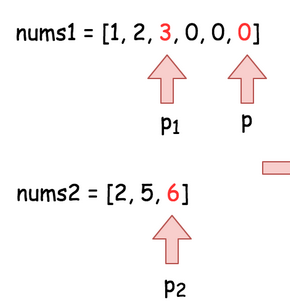

# 合并两个有序数组

### 信息卡片

- 时间： 2019-1-16
- 题目链接：https://leetcode-cn.com/problems/merge-sorted-array
- 难度：简单
- 题目描述：

```
给定两个有序整数数组 nums1 和 nums2，将 nums2 合并到 nums1 中，使得 num1 成为一个有序数组。

说明:

    初始化 nums1 和 nums2 的元素数量分别为 m 和 n。
    你可以假设 nums1 有足够的空间（空间大小大于或等于 m + n）来保存 nums2 中的元素。

示例:

输入:
nums1 = [1,2,3,0,0,0], m = 3
nums2 = [2,5,6],       n = 3

输出: [1,2,2,3,5,6]
```


### 参考答案

> 思路

双指针 / 从后往前




> 代码


```js
class Solution {
    public void merge(int[] nums1, int m, int[] nums2, int n) {
        int p1 = m - 1;
        int p2 = n - 1;
        int p = m + n - 1;

        while(p1 >= 0 && p2 >= 0){
//            if(nums2[p2] > nums1[p1]){
//                nums1[p--] = nums2[p2--];
//            }else{
//                nums1[p--] = nums1[p1--];
//            }
            nums1[p--] = nums2[p2] > nums1[p1] ?   nums2[p2--]:  nums1[p1--];
        }
        System.arraycopy(nums2,0,nums1,0,p2+1);
    }
}
```


> 复杂度分析

时间复杂度 : O(n+m)。

空间复杂度 : O(m)。


### 其他优秀解答

> 暂无


