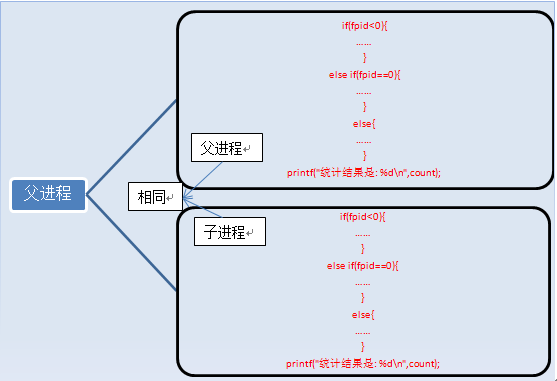
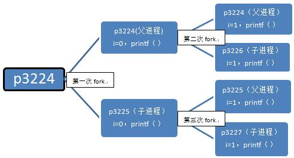
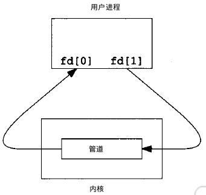
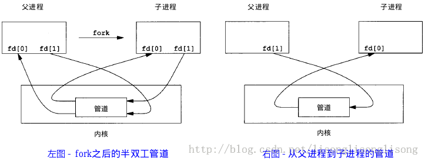
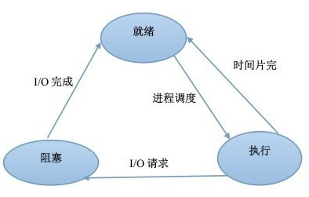

# 1 进程与线程的区别

1. 进程是资源的分配和调度的一个独立单元，而线程是CPU调度的基本单元
2. 同一个进程中可以包括多个线程，并且线程共享整个进程的资源（寄存器、堆栈、上下文），一个进行至少包3.进程的创建调用fork或者vfork，而线程的创建调用pthread_create，进程结束后它拥有的所有线程都将销毁，而线程的结束不会影响同个进程中的其他线程的结束
3. 线程是轻两级的进程，它的创建和销毁所需要的时间比进程小很多，所有操作系统中的执行功能都是创建线程去完成的
4. 线程中执行时一般都要进行同步和互斥，因为他们共享同一进程的所有资源
5. 线程有自己的私有属性TCB，线程id，寄存器、硬件上下文，而进程也有自己的私有属性进程控制块PCB，这些私有属性是不被共享的，用来标示一个进程或一个线程的标志


**共享的资源有：**

1. 堆：由于堆是在进程空间中开辟出来的，所以它是理所当然地被共享的；因此new出来的都是共享的（16位平台上分全局堆和局部堆，局部堆是独享的）

2. 全局变量 它是与具体某一函数无关的，所以也与特定线程无关；因此也是共享的
3. 静态变量 虽然对于局部变量来说，它在代码中是“放”在某一函数中的，但是其存放位置和全局变量一样，存于堆中开辟的.bss和.data段，是共享的
4. 文件等公用资源  这个是共享的，使用这些公共资源的线程必须同步。Win32 提供了几种同步资源的方式，包括信号、临界区、事件和互斥体。

**独享的资源有：**

1. 栈：栈是独享的
2. 寄存器 ：这个可能会误解，因为电脑的寄存器是物理的，每个线程去取值难道不一样吗？其实线程里存放的是副本，包括程序计数器PC


# 2 fork

[博客1][https://blog.csdn.net/jason314/article/details/5640969]

[博客2][https://www.jianshu.com/p/1327c51a4a99]

一个进程，包括代码、数据和分配给进程的资源。fork（）函数通过系统调用创建一个与原来进程几乎完全相同的进程，也就是两个进程可以做完全相同的事，但如果初始参数或者传入的变量不同，两个进程也可以做不同的事。 

一个进程调用fork（）函数后，系统先给新的进程分配资源，例如存储数据和代码的空间。然后把原来的进程的所有值都复制到新的新进程中，只有少数值与原来的进程的值不同。相当于克隆了一个自己。

### 2.1 示例1

```c
/*
 *  fork_test.c
 *  version 1
 *  Created on: 2010-5-29
 *      Author: wangth
 */
#include <unistd.h>
#include <stdio.h> 
int main () 
{ 
	pid_t fpid; //fpid表示fork函数返回的值
	int count=0;
	fpid=fork(); 
	if (fpid < 0) 
		printf("error in fork!"); 
	else if (fpid == 0) {
		printf("i am the child process, my process id is %d/n",getpid()); 
		count++;
	}
	else {
		printf("i am the parent process, my process id is %d/n",getpid()); 
		count++;
	}
	printf("统计结果是: %d/n",count);
	return 0;
}
```


运行结果：

```
 i am the child process, my process id is 5574
 统计结果是: 1
 i am the parent process, my process id is 5573
 统计结果是: 1
```




> 可以看到，这里代码的复制是从if(fpid<0)开始的，而不是#include <unistd.h>

这两个进程的变量都是独立的，存在不同的地址中，不是共用的，这点要注意。可以说，我们就是**通过fpid来识别和操作父子进程的。**

每个进程都有一个独特（互不相同）的进程标识符（process ID），可以通过getpid（）函数获得，还有一个记录父进程pid的变量，可以通过getppid（）函数获得变量的值。 

**fpid可能有三种不同的返回值：**
    1）在父进程中，fork返回新创建子进程的进程ID；
    2）在子进程中，fork返回0；
    3）如果出现错误，fork返回一个负值；

其实就相当于链表，进程形成了链表，父进程的fpid(p 意味point)指向子进程的进程id, 因为子进程没有子进程，所以其fpid为0. 


**fork出错可能有两种原因：**     

1）当前的进程数已经达到了系统规定的上限，这时errno的值被设置为EAGAIN。    

2）系统内存不足，这时errno的值被设置为ENOMEM。 


> 创建新进程成功后，系统中出现两个基本完全相同的进程，这两个进程执行没有固定的先后顺序，哪个进程先执行要看系统的进程调度策略。 


### 2.2 示例2

```c
/*
 *  fork_test.c
 *  version 2
 *  Created on: 2010-5-29
 *      Author: wangth
 */
#include <unistd.h>
#include <stdio.h>
int main(void)
{
   int i=0;
   printf("start/n");
   //ppid指当前进程的父进程pid
   //pid指当前进程的pid,
   //fpid指fork返回给当前进程的值
   for(i=0;i<2;i++){
       pid_t fpid=fork();
       if(fpid==0)
    	   printf("%d child  %4d %4d %4d/n",i,getppid(),getpid(),fpid);
       else
    	   printf("%d parent %4d %4d %4d/n",i,getppid(),getpid(),fpid);
   }
   return 0;
}
```


输出结果：

```c
	start
  //i    getppid(),getpid(),fpid
    0 parent 2043 3224 3225
    0 child  3224 3225    0
    1 parent 2043 3224 3226
    1 parent 3224 3225 3227
    1 child     1 3227    0
    1 child     1 3226    0 
```





p3226，p3227的父进程难道不该是p3224和p3225吗，怎么会是1呢？这里得讲到进程的创建和死亡的过程，在p3224和p3225执行完第二个循环后，main函数就该退出了，也即进程该死亡了，因为它已经做完所有事情了。p3224和p3225死亡后，p3226，p3227就没有父进程了，这在操作系统是不被允许的，所以p3226，p3227的父进程就被置为p1了，p1是永远不会死亡的.

> 这个程序最终产生了3个子进程，执行过6次printf（）函数。 


p2043是main函数的进程。①②③④这些数字表示进程执行的顺序。

​		  ①		②

p2043->p3224->p3225  

​		   ③		 ④

​		   ↓             ↓

​		p3226   p3227

​		    ⑤	  ⑥


### 2.3 示例3

```c
/*
 *  fork_test.c
 *  version 3
 *  Created on: 2010-5-29
 *      Author: wangth
 */
#include <unistd.h>
#include <stdio.h>
int main(void)
{
   int i=0;
   for(i=0;i<3;i++){
       pid_t fpid=fork();
       if(fpid==0)
    	   printf("son/n");
       else
    	   printf("father/n");
   }
   return 0;

}
```


```
    father
    son
    father
    father
    father
    father
    son
    son
    father
    son
    son
    son
    father
    son 
```

分析：

 for        i=0          1                 2
              father     father     father
                                              son
                                son       father
                                              son
               son        father     father
                                             son
                              son        father
                                            son


### 2.4 示例4

```java
/*
 *  fork_test.c
 *  version 4
 *  Created on: 2010-5-29
 *      Author: wangth
 */
#include <unistd.h>
#include <stdio.h>
int main() {
	pid_t fpid;//fpid表示fork函数返回的值
	//printf("fork!");
	printf("fork!/n");
	fpid = fork();
	if (fpid < 0)
		printf("error in fork!");
	else if (fpid == 0)
		printf("I am the child process, my process id is %d/n", getpid());
	else
		printf("I am the parent process, my process id is %d/n", getpid());
	return 0;
}
```


 执行结果如下：

```
 fork!
I am the parent process, my process id is 3361
I am the child process, my process id is 3362 
```


 如果把语句printf("fork!/n");注释掉，执行printf("fork!");

   则新的程序的执行结果是：

```
fork!I am the parent process, my process id is 3298
fork!I am the child process, my process id is 3299 
```

就跟printf的缓冲机制有关了，printf某些内容时，操作系统仅仅是把该内容放到了stdout的缓冲队列里了,并没有实际的写到屏幕上。但是,只要看到有/n 则会立即刷新stdout,因此就马上能够打印了。

- 运行了printf("fork!")后,“fork!”仅仅被放到了缓冲里,程序运行到fork时缓冲里面的“fork!”  被子进程复制过去了。
-  而运行printf("fork! /n")后,“fork!”被立即打印到了屏幕上。


### 2.5 示例5

```c
#include <stdio.h>
int main(int argc, char* argv[])
{
   fork();
   fork() && fork() || fork();
   fork();
   printf("+/n");
}

```


# 3 进程间的通信方式（IPC）

> InterProcess Communication 

### 2.1 管道

管道，通常指无名管道，是 UNIX 系统IPC最古老的形式。
**特点：**

它是半双工的（即数据只能在一个方向上流动），具有固定的读端和写端。

它只能用于具有亲缘关系的进程之间的通信（也是父子进程或者兄弟进程之间）。

它可以看成是一种特殊的文件，对于它的读写也可以使用普通的read、write 等函数。但是它不是普通的文件，并不属于其他任何文件系统，并且只存在于内存中。

```c
#include <unistd.h>
int pipe(int fd[2]);    // 返回值：若成功返回0，失败返回-1
```

当一个管道建立时，它会创建两个文件描述符：`fd[0]`为读而打开，`fd[1]`为写而打开。如下图： 



要关闭管道只需将这两个文件描述符关闭即可。 


 **例子**

单个进程中的管道几乎没有任何用处。所以，通常调用 pipe 的进程接着调用 fork，这样就创建了父进程与子进程之间的 IPC 通道。如下图所示： 



若要数据流从父进程流向子进程，则关闭父进程的读端（`fd[0]`）与子进程的写端（`fd[1]`）；反之，则可以使数据流从子进程流向父进程。 

```c
#include<stdio.h>
#include<unistd.h>
 
int main()
{
     int fd[2];  // 两个文件描述符
     pid_t pid;
     char buff[20];
 
     if(pipe(fd) < 0)  // 创建管道
         printf("Create Pipe Error!\n");
 
     if((pid = fork()) < 0)  // 创建子进程
         printf("Fork Error!\n");
     else if(pid > 0)  // 父进程
     {
         close(fd[0]); // 关闭读端
         write(fd[1], "hello world\n", 12);
     }
     else
     {         
         close(fd[1]); // 关闭写端
         read(fd[0], buff, 20);
         printf("%s", buff);
     } 
    return 0;
}


```


### 2.2 FIFO

FIFO，也称为命名管道，它是一种文件类型。

**特点:**

1. FIFO可以在无关的进程之间交换数据，与无名管道不同。
2. FIFO有路径名与之相关联，它以一种特殊设备文件形式存在于文件系统中。


FIFO的通信方式类似于在进程中使用文件来传输数据，只不过FIFO类型文件同时具有管道的特性。在数据读出时，FIFO管道中同时清除数据，并且“先进先出”。下面的例子演示了使用 FIFO 进行 IPC 的过程： 

write_fifo.c ：

```c
 1 #include<stdio.h>
 2 #include<stdlib.h>   // exit
 3 #include<fcntl.h>    // O_WRONLY
 4 #include<sys/stat.h>
 5 #include<time.h>     // time
 6 
 7 int main()
 8 {
 9     int fd;
10     int n, i;
11     char buf[1024];
12     time_t tp;
13 
14     printf("I am %d process.\n", getpid()); // 说明进程ID
15     
16     if((fd = open("fifo1", O_WRONLY)) < 0) // 以写打开一个FIFO 
17     {
18         perror("Open FIFO Failed");
19         exit(1);
20     }
21 
22     for(i=0; i<10; ++i)
23     {
24         time(&tp);  // 取系统当前时间
25         n=sprintf(buf,"Process %d's time is %s",getpid(),ctime(&tp));
26         printf("Send message: %s", buf); // 打印
27         if(write(fd, buf, n+1) < 0)  // 写入到FIFO中
28         {
29             perror("Write FIFO Failed");
30             close(fd);
31             exit(1);
32         }
33         sleep(1);  // 休眠1秒
34     }
35 
36     close(fd);  // 关闭FIFO文件
37     return 0;
38 }

```

read_fifo.c :

```c
 1 #include<stdio.h>
 2 #include<stdlib.h>
 3 #include<errno.h>
 4 #include<fcntl.h>
 5 #include<sys/stat.h>
 6 
 7 int main()
 8 {
 9     int fd;
10     int len;
11     char buf[1024];
12 
13     if(mkfifo("fifo1", 0666) < 0 && errno!=EEXIST) // 创建FIFO管道
14         perror("Create FIFO Failed");
15 
16     if((fd = open("fifo1", O_RDONLY)) < 0)  // 以读打开FIFO
17     {
18         perror("Open FIFO Failed");
19         exit(1);
20     }
21     
22     while((len = read(fd, buf, 1024)) > 0) // 读取FIFO管道
23         printf("Read message: %s", buf);
24 
25     close(fd);  // 关闭FIFO文件
26     return 0;
27 }
```


在两个终端里用 gcc 分别编译运行上面两个文件，可以看到输出结果如下： 

```c
1 [cheesezh@localhost]$ ./write_fifo 
 2 I am 5954 process.
 3 Send message: Process 5954's time is Mon Apr 20 12:37:28 2015
 4 Send message: Process 5954's time is Mon Apr 20 12:37:29 2015
 5 Send message: Process 5954's time is Mon Apr 20 12:37:30 2015
 6 Send message: Process 5954's time is Mon Apr 20 12:37:31 2015
 7 Send message: Process 5954's time is Mon Apr 20 12:37:32 2015
 8 Send message: Process 5954's time is Mon Apr 20 12:37:33 2015
 9 Send message: Process 5954's time is Mon Apr 20 12:37:34 2015
10 Send message: Process 5954's time is Mon Apr 20 12:37:35 2015
11 Send message: Process 5954's time is Mon Apr 20 12:37:36 2015
12 Send message: Process 5954's time is Mon Apr 20 12:37:37 2015
```

```c
 1 [cheesezh@localhost]$ ./read_fifo 
 2 Read message: Process 5954's time is Mon Apr 20 12:37:28 2015
 3 Read message: Process 5954's time is Mon Apr 20 12:37:29 2015
 4 Read message: Process 5954's time is Mon Apr 20 12:37:30 2015
 5 Read message: Process 5954's time is Mon Apr 20 12:37:31 2015
 6 Read message: Process 5954's time is Mon Apr 20 12:37:32 2015
 7 Read message: Process 5954's time is Mon Apr 20 12:37:33 2015
 8 Read message: Process 5954's time is Mon Apr 20 12:37:34 2015
 9 Read message: Process 5954's time is Mon Apr 20 12:37:35 2015
10 Read message: Process 5954's time is Mon Apr 20 12:37:36 2015
11 Read message: Process 5954's time is Mon Apr 20 12:37:37 2015

```

上述例子可以扩展成 客户进程—服务器进程 通信的实例，write_fifo的作用类似于客户端，可以打开多个客户端向一个服务器发送请求信息，read_fifo类似于服务器，它适时监控着FIFO的读端，当有数据时，读出并进行处理，但是有一个关键的问题是，每一个客户端必须预先知道服务器提供的FIFO接口，下图显示了这种安排：


### 2.3 消息队列

消息队列，是消息的链接表，存放在内核中。一个消息队列由一个标识符（即队列ID）来标识。

**特点：**

1. 消息队列是面向记录的，其中的消息具有特定的格式以及特定的优先级。
2. 消息队列独立于发送与接收进程。进程终止时，消息队列及其内容并不会被删除。

3. 消息队列可以实现消息的随机查询,消息不一定要以先进先出的次序读取,也可以按消息的类型读取。


### 2.4 信号量

信号量（semaphore）与已经介绍过的 IPC 结构不同，它是一个计数器。信号量用于实现进程间的互斥与同步，而不是用于存储进程间通信数据。

**特点：**

1. 信号量用于进程间同步，若要在进程间传递数据需要结合共享内存。
2. 信号量基于操作系统的 PV 操作，程序对信号量的操作都是原子操作。

3. 每次对信号量的 PV 操作不仅限于对信号量值加 1 或减 1，而且可以加减任意正整数。

4. 支持信号量组。


最简单的信号量是只能取 0 和 1 的变量，这也是信号量最常见的一种形式，叫做二值信号量（Binary Semaphore）。而可以取多个正整数的信号量被称为通用信号量。

Linux 下的信号量函数都是在通用的信号量数组上进行操作，而不是在一个单一的二值信号量上进行操作。


### 2.5 共享内存

共享内存（Shared Memory），指两个或多个进程共享一个给定的存储区。

**特点：**

1. 共享内存是最快的一种 IPC，因为进程是直接对内存进行存取。
2. 因为多个进程可以同时操作，所以需要进行同步。

3. 信号量+共享内存通常结合在一起使用，信号量用来同步对共享内存的访问


### 2.6 信号

**1. 概念：**

 　　1）信号是在软件层次上对中断机制的一种模拟，是一种异步通信方式

 　　2）信号可以直接进行用户空间进程和内核进程之间的交互，内核进程也可以利用它来通知用户空间进程发生了哪些系统事件。

 　　3）如果该进程当前并未处于执行态，则该信号就由内核保存起来，直到该进程恢复执行再传递给它；如果一个信号被进程设置为阻塞，则该信号的传递被延迟，直到其阻塞被 取消时才被传递给进程。

 **2.用户进程对信号的响应方式：**

 　　1）忽略信号：对信号不做任何处理，但是有两个信号不能忽略：即SIGKILL及SIGSTOP。

 　　2）捕捉信号：定义信号处理函数，当信号发生时，执行相应的处理函数。

 　　3）执行缺省操作：Linux对每种信号都规定了默认操作

 

### 2.7 套接字(socket)

面说到的进程间的通信，所通信的进程都是在同一台计算机上的，而使用socket进行通信的进程可以是同一台计算机的进程，也是可以是通过网络连接起来的不同计算机上的进程。通常我们使用socket进行网络编程，这里将会简单地讲述如何使用``socket``进行简单的网络编程。 

套接字的特性由3个属性确定，它们分别是：**域、类型和协议**。 

1. **套接字的域**

  它指定套接字通信中使用的网络介质，最常见的套接字域是AF_INET，它指的是Internet网络。当客户使用套接字进行跨网络的连接时，它就需要用到服务器计算机的IP地址和端口来指定一台联网机器上的某个特定服务，所以在使用socket作为通信的终点，服务器应用程序必须在开始通信之前绑定一个端口，服务器在指定的端口等待客户的连接。另一个域AF_UNIX表示UNIX文件系统，它就是文件输入/输出，而它的地址就是文件名。


2. **套接字类型**

  因特网提供了两种通信机制：流（stream）和数据报（datagram），因而套接字的类型也就分为流套接字和数据报套接字。这里主要讲流套接字。

- **流套接字**由类型SOCK_STREAM指定，它们是在AF_INET域中通过**TCP/IP**连接实现，同时也是AF_UNIX中常用的套接字类型。流套接字提供的是一个有序、可靠、双向字节流的连接，因此发送的数据可以确保不会丢失、重复或乱序到达，而且它还有一定的出错后重新发送的机制。
- **数据报套接字**由类型SOCK_DGRAM指定，它不需要建立连接和维持一个连接，它们在AF_INET中通常是通过**UDP/IP协议**实现的。它对可以发送的数据的长度有限制，数据报作为一个单独的网络消息被传输,它可能会丢失、复制或错乱到达，UDP不是一个可靠的协议，但是它的速度比较高，因为它并一需要总是要建立和维持一个连接。


### 2.7 总结

1. **管道：**速度慢，容量有限，只有父子进程能通讯    
2. **FIFO：**任何进程间都能通讯，但速度慢    
3. **消息队列：**容量受到系统限制，且要注意第一次读的时候，要考虑上一次没有读完数据的问题    
4. **信号量：**不能传递复杂消息，只能用来同步    
5. **共享内存区：**能够很容易控制容量，速度快，但要保持同步，比如一个进程在写的时候，另一个进程要注意读写的问题，相当于线程中的线程安全，当然，共享内存区同样可以用作线程间通讯，不过没这个必要，线程间本来就已经共享了同一进程内的一块内存


# 4 线程同步的方式

- **互斥量 Synchronized/Lock**：采用互斥对象机制，只有拥有互斥对象的线程才有访问公共资源的权限。因为互斥对象只有一个，所以可以保证公共资源不会被多个线程同时访问
- **信号量 Semphare：**它允许同一时刻多个线程访问同一资源，但是需要控制同一时刻访问此资源的最大线程数量

- **事件(信号)，Wait/Notify：**通过通知操作的方式来保持多线程同步，还可以方便的实现多线程优先级的比较操作
  

# 5 进程同步有哪几种机制 


# 6 线程生命周期状态


### 6.1 新建

当程序使用new关键字创建了一个线程之后，该线程就处于新建状态，此时仅由 JVM 为其分配内存，并初始化其成员变量的值

 

### 6.2 就绪

当线程对象调用了 start()方法之后，该线程处于就绪状态。Java 虚拟机会为其创建方法调用栈和程序计数器，等待调度运行.


### 6.3 运行 Running

如果处于就绪状态的线程获得了CPU资源，就开始执行run方法的线程执行体，则该线程处于运行状态。run方法的那里呢？其实run也是在native线程中。


### 6.4 阻塞 Blocked

阻塞状态是线程因为某种原因放弃CPU使用权，暂时停止运行。直到线程进入就绪状态，才有机会转到运行状态。阻塞的情况大概三种：

1. **等待阻塞：**运行的线程执行wait()方法，JVM会把该线程放入等待池中。(wait会释放持有的锁)
2. **同步阻塞：**运行的线程在获取对象的同步锁时，若该同步锁被别的线程占用，则JVM会把该线程放入锁池中。
3. **其他阻塞：**运行的线程执行sleep()或join()方法，或者发出了I/O请求时，JVM会把该线程置为阻塞状态。当sleep()状态超时、join()等待线程终止或者超时、或者I/O处理完毕时，线程重新转入就绪状态。（注意,sleep是不会释放持有的锁）。

**线程睡眠：**Thread.sleep(long millis)方法，使线程转到阻塞状态。millis参数设定睡眠的时间，以毫秒为单位。当睡眠结束后，就转为就绪（Runnable）状态。sleep()平台移植性好。
 **线程等待：**Object类中的wait()方法，导致当前的线程等待，直到其他线程调用此对象的 notify() 方法或 notifyAll() 唤醒方法。这个两个唤醒方法也是Object类中的方法，行为等价于调用 wait(0) 一样。唤醒线程后，就转为就绪（Runnable）状态。
 **线程让步：**Thread.yield() 方法，暂停当前正在执行的线程对象，把执行机会让给相同或者更高优先级的线程。
 **线程加入：**join()方法，等待其他线程终止。在当前线程中调用另一个线程的join()方法，则当前线程转入阻塞状态，直到另一个进程运行结束，当前线程再由阻塞转为就绪状态。
 **线程I/O：**线程执行某些IO操作，因为等待相关的资源而进入了阻塞状态。比如说监听system.in，但是尚且没有收到键盘的输入，则进入阻塞状态。
 **线程唤醒：**Object类中的notify()方法，唤醒在此对象监视器上等待的单个线程。如果所有线程都在此对象上等待，则会选择唤醒其中一个线程，选择是任意性的，并在对实现做出决定时发生。类似的方法还有一个notifyAll()，唤醒在此对象监视器上等待的所有线程。


### 6.5 死亡 Dead

线程会以以下三种方式之一结束，结束后就处于死亡状态:

1. run()方法执行完成，线程正常结束。
2. 线程抛出一个未捕获的Exception或Error。
3. 直接调用该线程的stop()方法来结束该线程——该方法容易导致死锁，通常不推荐使用。


## 7 进程生命周期

就绪状态：进程已获得除处理机以外的所需资源，等待分配处理机资源；

运行状态：占用处理机资源运行，处于此状态的进程数小于等于CPU数；

阻塞状态： 进程等待某种条件，在条件满足之前无法执行；




# 8 **什么是死锁？死锁产生的条件？** 

[博客][https://blog.csdn.net/wljliujuan/article/details/79614019]

### 8.1 死锁的概念

在两个或者多个并发进程中，如果每个进程持有某种资源而又等待其它进程释放它或它们现在保持着的资源，在未改变这种状态之前都不能向前推进，称这一组进程产生了死锁。通俗的讲，就是两个或多个进程无限期的阻塞、相互等待的一种状态。


### 8.2 死锁产生的四个必要条件

互斥：至少有一个资源必须属于非共享模式，即一次只能被一个进程使用；若其他申请使用该资源，那么申请进程必须等到该资源被释放为止；

占有并等待：一个进程必须占有至少一个资源，并等待另一个资源，而该资源为其他进程所占有；

非抢占：进程不能被抢占，即资源只能被进程在完成任务后自愿释放

循环等待：若干进程之间形成一种头尾相接的环形等待资源关系


# 9 **分页和分段有什么区别（内存管理）** 

[博客][https://www.zhihu.com/question/50796850]

放一下。不太会


两者的不同点：

- 目的不同：分页是由于系统管理的需要而不是用户的需要，它是信息的物理单位；分段的目的是为了能更好地满足用户的需要，它是信息的逻辑单位，它含有一组其意义相对完整的信息；
- 大小不同：页的大小固定且由系统决定，而段的长度却不固定，由其所完成的功能决定；

- 地址空间不同： 段向用户提供二维地址空间；页向用户提供的是一维地址空间；

- 信息共享：段是信息的逻辑单位，便于存储保护和信息的共享，页的保护和共享受到限制；

- 内存碎片：页式存储管理的优点是没有外碎片（因为页的大小固定），但会产生内碎片（一个页可能填充不满）；而段式管理的优点是没有内碎片（因为段大小可变，改变段大小来消除内碎片）。但段换入换出时，会产生外碎片（比如4k的段换5k的段，会产生1k的外碎片）。


# 10 操作系统中进程调度策略


# 11 **什么是虚拟内存** 