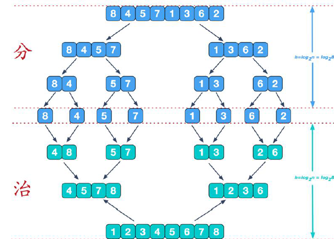
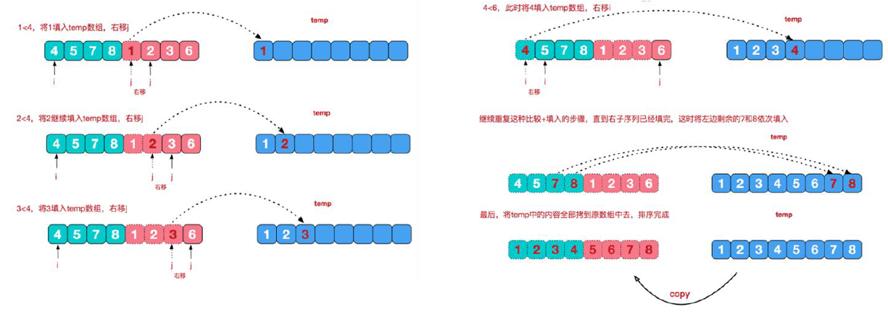

# 归并排序

#### 1.介绍

归并排序（MERGE-SORT）是利用归并的思想实现的排序方法，该算法采用经典的分治（divide-and-conquer）
策略。

分治法将问题分(divide)成一些小的问题然后递归求解，而治(conquer)的阶段则将分的阶段得到的各答案"修补"在一起。


#### 2.解决思路

分：将数组通过mergeSort函数分成8个部分，然后再分别排序。




治的过程：merge是将分开的数组有序合并的过程。可以看到合并的过程需要一个额外的temp数组进行存储。

将数组分成两部分，i = 0，j = mid+1，对两个指针指向的数字进行比较，将其中小的数字放入temp数组并进行指针++。

若最终i==mid，说明左边的数组全部放入了temp数组，这时只要将右边剩余的数组全部放入temp数组即可。

若最终j==right，说明右边的数组全部放入了temp数组，这时只要将左边剩余的数组全部放入temp数组即可。

注意：

最后temp数组排序完毕后，需要将temp数组的数据放入arr原数组中，根据函数传来的left和right参数确定在temp排序的数组在arr数组中的方位。




#### 3.代码

> 代码实现

```java
//分+合方法
public static void mergeSort(int[] arr, int left, int right, int[] temp) {
    if(left < right){
        int mid = (left + right) / 2;
        mergeSort(arr,left,mid,temp);
        mergeSort(arr,mid + 1,right,temp);
        // 左右归并
        merge(arr,left,mid,right,temp);
    }
}

//合并的方法
public static void merge(int[] arr, int left, int mid, int right, int[] temp) {
    int i = left;
    int j = mid + 1;
    int t = 0;
     // 把较小的数先移到新数组中
    while(i <= mid && j <= right){
        if(arr[i] <= arr[j]){
            temp[t] = arr[i];
            t++;
            i++;
        }

        if(arr[i] > arr[j]){
            temp[t] = arr[j];
            t++;
            j++;
        }
    }
    
 // 把左边剩余的数移入数组
    while(i <= mid){
        temp[t] = arr[i];
        t++;
        i++;
    }
    // 把右边边剩余的数移入数组
    while(j <= right){
        temp[t] = arr[j];
        t++;
        j++;
    }

    //将temp数组的数据放入arr原数组
    t = 0;
    while(left <= right){
        arr[left] = temp[t];
        t++;
        left++;
    }
}
```

