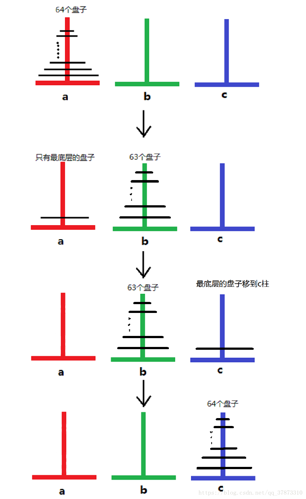

# 汉诺塔

#### 1.介绍

汉诺塔：汉诺塔（又称河内塔）问题是源于印度一个古老传说的益智玩具。大梵天创造世界的时候做了三根金
刚石柱子，在一根柱子上从下往上按照大小顺序摞着64 片黄金圆盘。大梵天命令婆罗门把圆盘从下面开始按大小
顺序重新摆放在另一根柱子上。并且规定，在小圆盘上不能放大圆盘，在三根柱子之间一次只能移动一个圆盘。


#### 2.解决思路

算法：当只有一个盘子的时候，只需要从将A塔上的一个盘子移到C塔上。

  当A塔上有两个盘子是，先将A塔上的1号盘子（编号从上到下）移动到B塔上，再将A塔上的2号盘子移动的C塔上，最后将B塔上的小盘子移动到C塔上。

当A塔上有3个盘子时，先将A塔上编号1至2的盘子（共2个）移动到B塔上（需借助C塔），然后将A塔上的3号最大的盘子移动到C塔，最后将B塔上的两个盘子借助A塔移动到C塔上。

   当A塔上有n个盘子是，先将A塔上编号1至n-1的盘子（共n-1个）移动到B塔上（借助C塔），然后将A塔上最大的n号盘子移动到C塔上，最后将B塔上的n-1个盘子借助A塔移动到C塔上。

  综上所述，除了只有一个盘子时不需要借助其他塔外，其余情况均一样（只是事件的复杂程度不一样）。



参考博客：https://blog.csdn.net/qq_37873310/article/details/80461767


#### 3.代码

> 代码实现

```
package demo;

public class Hanoitower {

    public static void main(String[] args) {
        hanoiTower(3, 'A', 'B', 'C');
    }

    //汉诺塔的移动的方法
    //使用分治算法

    public static void hanoiTower(int num, char a, char b, char c) {
        //如果只有一个盘
        if(num == 1) {
            System.out.println("第1个盘从 " + a + "->" + c);
        } else {
            //如果我们有 n >= 2 情况，我们总是可以看做是两个盘 1.最下边的一个盘 2. 上面的所有盘
            //1. 先把 最上面的所有盘 A->B， 移动过程会使用到 c
            hanoiTower(num - 1, a, c, b);
            //2. 把最下边的盘 A->C
            System.out.println("第" + num + "个盘从 " + a + "->" + c);
            //3. 把B塔的所有盘 从 B->C , 移动过程使用到 a塔
            hanoiTower(num - 1, b, a, c);

        }
    }

}


```

