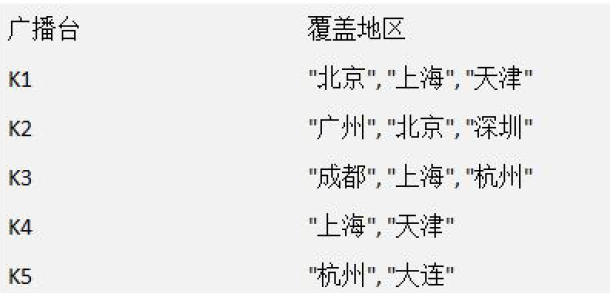

# 贪心算法

#### 1.介绍

贪婪算法(贪心算法)是指在对问题进行求解时，在每一步选择中都采取最好或者最优(即最有利)的选择，从而
希望能够导致结果是最好或者最优的算法

贪婪算法所得到的结果不一定是最优的结果(有时候会是最优解)，但是都是相对近似(接近)最优解的结果


#### 2.问题&解决思路

假设存在如下表的需要付费的广播台，以及广播台信号可以覆盖的地区。如何选择最少的广播台，让所有
的地区都可以接收到信号




1. 遍历所有的广播电台, 找到一个覆盖了最多未覆盖的地区的电台(此电台可能包含一些已覆盖的地区，但没有关

系）

2. 将这个电台加入到一个集合中(比如ArrayList), 想办法把该电台覆盖的地区在下次比较时去掉。
3. 重复第1 步直到覆盖了全部的地区


#### 3.代码

> 代码实现

```
package demo;
import java.util.HashMap;
import java.util.HashSet;
import java.util.ArrayList;

public class GreedyAlgorithm {

    public static void main(String[] args) {
        //创建广播电台,放入到Map
        HashMap<String,HashSet<String>> broadcasts = new HashMap<String, HashSet<String>>();
        //将各个电台放入到broadcasts
        HashSet<String> hashSet1 = new HashSet<String>();
        hashSet1.add("北京");
        hashSet1.add("上海");
        hashSet1.add("天津");

        HashSet<String> hashSet2 = new HashSet<String>();
        hashSet2.add("广州");
        hashSet2.add("北京");
        hashSet2.add("深圳");

        HashSet<String> hashSet3 = new HashSet<String>();
        hashSet3.add("成都");
        hashSet3.add("上海");
        hashSet3.add("杭州");


        HashSet<String> hashSet4 = new HashSet<String>();
        hashSet4.add("上海");
        hashSet4.add("天津");

        HashSet<String> hashSet5 = new HashSet<String>();
        hashSet5.add("杭州");
        hashSet5.add("大连");

        //加入到map
        broadcasts.put("K1", hashSet1);
        broadcasts.put("K2", hashSet2);
        broadcasts.put("K3", hashSet3);
        broadcasts.put("K4", hashSet4);
        broadcasts.put("K5", hashSet5);

        //allAreas 存放所有的地区
        HashSet<String> allAreas = new HashSet<String>();
        allAreas.add("北京");
        allAreas.add("上海");
        allAreas.add("天津");
        allAreas.add("广州");
        allAreas.add("深圳");
        allAreas.add("成都");
        allAreas.add("杭州");
        allAreas.add("大连");

        //创建ArrayList, 存放选择的电台集合
        ArrayList<String> selects = new ArrayList<String>();

        //定义一个临时的集合
        HashSet<String> tempSet = new HashSet<String>();


        String maxKey = null;
        while(allAreas.size() != 0) {
            maxKey = null;
            for(String key : broadcasts.keySet()) {
                tempSet.clear();
                HashSet<String> areas = broadcasts.get(key);
                tempSet.addAll(areas);
                //求出tempSet 和allAreas 集合的交集
                tempSet.retainAll(allAreas);
                //tempSet.size() > 0：表示key里面存的区域还有未覆盖的区域
                //tempSet.size() >broadcasts.get(maxKey).size())：如果当前这个集合包含的未覆盖地区的数量，比maxKey指向的集合地区还多
                if(tempSet.size() > 0 &&
                        (maxKey == null || tempSet.size() >broadcasts.get(maxKey).size())){
                    maxKey = key;
                }
            }
            //maxKey != null, 就应该将maxKey 加入selects
            if(maxKey != null) {
                selects.add(maxKey);
                //将maxKey指向的广播电台覆盖的地区，从 allAreas 去掉
                allAreas.removeAll(broadcasts.get(maxKey));
            }

        };
        System.out.println("得到的选择结果是" + selects);
        //[K1,K2,K3,K5]
    }

}

```

