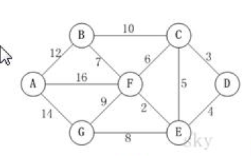

# kruskal算法

#### 1.介绍

**Kruskal算法**是一种用来寻找最小生成树的算法，由Joseph Kruskal在1956年发表。用来解决同样问题的还有Prim算法和Boruvka算法等。三种算法都是贪婪算法的应用。和Boruvka算法不同的地方是，Kruskal算法在图中存在同样权值的边时也有效。 


#### 2.问题&解决思路

公交车站问题：如下



1) 某城市新增7 个站点(A, B, C, D, E, F, G) ，现在需要修路把7 个站点连通
2) 各个站点的距离用边线表示(权) ，比如A – B 距离12 公里
3) 问：如何修路保证各个站点都能连通，并且总的修建公路总里程最短?


#### 3.代码

> 代码实现

```
package demo;

import java.util.Arrays;


//创建一个类EData ，存储边信息
class EData {
    char start; //边的一个点
    char end; //边的另外一个点
    int weight; //边的权值

    public EData(char start, char end, int weight) {
        this.start = start;
        this.end = end;
        this.weight = weight;
    }

    @Override
    public String toString() {
        return "EData [<" + start + ", " + end + ">= " + weight + "]";
    }


}


public class KruskalCase {
    private int edgeNum; //边的个数
    private char[] vertexs; //顶点数组
    private int[][] matrix; //邻接矩阵
    //使用 INF 表示两个顶点不能连通
    private static final int INF = Integer.MAX_VALUE;


    public KruskalCase(char[] vertexs, int[][] matrix) {
        int vlen = vertexs.length;

        //初始化顶点
        this.vertexs = new char[vlen];
        for(int i = 0; i < vertexs.length; i++) {
            this.vertexs[i] = vertexs[i];
        }

        //初始化边
        this.matrix = new int[vlen][vlen];
        for(int i = 0; i < vlen; i++) {
            for(int j= 0; j < vlen; j++) {
                this.matrix[i][j] = matrix[i][j];
            }
        }
        //统计边的条数
        for(int i =0; i < vlen; i++) {
            for(int j = i+1; j < vlen; j++) {
                if(this.matrix[i][j] != INF) {
                    edgeNum++;
                }
            }
        }
    }


    public void kruskal() {
        //表示最后结果数组的索引
        int index = 0;
        //用于保存"已有最小生成树" 中的每个顶点在最小生成树中的终点
        int[] ends = new int[edgeNum];
        //创建结果数组, 保存最后的最小生成树
        EData[] rets = new EData[edgeNum];

        //获取图中 所有的边的集合 ， 一共有12边
        EData[] edges = getEdges();

        //按照边的权值大小进行排序(从小到大)
        sortEdges(edges);

        //遍历edges 数组，将边添加到最小生成树中时，判断是准备加入的边否形成了回路，如果没有，就加入 rets, 否则不能加入
        for(int i=0; i < edgeNum; i++) {
            //获取到第i条边的第一个顶点(起点)
            int p1 = getPosition(edges[i].start); 
            //获取到第i条边的第2个顶点
            int p2 = getPosition(edges[i].end); 

            //获取p1在已有最小生成树中的终点
            int m = getEnd(ends, p1); 
            //获取p2在已有最小生成树中的终点
            int n = getEnd(ends, p2); 
            //是否构成回路
            if(m != n) { //没有构成回路
                // 设置m 在"已有最小生成树"中的终点 <E,F> [0,0,0,0,5,0,0,0,0,0,0,0]
                ends[m] = n;
                //有一条边加入到rets数组
                rets[index++] = edges[i]; 
            }
        }

        //统计并打印 "最小生成树", 输出  rets
        System.out.println("最小生成树为");
        for(int i = 0; i < index; i++) {
            System.out.println(rets[i]);
        }


    }

    //打印邻接矩阵
    public void print() {
        System.out.println("邻接矩阵为: \n");
        for(int i = 0; i < vertexs.length; i++) {
            for(int j=0; j < vertexs.length; j++) {
                System.out.printf("%12d", matrix[i][j]);
            }
            System.out.println();//换行
        }
    }

    /**
     * 功能：对边进行排序处理, 冒泡排序
     * @param edges 边的集合
     */
    private void sortEdges(EData[] edges) {
        for(int i = 0; i < edges.length - 1; i++) {
            for(int j = 0; j < edges.length - 1 - i; j++) {
                if(edges[j].weight > edges[j+1].weight) {//交换
                    EData tmp = edges[j];
                    edges[j] = edges[j+1];
                    edges[j+1] = tmp;
                }
            }
        }
    }
    /**
     *获取顶点的下标
     */
    private int getPosition(char ch) {
        for(int i = 0; i < vertexs.length; i++) {
            if(vertexs[i] == ch) {//找到
                return i;
            }
        }
        return -1;
    }
    
    /**
     * 获取图中所有边信息
     * @return
     */
    private EData[] getEdges() {
        int index = 0;
        EData[] edges = new EData[edgeNum];
        for(int i = 0; i < vertexs.length; i++) {
            for(int j=i+1; j <vertexs.length; j++) {
                if(matrix[i][j] != INF) {
                    edges[index++] = new EData(vertexs[i], vertexs[j], matrix[i][j]);
                }
            }
        }
        return edges;
    }


    /**
     * 获取终点
     */
    private int getEnd(int[] ends, int i) { 
        while(ends[i] != 0) {
            i = ends[i];
        }
        return i;
    }


    public static void main(String[] args) {
        char[] vertexs = {'A', 'B', 'C', 'D', 'E', 'F', 'G'};
        //克鲁斯卡尔算法的邻接矩阵
        int matrix[][] = {
	      /*A*//*B*//*C*//*D*//*E*//*F*//*G*/
	/*A*/ {   0,  12, INF, INF, INF,  16,  14},
	/*B*/ {  12,   0,  10, INF, INF,   7, INF},
	/*C*/ { INF,  10,   0,   3,   5,   6, INF},
	/*D*/ { INF, INF,   3,   0,   4, INF, INF},
	/*E*/ { INF, INF,   5,   4,   0,   2,   8},
	/*F*/ {  16,   7,   6, INF,   2,   0,   9},
	/*G*/ {  14, INF, INF, INF,   8,   9,   0}};

        //构建图
        KruskalCase kruskalCase = new KruskalCase(vertexs, matrix);
        kruskalCase.print();
        kruskalCase.kruskal();

    }
}
```


