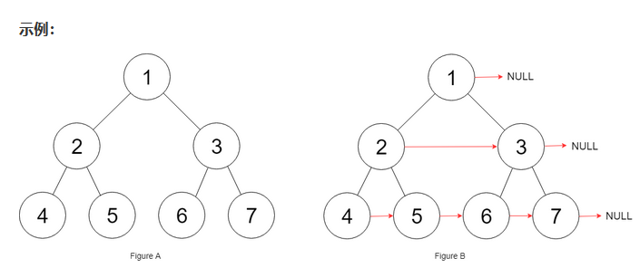

# 填充每个节点的下一个右侧节点指针

### 信息卡片

- 时间： 2020-1-14
- 题目链接：https://leetcode-cn.com/problems/populating-next-right-pointers-in-each-node
- 难度：中等
- 题目描述：

```
给定一个完美二叉树，其所有叶子节点都在同一层，每个父节点都有两个子节点。二叉树定义如下：

struct Node {
  int val;
  Node *left;
  Node *right;
  Node *next;
}

填充它的每个 next 指针，让这个指针指向其下一个右侧节点。如果找不到下一个右侧节点，则将 next 指针设置为 NULL。

初始状态下，所有 next 指针都被设置为 NULL。
 

提示：
    你只能使用常量级额外空间。
    使用递归解题也符合要求，本题中递归程序占用的栈空间不算做额外的空间复杂度。
```




### 参考答案

> 思路

定义两个指针cur和pre，cur用于指定行首，以上图举例，cur的值依次为1，2，4，这样就确定了以1，2，4为首的三行数据，可将其看作需要连接的三行链表，而将其连接起来的工具就是pre指针。

pre根据cur所在的行进行链表的指向，cur为最外循环控制行的指向，pre为一个循环控制一行中列的指向。


> 代码

```js
/*
// Definition for a Node.
class Node {
    public int val;
    public Node left;
    public Node right;
    public Node next;

    public Node() {}
    
    public Node(int _val) {
        val = _val;
    }

    public Node(int _val, Node _left, Node _right, Node _next) {
        val = _val;
        left = _left;
        right = _right;
        next = _next;
    }
};
*/
class Solution {
        public Node connect(Node root) {
        Node cur = root;
        Node pre = null;
        while(cur != null){
            while(pre != null){
                pre.left.next = pre.right;
                if(pre.next != null){
                    pre.right.next = pre.next.left;
                }
                pre = pre.next;
            }
            pre = cur;
            cur = cur.left;
        }
      return  root;
    }
}
```


### 其他优秀解答

> 暂无

