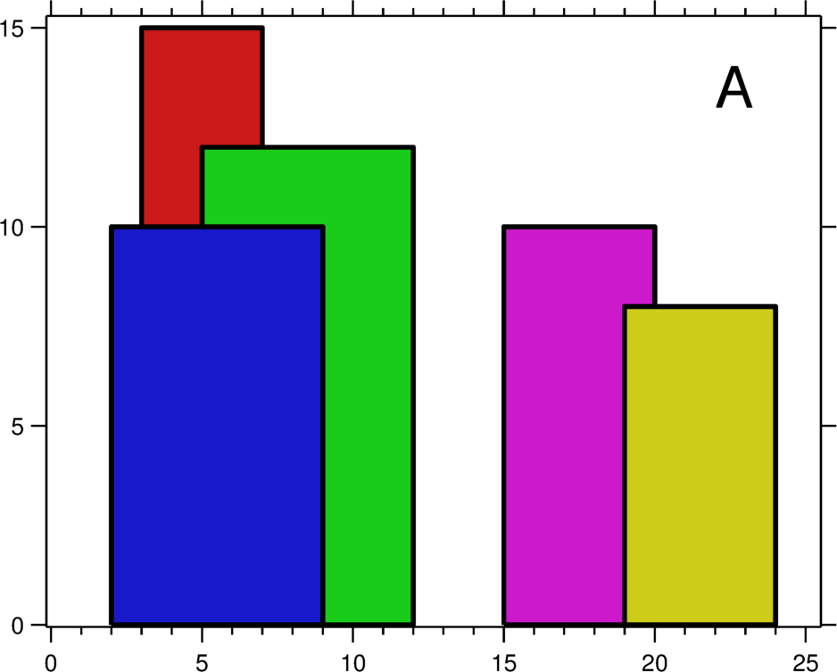

# 未完成-[天际线问题](https://leetcode-cn.com/problems/the-skyline-problem/)

### 信息卡片

- 时间： 2020-2-13
- 难度：困难
- 题目描述：

```
城市的天际线是从远处观看该城市中所有建筑物形成的轮廓的外部轮廓。现在，假设您获得了城市风光照片（图A）上显示的所有建筑物的位置和高度，请编写一个程序以输出由这些建筑物形成的天际线（图B）。

每个建筑物的几何信息用三元组 [Li，Ri，Hi] 表示，其中 Li 和 Ri 分别是第 i 座建筑物左右边缘的 x 坐标，Hi 是其高度。可以保证 0 ≤ Li, Ri ≤ INT_MAX, 0 < Hi ≤ INT_MAX 和 Ri - Li > 0。您可以假设所有建筑物都是在绝对平坦且高度为 0 的表面上的完美矩形。

例如，图A中所有建筑物的尺寸记录为：[ [2 9 10], [3 7 15], [5 12 12], [15 20 10], [19 24 8] ] 。

输出是以 [ [x1,y1], [x2, y2], [x3, y3], ... ] 格式的“关键点”（图B中的红点）的列表，它们唯一地定义了天际线。关键点是水平线段的左端点。请注意，最右侧建筑物的最后一个关键点仅用于标记天际线的终点，并始终为零高度。此外，任何两个相邻建筑物之间的地面都应被视为天际线轮廓的一部分。

例如，图B中的天际线应该表示为：[ [2 10], [3 15], [7 12], [12 0], [15 10], [20 8], [24, 0] ]。

说明:

    任何输入列表中的建筑物数量保证在 [0, 10000] 范围内。
    输入列表已经按左 x 坐标 Li  进行升序排列。
    输出列表必须按 x 位排序。
    输出天际线中不得有连续的相同高度的水平线。例如 [...[2 3], [4 5], [7 5], [11 5], [12 7]...] 是不正确的答案；三条高度为 5 的线应该在最终输出中合并为一个：[...[2 3], [4 5], [12 7], ...]
```





### 参考答案

> 思路

对于图中的例子，我们仔细观察一下拐点出现具备哪些条件

1. 新出现的矩形高度大于原矩形高度（蓝红矩形）
2. 最大高度对应的矩形处理完之后，当前的最大高度（红绿矩形）

对于上面两个条件，进一步都可以总结为：**当前未处理完的矩形中最大高度发生了变化。**

因此，我们将矩形**拆分**成左上角和右上角的坐标，为了表明某个矩形是否处理完，我们将左上角的纵坐标记为负值，右上角纵坐标为正值，于是只要碰到某个负值时，就表明碰到一个新的矩形，同理，正值即表明某个矩形处理完了。 

- 每当遇到左上角坐标，即处理一个新的矩形，将其高度加入堆中，判断此时堆顶元素（最大高度）是否发生变化，如果发生变化意味着需要添加拐点（如图中蓝色矩形中的红色矩形左上角坐标），未变化则表明新的矩形被某个矩形所覆盖，不做任何处理（如红色矩形中的绿色矩形左上角坐标）；
- 当遇到右上角坐标时，说明某个矩形处理完，将其对应高度移除，此时再次判断堆顶元素是否变化，如果变化，说明最大高度对应的矩形被移除了，此时需要根据当前的堆顶元素添加拐点。


> 代码

```java
   public List<int[]> getSkyline(int[][] buildings) {
        List<int[]> result = new ArrayList<>();
        List<int[]> height = new ArrayList<>();

        //将矩形拆分为，左上角坐标和右上角坐标，同时为了区分二者，将左上角的纵坐标设为负值
        for(int[] building:buildings){
            //x1 x2 height
            //[ [2 9 10], [3 7 15], [5 12 12], [15 20 10], [19 24 8] ] 
            height.add(new int[]{building[0],-building[2]});
            height.add(new int[]{building[1],building[2]});
        }

        //按照 优先横坐标从小到大（x轴从左到右），其次纵坐标从小到大 排序
        Collections.sort(height,new Comparator<int[]>(){
            @Override
            public int compare(int[] a ,int[] b){
                if(a[0]!=b[0]){
                    return a[0]-b[0];
                }else {
                    return a[1]-b[1];
                }
            }
        });

        //优先队列，大顶堆
        //默认容量是11，因此也创建一个容量为11
        Queue<Integer> pq = new PriorityQueue<Integer>(11,new Comparator<Integer>(){
            @Override
            public int compare(Integer i1,Integer i2){
                return i2-i1;
            }
        });
       
        //首先将地平线加入
        pq.offer(0);

        //记录上一次最大高度
        int prev = 0;

        //遍历
        for(int[] h:height){
            System.out.println("坐标：("+h[0]+","+h[1]+")");
            //加入左上角坐标
            if(h[1]<0){
                pq.offer(-h[1]);
            }else{
                //如果此时遇到右上角坐标，那么意味着这个矩形已经处理完了，将左上角坐标移除即可
                pq.remove(h[1]);
            }
            //当前最大高度
            int cur = pq.peek();

            //两次最大高度不一致，说明前一个最大高度被移除，或者新加入了更高的building
            if(prev != cur){
                //添加拐点
                result.add(new int[]{h[0],cur});
                //更新
                prev = cur;
            }
        }
        return result;
    }

```


