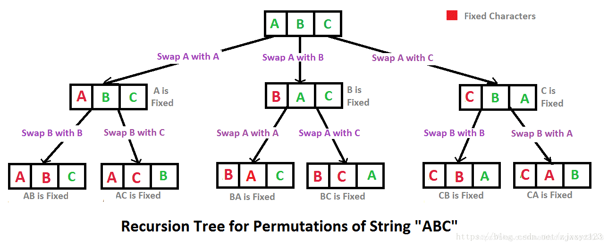

# 字符串的排序 

### 信息卡片 

- 时间： 2019-1-26
- 题目描述：

```
输入一棵二叉搜索树，将该二叉搜索树转换成一个排序的双向链表。要求不能创建任何新的结点，只能调整树中结点指针的指向。
```

 

### 参考答案

> 思路



 假设输入为a、b、c 那么其实排序的总数： fun（a，b，c）=a（fun（b，c））+ a和b交换（fun（a，c））+a和c交换（fun（b，a）） fun（b，c） = b+fun（c）+b和c交换（fun（b）） fun（c）=1 

所以用递归的方法就可以了，并且在这个递归的过程中，并没有做出一些浪费运行时间的事情，每一个递归都会产生新的结果，因此用递归来解决被称为动态规划的此题，是合理的。 

另外题目中说明可能存在重复的字符，**因此在进行交换的时候需要判断进行交换的字符是否相等，如果相等就没有必要交换了。** 


> 代码

```java
import java.util.*;
public class Solution {
    ArrayList<String> list = new ArrayList<>();
    public ArrayList<String> Permutation(String str) {

        if(str == null || str.length() == 0) return list;
        permu(str.toCharArray(),0);
        Collections.sort(list);
        return list;

    }

    private void permu(char[] strArr, int start) {
        if(start == strArr.length){
            //将数组转化为字符串
            String result = String.valueOf(strArr);
            //如果list里没有这个字符串了，就添加
            if(list.indexOf(result) < 0){
                list.add(result);
                return;
            }
        }
        for (int i = start; i < strArr.length; i++) {
            //将每个元素轮流提到start位
            char temp = strArr[start];
            strArr[start] = strArr[i];
            strArr[i] = temp;

            permu(strArr,start+1);

            //处理完了还要放回去的
            temp = strArr[start];
            strArr[start] = strArr[i];
            strArr[i] = temp;

        }
}
}
```


### 其他优秀解答

