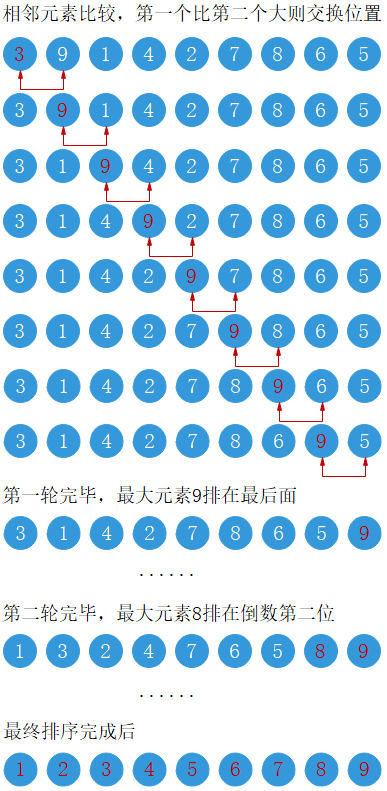

# 冒泡排序

#### 1.解决思路

冒泡排序（Bubble Sorting）的基本思想是：通过对待排序序列从前向后（从下标较小的元素开始）,依次比较
相邻元素的值，若发现逆序则交换，使值较大的元素逐渐从前移向后部，就象水底下的气泡一样逐渐向上冒。

**优化：**
因为排序的过程中，各元素不断接近自己的位置，如果一趟比较下来没有进行过交换，就说明序列有序，因此要在
排序过程中设置一个标志flag 判断元素是否进行过交换。从而减少不必要的比较。(这里说的优化，可以在冒泡排
序写好后，在进行)


**图解：**




#### 2.代码

> 代码实现

```java
   public static void bubbleSort(int[] arr) {
        int temp = 0;
        boolean flag = false; // 标识变量，表示是否进行过交换
        for (int i = 0; i < arr.length - 1; i++) {
            for (int j = 0; j < arr.length - 1 - i; j++) {
                // 如果前面的数比后面的数大，则交换
                if (arr[j] > arr[j + 1]) {
                    flag = true;
                    temp = arr[j];
                    arr[j] = arr[j + 1];
                    arr[j + 1] = temp;
                }
            }
            // 在一趟排序中，一次交换都没有发生过
            if (!flag) {
                break;
            } else {
                // 重置flag!!!, 进行下次判断
                flag = false;
            }
        }
    }
```

