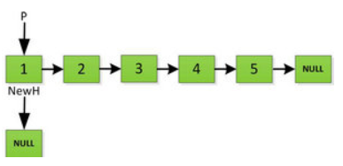
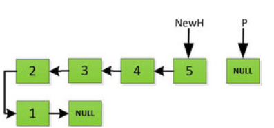

# 反转链表

### 信息卡片

- 时间： 2020-1-2
- 题目链接：https://leetcode-cn.com/problems/reverse-linked-list/solution
- 难度：简单
- 题目描述：

```
反转一个单链表。

示例:

输入: 1->2->3->4->5->NULL
输出: 5->4->3->2->1->NULL

进阶:
你可以迭代或递归地反转链表。你能否用两种方法解决这道题？
```


### 参考答案

> 思路：迭代

迭代的方式是从链头开始处理，如下图给定一个存放5个数的链表。


　　首先对于链表设置两个指针：





　　然后依次将旧链表上每一项添加在新链表的后面，然后新链表的头指针NewH移向新的链表头，如下图所示。此处需要注意，以此处为例，2节点后面需要加一个指针temp来保存2后面的节点位置，否则2指向1后会失去3的地址。


　　指针继续向后移动，直到P指针指向NULL停止迭代。


　　

最后一步：




> 代码实现

```js
/**
 * Definition for singly-linked list.
 * public class ListNode {
 *     int val;
 *     ListNode next;
 *     ListNode(int x) { val = x; }
 * }
 */
class Solution {
        public ListNode reverseList(ListNode head) {
    if(head == null || head.next==null){
            return  head;
        }
        ListNode cur1 = head;
        ListNode cur2 = head.next;
        ListNode temp = head.next.next;

        if(temp == null){
            cur2.next = cur1;
            cur1.next = null;
            return cur2;
        }
        cur1.next = null;
        while (true){
            if(temp == null){
                cur2.next = cur1;
                return cur2;
            }
            cur2.next = cur1;
            cur1 = cur2;
            cur2 = temp;
            temp = temp.next;
        }
}
}
```


> leetcode上简洁的代码实现

```
public ListNode reverseList(ListNode head) {
    ListNode prev = null;
    ListNode curr = head;
    while (curr != null) {
        ListNode nextTemp = curr.next;
        curr.next = prev;
        prev = curr;
        curr = nextTemp;
    }
    return prev;
}
```


> 复杂度分析

- 时间复杂度：O(n)，假设 n是列表的长度，时间复杂度是 O(n)。
- 空间复杂度：O(1)。


### 其他优秀解答

>  思路：递归

我们再来看看递归实现链表翻转的实现，前面非递归方式是从前面数1开始往后依次处理，而递归方式则恰恰相反，它先循环找到最后面指向的数5，然后从5开始处理依次翻转整个链表。


> 代码实现

```
    public ListNode reverseList(ListNode head) {
        if (head == null || head.next == null) return head;
        ListNode p = reverseList(head.next);
        head.next.next = head;
        head.next = null;
        return p;
    }

```


> 复杂度分析

- 时间复杂度：O(n)，假设 n是列表的长度，那么时间复杂度为 O(n)。
- 空间复杂度：O(n)，由于使用递归，将会使用隐式栈空间。递归深度可能会达到 n层。


参考博客：

https://blog.csdn.net/shimadear/article/details/81366951