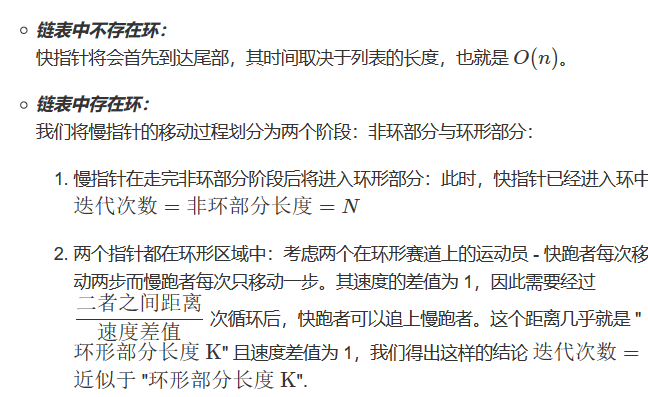

# 环形链表

### 信息卡片

- 时间： 2020-1-10
- 题目链接：https://leetcode-cn.com/problems/linked-list-cycle/submissions/
- 难度：简单
- 题目描述：

```
给定一个链表，判断链表中是否有环。

为了表示给定链表中的环，我们使用整数 pos 来表示链表尾连接到链表中的位置（索引从 0 开始）。 如果 pos 是 -1，则在该链表中没有环。

 

示例 1：

输入：head = [3,2,0,-4], pos = 1
输出：true
解释：链表中有一个环，其尾部连接到第二个节点。

```


### 参考答案

> 思路

双指针

想象一下，两名运动员以不同的速度在环形赛道上跑步会发生什么？

算法

通过使用具有 不同速度 的快、慢两个指针遍历链表，空间复杂度可以被降低至 O(1)O(1)O(1)。慢指针每次移动一步，而快指针每次移动两步。

如果列表中不存在环，最终快指针将会最先到达尾部，此时我们可以返回 false。

现在考虑一个环形链表，把慢指针和快指针想象成两个在环形赛道上跑步的运动员（分别称之为慢跑者与快跑者）。而快跑者最终一定会追上慢跑者。


> 代码

```js
/**
 * Definition for singly-linked list.
 * class ListNode {
 *     int val;
 *     ListNode next;
 *     ListNode(int x) {
 *         val = x;
 *         next = null;
 *     }
 * }
 */
public class Solution {
  public boolean hasCycle(ListNode head) {
      if(head == null){
          return false;
      }
        ListNode fast = head.next;
        ListNode slow = head;
        while(fast != slow){
            if(fast == null || fast.next == null){
                return false;
            }
            fast = fast.next.next;
            slow = slow.next;
        }
        return true;
    }
}
```


> 复杂度分析

时间复杂度：O(n)，让我们将 n 设为链表中结点的总数。为了分析时间复杂度，我们分别考虑下面两种情况。



因此，在最糟糕的情形下，时间复杂度为 O(N+K)，也就是 O(n)。

空间复杂度：O(1)，我们只使用了慢指针和快指针两个结点，所以空间复杂度为 O(1)。


### 其他优秀解答

> 无
