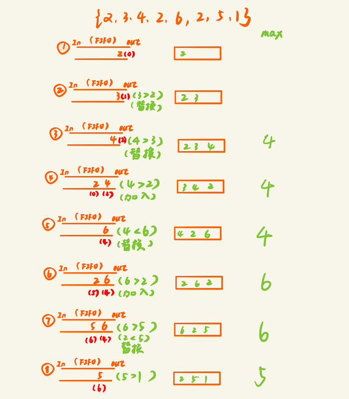

# 滑动窗口的最大值 

### 信息卡片 

- 时间： 2019-2-3

- 题目描述：

  ```
  给定一个数组和滑动窗口的大小，找出所有滑动窗口里数值的最大值。例如，如果输入数组{2,3,4,2,6,2,5,1}及滑动窗口的大小3，那么一共存在6个滑动窗口，他们的最大值分别为{4,4,6,6,6,5}； 针对数组{2,3,4,2,6,2,5,1}的滑动窗口有以下6个： {[2,3,4],2,6,2,5,1}， {2,[3,4,2],6,2,5,1}， {2,3,[4,2,6],2,5,1}， {2,3,4,[2,6,2],5,1}， {2,3,4,2,[6,2,5],1}， {2,3,4,2,6,[2,5,1]}。
  ```

  

### 参考答案

> 思路

[博客](https://blog.csdn.net/u010429424/article/details/73692248)

借助一个辅助队列，从头遍历数组，根据如下规则进行入队列或出队列操作：

1. 如果队列为空，则当前数字入队列
2. 如果当前数字大于队列尾，则删除队列尾，直到当前数字小于等于队列尾，或者队列空，然后当前数字入队列
3. 如果当前数字小于队列尾，则当前数字入队列
4. 如果队列头超出滑动窗口范围，则删除队列头


**这样能始终保证队列头为当前的最大值，队列保存的是元素的下标，以此可以判断新进的元素和队列头元素是否在一个滑动窗口**





> 代码

```java
import java.util.*;

public class Solution {
     public ArrayList<Integer> maxInWindows(int [] num, int size){
        /*
        思路：用双端队列实现
        */
        ArrayList<Integer> res=new ArrayList<>();
        if(num==null || num.length<1 || size<=0 || size>num.length)
            return res;
        Deque<Integer> queue=new LinkedList<>();
        for(int i=0;i<num.length;i++){
            //超出窗口范围的去掉
           if(!queue.isEmpty() &&  i - queue.peek() >= size){
                 queue.poll();
           }
            
            //如果当前值大于队列末的值，说明队列末这个值不可能是窗口最大值，删掉队列末值
            while(!queue.isEmpty() && num[i] > num[queue.getLast()]){
                queue.removeLast();
            }
            //添加当前元素下标
            queue.add(i);
            //将队列头元素加入res，因为队列头保存的始终是最大的窗口元素
            //假设size=3，必须保证遍历到i=2才能确定前三个中的最大值，所以要保证i>=size-1
            if(i>=size-1){ 
                res.add(num[queue.peek()]);
            }
        }
        return res;
    }
    
}
```


### 其他优秀解答

> 思路

大顶堆


> 代码

```java
public ArrayList<Integer> maxInWindows(int[] num, int size) {
    ArrayList<Integer> ret = new ArrayList<>();
    if (size > num.length || size < 1)
        return ret;
    PriorityQueue<Integer> heap = new PriorityQueue<>((o1, o2) -> o2 - o1);  /* 大顶堆 */
    for (int i = 0; i < size; i++)
        heap.add(num[i]);
    ret.add(heap.peek());
    for (int i = 0, j = i + size; j < num.length; i++, j++) {            /* 维护一个大小为 size 的大顶堆 */
        heap.remove(num[i]);
        heap.add(num[j]);
        ret.add(heap.peek());
    }
    return ret;
}
```

