[知识点在这里][https://snailclimb.gitee.io/javaguide/#/docs/network/%E8%AE%A1%E7%AE%97%E6%9C%BA%E7%BD%91%E7%BB%9C]

# 1 OSI(七层模型)

OSI（Open System Interconnection，开放系统互连）七层网络模型称为开放式系统互联参考模型 ，是一个逻辑上的定义，一个规范，它把网络从逻辑上分为了7层。每一层都有相关、相对应的物理设备，比如路由器，交换机。OSI 七层模型是一种框架性的设计方法 ，建立七层模型的主要目的是为解决异种网络互连时所遇到的兼容性问题，其最主要的功能使就是帮助不同类型的主机实现数据传输。它的最大优点是将服务、接口和协议这三个概念明确地区分开来，通过七个层次化的结构模型使不同的系统不同的网络之间实现可靠的通讯。

 

**模型优点**

建立七层模型的主要目的是为解决异种网络互连时所遇到的兼容性问题。它的最大优点是将服务、接口和协议这三个概念明确地区分开来：服务说明某一层为上一层提供一些什么功能，接口说明上一层如何使用下层的服务，而协议涉及如何实现本层的服务；这样各层之间具有很强的独立性，互连网络中各实体采用什么样的协议是没有限制的，只要向上提供相同的服务并且不改变相邻层的接口就可以了。网络七层的划分也是为了使网络的不同功能模块（不同层次）分担起不同的职责，从而带来如下好处： 　　

- 减轻问题的复杂程度，一旦网络发生故障，可迅速定位故障所处层次，便于查找和纠错； 　　
- 在各层分别定义标准接口，使具备相同对等层的不同网络设备能实现互操作，各层之间则相对独立，一种高层协议可放在多种低层协议上运行； 　　
-  能有效刺激网络技术革新，因为每次更新都可以在小范围内进行，不需对整个网络动大手术； 　　
- 便于研究和教学。

# 2 物理层（Physical Layer）

O S I 模型的最低层或第一层，该层包括物理连网媒介，如电缆连线连接器。物理层的协议产生并检测电压以便发送和接收携带数据的信号。在你的[桌面](http://baike.baidu.com/view/79807.htm)P C 上插入[网络接口卡](http://baike.baidu.com/view/547393.htm)，你就建立了计算机连网的基础。换言之，你提供了一个物理层。尽管物理层不提供纠错服务，但它能够设定[数据传输速率](http://baike.baidu.com/view/434019.htm)并监测数据出错率。网络物理问题，如电线断开，将影响物理层。 　　用户要传递信息就要利用一些物理媒体，如双绞线、同轴电缆等，但具体的物理媒体并不在OSI的7层之内，有人把物理媒体当做第0层，物理层的任务就是为它的上一层提供一个物理连接，以及它们的机械、电气、功能和过程特性。如规定使用电缆和接头的类型、传送信号的电压等。在这一层，数据还没有被组织，仅作为原始的位流或电气电压处理，单位是bit比特。

# 2 数据链路层（Datalink Layer）

OSI模型的第二层，它控制[网络层](http://baike.baidu.com/view/239600.htm)与物理层之间的通信。它的主要功能是如何在不可靠的物理线路上进行数据的可靠传递。为了保证传输，从网络层接收到的数据被分割成特定的可被物理层传输的帧。帧是用来移动数据的结构包，它不仅包括原始数据，还包括发送方和接收方的物理地址以及检错和控制信息。其中的地址确定了帧将发送到何处，而纠错和控制信息则确保帧无差错到达。 如果在传送数据时，接收点检测到所传数据中有差错，就要通知发送方重发这一帧。 　　数据链路层的功能独立于网络和它的节点和所采用的物理层类型，它也不关心是否正在运行 Wo r d 、E x c e l 或使用I n t e r n e t 。有一些连接设备，如[交换机](http://baike.baidu.com/view/1077.htm)，由于它们要对帧解码并使用帧信息将数据发送到正确的接收方，所以它们是工作在数据链路层的。 　　数据链路层（DataLinkLayer):在物理层提供比特流服务的基础上，建立相邻结点之间的数据链路，通过差错控制提供数据帧（Frame）在信道上无差错的传输，并进行各电路上的动作系列。 　　数据链路层在不可靠的物理介质上提供可靠的传输。该层的作用包括：物理地址寻址、数据的[成帧](http://baike.baidu.com/view/3871125.htm)、流量控制、数据的检错、重发等。 　　数据链路层协议的代表包括：[SDLC](http://baike.baidu.com/view/206610.htm)、[HDLC](http://baike.baidu.com/view/89174.htm)、[PPP](http://baike.baidu.com/view/30514.htm)、[STP](http://baike.baidu.com/view/28816.htm)、[帧中继](http://baike.baidu.com/view/21773.htm)等。

# 3 网络层（Network Layer）

O S I 模型的第三层，其主要功能是将网络地址翻译成对应的物理地址，并决定如何将数据从发送方路由到接收方。 　　网络层通过综合考虑发送优先权、[网络拥塞](http://baike.baidu.com/view/1452069.htm)程度、服务质量以及可选路由的花费来决定从一个网络中节点A 到另一个网络中节点B 的最佳路径。由于网络层处理，并智能指导数据传送，[路由器](http://baike.baidu.com/view/1360.htm)连接网络各段，所以路由器属于网络层。在网络中，“路由”是基于编址方案、使用模式以及可达性来指引数据的发送。 　　网络层负责在源机器和目标机器之间建立它们所使用的路由。这一层本身没有任何错误检测和修正机制，因此，网络层必须依赖于端端之间的由D L L提供的可靠传输服务。 　　网络层用于本地L A N网段之上的[计算机系统](http://baike.baidu.com/view/1130583.htm)建立通信，它之所以可以这样做，是因为它有自己的路由地址结构，这种结构与第二层机器地址是分开的、独立的。这种协议称为路由或可路由协议。路由协议包括I P、N o v e l l公司的I P X以及A p p l e Ta l k协议。 　　网络层是可选的，它只用于当两个计算机系统处于不同的由路由器分割开的网段这种情况，或者当通信应用要求某种网络层或传输层提供的服务、特性或者能力时。例如，当两台主机处于同一个L A N网段的直接相连这种情况，它们之间的通信只使用L A N的通信机制就可以了(即OSI 参考模型的一二层)。

## 3.1 IP协议

## 3.2 Internet控制信息协议（ICMP）

## 3.3 地址解析协议（ARP）

## 3.4 反向地址解析协议（RARP）

# 4 传输层（Transport Layer） 

O S I 模型中最重要的一层。传输协议同时进行流量控制或是基于接收方可接收数据的快慢程度规定适当的发送速率。除此之外，传输层按照网络能处理的最大尺寸将较长的数据包进行强制分割。例如，以太网无法接收大于1 5 0 0 字节的数据包。发送方节点的传输层将[数据分割](http://baike.baidu.com/view/4466818.htm)成较小的数据片，同时对每一数据片安排一序列号，以便数据到达接收方节点的传输层时，能以正确的顺序重组。该过程即被称为排序。 　　工作在传输层的一种服务是 T C P / I P 协议套中的T C P （[传输控制协议](http://baike.baidu.com/view/544903.htm)），另一项传输层服务是I P X / S P X 协议集的S P X （序列包交换）。

**运输层主要使用以下两种协议:**

1. **传输控制协议 TCP**（Transmission Control Protocol）--提供**面向连接**的，**可靠的**数据传输服务。
2. **用户数据协议 UDP**（User Datagram Protocol）--提供**无连接**的，尽最大努力的数据传输服务（**不保证数据传输的可靠性**）。

## 4.1 TCP

[博客1][https://blog.csdn.net/qq_38950316/article/details/81087809]

[博客2][https://www.cnblogs.com/Andya/p/7272462.html]

### 4.1.1 首部

1. **源端口和目的端口**，各占2个字节，分别写入源端口和目的端口；
2. **序号seq**，占4个字节，数据是每个字节一个序号 。就是告诉接收方：我发送的数据是从seq开始的。 **当发送syn标记时将消耗一个序号；** **对于要发送的数据的第一个序号而言这个序号是通过一个算法计算得到一个初始序号（ISN）加1** 
3. **确认号ack**，占4个字节，就是告诉接收方：我希望下次收到对端发过来的seq序号值。例如，B收到了A发送过来的报文，其序列号字段是501，而数据长度是200字节，这表明B正确的收到了A发送的到序号700为止的数据。因此，B期望收到A的下一个数据序号是701，于是B在发送给A的确认报文段中把确认号置为701； 
4. **数据偏移**，占4位，它指出TCP报文的数据距离TCP报文段的起始处有多远；
5. **保留**，占6位，保留今后使用，但目前应都位0；
6. **紧急URG**，当URG=1，表明紧急指针字段有效。告诉系统此报文段中有紧急数据；
7. **确认ACK**，仅当ACK=1时，确认号字段才有效。TCP规定，在连接建立后所有报文的传输都必须把ACK置1；
8. **推送PSH**，当两个应用进程进行交互式通信时，有时在一端的应用进程希望在键入一个命令后立即就能收到对方的响应，这时候就将PSH=1；
9. **复位RST，**当RST=1，表明TCP连接中出现严重差错，必须释放连接，然后再重新建立连接；
10. **同步SYN，**在连接建立时用来同步序号。当SYN=1，ACK=0，表明是连接请求报文，若同意连接，则响应报文中应该使SYN=1，ACK=1；
11. **终止FIN**，用来释放连接。当FIN=1，表明此报文的发送方的数据已经发送完毕，并且要求释放；
12. **窗口**，占2字节，指的是通知接收方，发送本报文你需要有多大的空间来接受；
13. **检验和**，占2字节，校验首部和数据这两部分；
14. **紧急指针**，占2字节，指出本报文段中的紧急数据的字节数；
15. **选项，**长度可变，定义一些其他的可选的参数。

### 4.1.2 三次握手

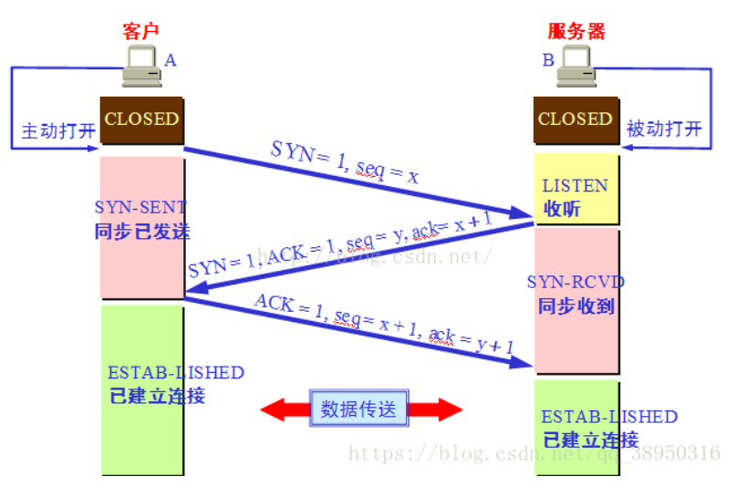

而三次握手最主要的目的就是双方确认自己与对方的发送与接收是正常的。首先Client端发送连接请求报文，Server段接受连接后回复ACK报文，并为这次连接分配资源。Client端接收到ACK报文后也向Server段发生ACK报文，并分配资源，这样TCP连接就建立了。 

最初两端的TCP进程都处于CLOSED关闭状态，A主动打开连接，而B被动打开连接。（**A、B关闭状态CLOSED**——**B收听状态LISTEN——A同步已发送状态SYN-SENT——B同步收到状态SYN-RCVD——A、B连接已建立状态ESTABLISHED**）

**总结三次握手过程：**

- **第一次握手**：起初两端都处于CLOSED关闭状态，Client将标志位SYN置为1，随机产生一个值seq=x，并将该数据包发送给Server，Client进入SYN-SENT状态，等待Server确认；
- **第二次握手**：Server收到数据包后由标志位SYN=1得知Client请求建立连接，Server将标志位SYN和ACK都置为1，ack=x+1，随机产生一个值seq=y，并将该数据包发送给Client以确认连接请求，Server进入SYN-RCVD状态，此时操作系统为该TCP连接分配TCP缓存和变量；
- **第三次握手**：Client收到确认后，检查ack是否为x+1，ACK是否为1，如果正确则将标志位ACK置为1，ack=y+1，并且此时操作系统为该TCP连接分配TCP缓存和变量，并将该数据包发送给Server，Server检查ack是否为y+1，ACK是否为1，如果正确则连接建立成功，Client和Server进入ESTABLISHED状态，完成三次握手，随后Client和Server就可以开始传输数据。

|                          发送                           |
| :-----------------------------------------------------: |
|       A        SYN=1,seq=x(随机产生)   ➡        B       |
| A        SYN=1,ACK=1,ack=x+1,seq=y(随机产生) ⬅        B |
|           A        ACK=1,ack=y+1  ➡         B           |

​  

**为什么A还要发送一次确认呢？可以二次握手吗？**

　　答：**主要为了防止已失效的连接请求报文段突然又传送到了B，因而产生错误**。如A发出连接请求，但因连接请求报文丢失而未收到确认，于是A再重传一次连接请求。后来收到了确认，建立了连接。数据传输完毕后，就释放了连接，A工发出了两个连接请求报文段，其中第一个丢失，第二个到达了B，但是第一个丢失的报文段只是在**某些网络结点长时间滞留了，延误到连接释放以后的某个时间才到达B**，此时B误认为A又发出一次新的连接请求，于是就向A发出确认报文段，同意建立连接，不采用三次握手，只要B发出确认，就建立新的连接了，此时A不理睬B的确认且不发送数据，则B一致等待A发送数据，浪费资源。

**Server端易受到SYN攻击？**

服务器端的资源分配是在二次握手时分配的，而客户端的资源是在完成三次握手时分配的，所以服务器容易受到SYN洪泛攻击，SYN攻击就是Client在短时间内伪造大量不存在的IP地址，并向Server不断地发送SYN包，Server则回复确认包，并等待Client确认，由于源地址不存在，因此Server需要不断重发直至超时，这些伪造的SYN包将长时间占用未连接队列，导致正常的SYN请求因为队列满而被丢弃，从而引起网络拥塞甚至系统瘫痪。

防范SYN攻击措施：降低主机的等待时间使主机尽快的释放半连接的占用，短时间受到某IP的重复SYN则丢弃后续请求。

### 4.1.3 四次挥手 

|                         发送                          |
| :---------------------------------------------------: |
|           A        SYN=1,seq=u   ➡        B           |
|        A        ACK=1,ack=u+1,seq=v ⬅        B        |
|      A       SYN=1, ACK=1,seq=w,ack=u+1⬅       B      |
| A       ACK=1,seq=u+1,ack=w+1,等待2MSL后关闭➡       B |

数据传输结束后，通信的双方都可释放连接，A和B都处于ESTABLISHED状态。（**A、B连接建立状态ESTABLISHED**——**A终止等待1状态FIN-WAIT-1**——**B关闭等待状态CLOSE-WAIT**——**A终止等待2状态FIN-WAIT-2**——**B最后确认状态LAST-ACK**——**A时间等待状态TIME-WAIT**——**B、A关闭状态CLOSED**） 

1. 客户端进程发出连接释放报文，并且停止发送数据。释放数据报文首部，FIN=1，其序列号为seq=u（等于前面已经传送过来的数据的最后一个字节的序号加1），此时，客户端进入FIN-WAIT-1（终止等待1）状态。 TCP规定，FIN报文段即使不携带数据，也要消耗一个序号。
2. 服务器收到连接释放报文，发出确认报文，ACK=1，ack=u+1，并且带上自己的序列号seq=v，此时，服务端就进入了CLOSE-WAIT（关闭等待）状态。TCP服务器通知高层的应用进程，客户端向服务器的方向就释放了，这时候处于半关闭状态，即客户端已经没有数据要发送了，但是服务器若发送数据，客户端依然要接受。这个状态还要持续一段时间，也就是整个CLOSE-WAIT状态持续的时间。
3. 客户端收到服务器的确认请求后，此时，客户端就进入FIN-WAIT-2（终止等待2）状态，等待服务器发送连接释放报文（在这之前还需要接受服务器发送的最后的数据）。
4. 服务器将最后的数据发送完毕后，就向客户端发送连接释放报文，FIN=1，ack=u+1，由于在半关闭状态，服务器很可能又发送了一些数据，假定此时的序列号为seq=w，此时，服务器就进入了LAST-ACK（最后确认）状态，等待客户端的确认。
5. 客户端收到服务器的连接释放报文后，必须发出确认，ACK=1，ack=w+1，而自己的序列号是seq=u+1，此时，客户端就进入了TIME-WAIT（时间等待）状态。注意此时TCP连接还没有释放，必须经过2∗∗MSL（最长报文段寿命）的时间后，当客户端撤销相应的TCB后，才进入CLOSED状态。
6. ​                                                                                                                                                                                                                                                                                                                                                                                                                                                                                                                                                                                                                                                                                                                                                                                                                                                                                                                                                                                                                                                                                                                                                                                                                                                                                                                                                                                                                                                                                                                                                                                                                                                                                                                                                                                                                                                                                                                                                                                                                                                                                                                                                                                                                                                                                                                                                                                                                                                                                                                                                                                                                                                                                                                                                                                                                                                                                                                                                                                                                                                                                                                                                                                                                                                                                                                                                                                                                                                                                                                                                                                                                                                                                                                                                                                                                                                                                                                                                                                                                                                                                                                                                                                                                                                                                                                                                                                                                                                                                                                                                                                                                                                                                                                                                                                                                                                                                                                                                                                                                                                                                                                                                                                                                                                                                                                                                                                                                                                                                                                                                                                                                                                                                                                                                                                                                                                                                                                                                                                                                                                                                                                                                                                                                                                                                                                                                                                                                                                                                                                                                                                                                                                                                                                                                                                                                                                                                                                                                                                                                                                                                                                                                                                                                                                                                                                                                                                                                                                                                                                                                                                                                                                                                                                服务器只要收到了客户端发出的确认，立即进入CLOSED状态。同样，撤销TCB后，就结束了这次的TCP连接。可以看到，服务器结束TCP连接的时间要比客户端早一些。

**为什么A在TIME-WAIT状态必须等待2MSL的时间？**

MSL指一个片段在网络中最大的存活时间，2MSL就是一个发送和一个回复所需的最大时间。如果直到2MSL，Client都没有再次收到FIN，那么Client推断ACK已经被成功接收，则结束TCP连接。 

答：两个理由：

1）保证A发送的最后一个ACK报文段能够到达B。

2）防止“已失效的连接请求报文段”出现在本连接中。

- 1）这个ACK报文段有可能丢失，使得处于LAST-ACK状态的B收不到对已发送的FIN+ACK报文段的确认，B超时重传FIN+ACK报文段，而A能在2MSL时间内收到这个重传的FIN+ACK报文段，接着A重传一次确认，重新启动2MSL计时器，最后A和B都进入到CLOSED状态，若A在TIME-WAIT状态不等待一段时间，而是发送完ACK报文段后立即释放连接，则无法收到B重传的FIN+ACK报文段，所以不会再发送一次确认报文段，则B无法正常进入到CLOSED状态。
- 2）A在发送完最后一个ACK报文段后，再经过2MSL，就可以使本连接持续的时间内所产生的所有报文段都从网络中消失，使下一个新的连接中不会出现这种旧的连接请求报文段。

**为什么连接的时候是三次握手，关闭的时候却是四次握手？**

答：因为当Server端收到Client端的SYN连接请求报文后，可以直接发送SYN+ACK报文。其中ACK报文是用来应答的，SYN报文是用来同步的。但是关闭连接时，当Server端收到FIN报文时，很可能并不会立即关闭SOCKET，所以只能先回复一个ACK报文，告诉Client端，"你发的FIN报文我收到了"。只有等到我Server端所有的报文都发送完了，我才能发送FIN报文，因此不能一起发送。故需要四步握手。

**为什么TIME_WAIT状态需要经过2MSL(最大报文段生存时间)才能返回到CLOSE状态？**

答：虽然按道理，四个报文都发送完毕，我们可以直接进入CLOSE状态了，但是我们必须假象网络是不可靠的，有可以最后一个ACK丢失。所以TIME_WAIT状态就是用来重发可能丢失的ACK报文。

### 4.1.4 TCP 协议如何保证可靠传输

[博客][https://blog.csdn.net/liuchenxia8/article/details/80428157]

TCP协议传输的特点主要就是面向字节流、传输可靠、面向连接。

TCP协议保证数据传输可靠性的方式主要有：

- 校验和
- 序列号
- 确认应答
- 超时重传
- 连接管理
- 流量控制
- 拥塞控制

**1.校验和**

计算方式：在数据传输的过程中，将发送的数据段都当做一个16位的整数。将这些整数加起来。并且前面的进位不能丢弃，补在后面，最后取反，得到校验和。
发送方：在发送数据之前计算检验和，并进行校验和的填充。
接收方：收到数据后，对数据以同样的方式进行计算，求出校验和，与发送方的进行比对。

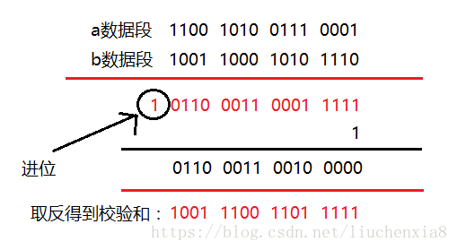

注意：如果接收方比对校验和与发送方不一致，那么数据一定传输有误。但是如果接收方比对校验和与发送方一致，数据不一定传输成功。

**2.确认应答与序列号**

序列号：TCP传输时将每个字节的数据都进行了编号，这就是序列号。
确认应答：TCP传输的过程中，每次接收方收到数据后，都会对传输方进行确认应答。也就是发送ACK报文。这个ACK报文当中带有对应的确认序列号，告诉发送方，接收到了哪些数据，下一次的数据从哪里发。

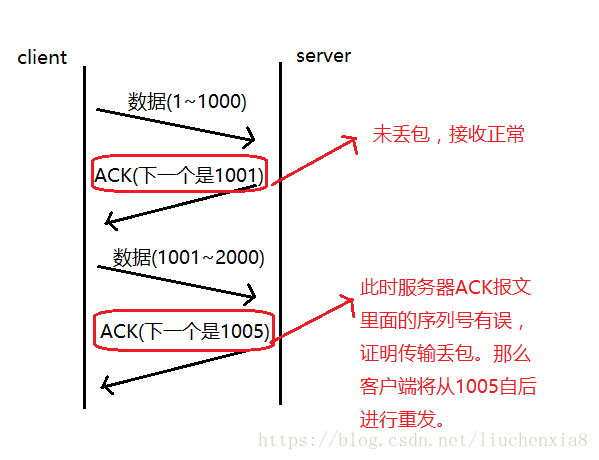

序列号的作用不仅仅是应答的作用，有了序列号能够将接收到的数据根据序列号排序，并且去掉重复序列号的数据。这也是TCP传输可靠性的保证之一。

**3.超时重传**

在进行TCP传输时，由于确认应答与序列号机制，也就是说发送方发送一部分数据后，都会等待接收方发送的ACK报文，并解析ACK报文，判断数据是否传输成功。如果发送方发送完数据后，迟迟没有等到接收方的ACK报文，这该怎么办呢？而没有收到ACK报文的原因可能是什么呢？

首先，发送方没有介绍到响应的ACK报文原因可能有两点：

- 数据在传输过程中由于网络原因等直接全体丢包，接收方根本没有接收到。
- 接收方接收到了响应的数据，但是发送的ACK报文响应却由于网络原因丢包了。

TCP在解决这个问题的时候引入了一个新的机制，叫做超时重传机制。简单理解就是发送方在发送完数据后等待一个时间，时间到达没有接收到ACK报文，那么对刚才发送的数据进行重新发送。如果是刚才第一个原因，接收方收到二次重发的数据后，便进行ACK应答。如果是第二个原因，接收方发现接收的数据已存在（判断存在的根据就是序列号，所以上面说序列号还有去除重复数据的作用），那么直接丢弃，仍旧发送ACK应答。

那么发送方发送完毕后等待的时间是多少呢？如果这个等待的时间过长，那么会影响TCP传输的整体效率，如果等待时间过短，又会导致频繁的发送重复的包。如何权衡？

由于TCP传输时保证能够在任何环境下都有一个高性能的通信，因此这个最大超时时间（也就是等待的时间）是动态计算的。

> 在Linux中（BSD Unix和Windows下也是这样）超时以500ms为一个单位进行控制，每次判定超时重发的超时时间都是500ms的整数倍。重发一次后，仍未响应，那么等待2*500ms的时间后，再次重传。等待4*500ms的时间继续重传。以一个指数的形式增长。累计到一定的重传次数，TCP就认为网络或者对端出现异常，强制关闭连接。

**4.连接管理**

连接管理就是三次握手与四次挥手的过程，在前面详细讲过这个过程，这里不再赘述。保证可靠的连接，是保证可靠性的前提。

**5.流量控制**

TCP用滑动窗口进行流量控制。

接收端在接收到数据后，对其进行处理。如果发送端的发送速度太快，导致接收端的结束缓冲区很快的填充满了。此时如果发送端仍旧发送数据，那么接下来发送的数据都会丢包，继而导致丢包的一系列连锁反应，超时重传呀什么的。而TCP根据接收端对数据的处理能力，决定发送端的发送速度，这个机制就是流量控制。

在TCP协议的报头信息当中，有一个16位字段的窗口大小。在介绍这个窗口大小时我们知道，窗口大小的内容实际上是接收端接收数据缓冲区的剩余大小。这个数字越大，证明接收端接收缓冲区的剩余空间越大，网络的吞吐量越大。接收端会在确认应答发送ACK报文时，将自己的即时窗口大小填入，并跟随ACK报文一起发送过去。而发送方根据ACK报文里的窗口大小的值的改变进而改变自己的发送速度。如果接收到窗口大小的值为0，那么发送方将停止发送数据。并定期的向接收端发送窗口探测数据段，让接收端把窗口大小告诉发送端。

注：16位的窗口大小最大能表示65535个字节（64K），但是TCP的窗口大小最大并不是64K。在TCP首部中40个字节的选项中还包含了一个窗口扩大因子M，实际的窗口大小就是16为窗口字段的值左移M位。每移一位，扩大两倍。

**6.拥塞控制**

TCP传输的过程中，发送端开始发送数据的时候，如果刚开始就发送大量的数据，那么就可能造成一些问题。网络可能在开始的时候就很拥堵，如果给网络中在扔出大量数据，那么这个拥堵就会加剧。拥堵的加剧就会产生大量的丢包，就对大量的超时重传，严重影响传输。

所以TCP引入了慢启动的机制，在开始发送数据时，先发送少量的数据探路。探清当前的网络状态如何，再决定多大的速度进行传输。这时候就引入一个叫做拥塞窗口的概念。

为了进行拥塞控制，TCP 发送方要维持一个 **拥塞窗口(cwnd)** 的状态变量。拥塞控制窗口的大小取决于网络的拥塞程度，并且动态变化。发送方让自己的发送窗口取为拥塞窗口和接收方的接受窗口中较小的一个。

TCP的拥塞控制采用了四种算法，即 **慢开始** 、 **拥塞避免** 、**快重传** 和 **快恢复**。在网络层也可以使路由器采用适当的分组丢弃策略（如主动队列管理 AQM），以减少网络拥塞的发生。

- **慢开始：**   慢开始算法的思路是当主机开始发送数据时，如果立即把大量数据字节注入到网络，那么可能会引起网络阻塞，因为现在还不知道网络的符合情况。经验表明，较好的方法是先探测一下，即由小到大逐渐增大发送窗口，也就是由小到大逐渐增大拥塞窗口数值。cwnd初始值为1，每经过一个传播轮次，cwnd加倍。

- **拥塞避免：** 拥塞避免算法的思路是让拥塞窗口cwnd缓慢增大，即每经过一个往返时间RTT就把发送放的cwnd加1.

- **快重传： ** 快重传算法要求首先接收方收到一个失序的报文段后就立刻发出重复确认，而不要等待自己发送数据时才进行捎带确认。接收方成功的接受了发送方发送来的M1、M2并且分别给发送了ACK，现在接收方没有收到M3，而接收到了M4，显然接收方不能确认M4，因为M4是失序的报文段。如果根据可靠性传输原理接收方什么都不做，但是按照快速重传算法，在收到M4、M5等报文段的时候，不断重复的向发送方发送M2的ACK,如果接收方一连收到三个重复的ACK,那么发送方不必等待重传计时器到期，由于发送方尽早重传未被确认的报文段。

- **快恢复：** 

  1.当发送发连续接收到三个确认时，就执行乘法减小算法，把慢启动开始门限（ssthresh）减半，但是接下来并不执行慢开始算法。

  2.此时不执行慢启动算法，而是把cwnd设置为ssthresh的一半， 然后执行拥塞避免算法，使拥塞窗口缓慢增大。

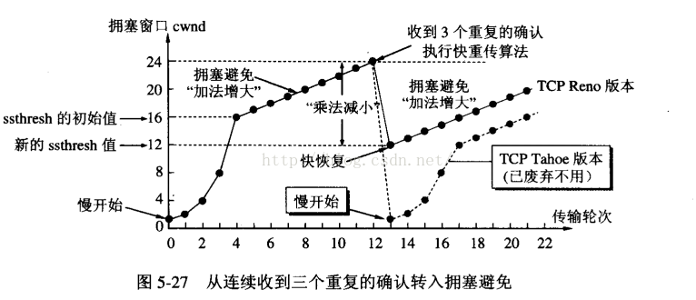

拥塞控制是TCP在传输时尽可能快的将数据传输，并且避免拥塞造成的一系列问题。是可靠性的保证，同时也是维护了传输的高效性。

### 4.1.5 ARQ协议

## 4.2 UDP

[博客][https://blog.csdn.net/aa1928992772/article/details/85240358]

### 4.2.1 特点

UDP是传输层的协议，功能即为在IP的数据报服务之上增加了最基本的服务：复用和分用以及差错检测。

UDP提供不可靠服务，具有TCP所没有的优势：

1. UDP无连接，时间上不存在建立连接需要的时延。空间上，TCP需要在端系统中维护连接状态，需要一定的开销。此连接装入包括接收和发送缓存，拥塞控制参数和序号与确认号的参数。UCP不维护连接状态，也不跟踪这些参数，开销小。空间和时间上都具有优势。

   举个例子：

   DNS如果运行在TCP之上而不是UDP，那么DNS的速度将会慢很多。
   HTTP使用TCP而不是UDP，是因为对于基于文本数据的Web网页来说，可靠性很重要。
   同一种专用应用服务器在支持UDP时，一定能支持更多的活动客户机。

2. 分组首部开销小，TCP首部20字节，UDP首部8字节。

3. UDP没有拥塞控制，应用层能够更好的控制要发送的数据和发送时间，网络中的拥塞控制也不会影响主机的发送速率。某些实时应用要求以稳定的速度发送，能容 忍一些数据的丢失，但是不能允许有较大的时延（比如实时视频，直播等）

4. UDP提供尽最大努力的交付，不保证可靠交付。所有维护传输可靠性的工作需要用户在应用层来完成。没有TCP的确认机制、重传机制。如果因为网络原因没有传送到对端，UDP也不会给应用层返回错误信息

5. UDP是面向报文的，对应用层交下来的报文，添加首部后直接乡下交付为IP层，既不合并，也不拆分，保留这些报文的边界。对IP层交上来UDP用户数据报，在去除首部后就原封不动地交付给上层应用进程，报文不可分割，是UDP数据报处理的最小单位。

   正是因为这样，UDP显得不够灵活，不能控制读写数据的次数和数量。比如我们要发送100个字节的报文，我们调用一次sendto函数就会发送100字节，对端也需要用recvfrom函数一次性接收100字节，不能使用循环每次获取10个字节，获取十次这样的做法。

6. UDP常用一次性传输比较少量数据的网络应用，如DNS,SNMP等，因为对于这些应用，若是采用TCP，为连接的创建，维护和拆除带来不小的开销。UDP也常用于多媒体应用（如IP电话，实时视频会议，流媒体等）数据的可靠传输对他们而言并不重要，TCP的拥塞控制会使他们有较大的延迟，也是不可容忍的。

### 4.2.2 首部

UDP数据报分为**首部**和**用户数据部分**，整个UDP数据报作为IP数据报的数据部分封装在IP数据报中，UDP数据报文结构如图所示： 

**UDP首部有8个字节，由4个字段构成，每个字段都是两个字节:**

1. 源端口： 源端口号，需要对方回信时选用，不需要时全部置0.

2. 目的端口：目的端口号，在终点交付报文的时候需要用到。

3. 长度：UDP的数据报的长度（包括首部和数据）其最小值为8（只有首部）

4. 校验和：检测UDP数据报在传输中是否有错，有错则丢弃。

   该字段是可选的，当源主机不想计算校验和，则直接令该字段全为0.

当传输层从IP层收到UDP数据报时，就根据首部中的目的端口，把UDP数据报通过相应的端口，上交给应用进程。
如果接收方UDP发现收到的报文中的目的端口号不正确（不存在对应端口号的应用进程0,），就丢弃该报文，并由ICMP发送“端口不可达”差错报文给对方。

## 4.3 TCP和UDP的区别

- TCP 是面向连接的，UDP 是面向无连接的
- UDP程序结构较简单
- TCP 是面向字节流的，UDP 是基于数据报的
- TCP 保证数据正确性，UDP 可能丢包
- TCP 保证数据顺序，UDP 不保证
- TCP提供可靠的服务。也就是说，通过TCP连接传送的数据，无差错，不丢失，不重复，且按序到达;UDP尽最大努力交付，即不保证可靠交付 

# 5 会话层（Session Layer）

负责在网络中的两节点之间建立、维持和终止通信。 会话层的功能包括：建立通信链接，保持会话过程通信链接的畅通，同步两个节点之间的对话，决定通信是否被中断以及通信中断时决定从何处重新发送。 　　你可能常常听到有人把会话层称作网络通信的“交通警察”。当通过拨号向你的 ISP （[因特网服务提供商](http://baike.baidu.com/view/275701.htm)）请求连接到因特网时，ISP 服务器上的会话层向你与你的 PC 客户机上的会话层进行协商连接。若你的电话线偶然从墙上插孔脱落时，你终端机上的会话层将检测到连接中断并重新发起连接。会话层通过决定节点通信的优先级和通信时间的长短来设置通信期限

# 6 表示层（Presentation Layer）

应用程序和网络之间的翻译官，在表示层，数据将按照网络能理解的方案进行格式化；这种格式化也因所使用网络的类型不同而不同。 　　表示层管理数据的解密与加密，如系统口令的处理。例如：在 Internet上查询你银行账户，使用的即是一种安全连接。你的账户数据在发送前被加密，在网络的另一端，表示层将对接收到的数据解密。除此之外，表示层协议还对图片和[文件格式](http://baike.baidu.com/view/1066926.htm)信息进行解码和编码。

# 7 应用层（Application Layer） 

应用层也称为[应用实体](http://baike.baidu.com/view/3456117.htm)（AE），它由若干个特定应用服务元素（SASE）和一个或多个公用应用服务元素（CASE）组成。每个SASE提供特定的应用服务，例如文件运输访问和管理（FTAM）、电子文电处理（MHS）、[虚拟终端](http://baike.baidu.com/view/694267.htm)协议（VAP）等。CASE提供一组公用的应用服务，例如联系控制服务元素（ACSE）、可靠运输服务元素（RTSE）和远程操作服务元素（ROSE）等。主要负责对[软件](http://baike.baidu.com/view/37.htm)提供接口以使程序能使用网络服务。术语“应用层”并不是指运行在网络上的某个特别应用程序 ，应用层提供的服务包括[文件传输](http://baike.baidu.com/view/543341.htm)、文件管理以及[电子邮件](http://baike.baidu.com/view/1524.htm)的信息处理。

## 7.1 域名系统DNS

我们都知道，TCP/IP中使用的是IP地址和端口号来确定网络上某一台主机上的某一个程序，不免有人有疑问，为什么不用域名来直接进行通信呢？

1. 因为IP地址是固定长度的，IPv4是32位，IPv6是128位，而域名是变长的，不便于计算机处理。
2. IP地址对于用户来说不方便记忆，但域名便于用户使用，例如www.baidu.com这是百度的域名。
  总结一点就是IP地址是面向主机的，而域名则是面向用户的。
  

### 7.1.1 域名结构

域名系统必须要保持唯一性。
为了达到唯一性的目的，因特网在命名的时候采用了层次结构的命名方法：

1. 每一个域名（本文只讨论英文域名）都是一个标号序列（labels），用字母（A-Z，a-z，大小写等价）、数字（0-9）和连接符（-）组成
2. 标号序列总长度不能超过255个字符，它由点号分割成一个个的标号（label）
3. 每个标号应该在63个字符之内，每个标号都可以看成一个层次的域名。
4. 级别最低的域名写在左边，级别最高的域名写在右边。

  **域名服务主要是基于UDP实现的，服务器的端口号为53。**
  

### 7.1.2 域名分级

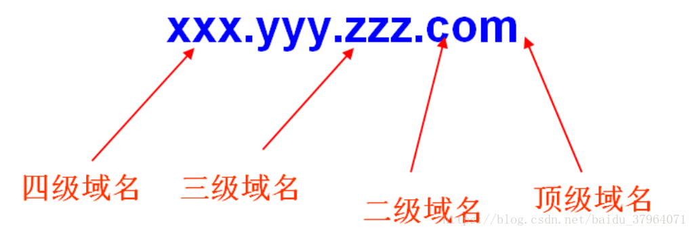

其中顶级域名分为：国家顶级域名、通用顶级域名、反向域名。

| 国家顶级域名 | 中国:cn， 美国:us，英国uk…                                   |
| ------------ | ------------------------------------------------------------ |
| 通用顶级域名 | com公司企业，edu教育机构，gov政府部门，int国际组织，mil军事部门 ，net网络，org非盈利组织… |
| 反向域名     | arpa，用于PTR查询（IP地址转换为域名）                        |

### 7.1.3 域名服务器

域名需要由遍及全世界的域名服务器去解析，域名服务器实际上就是装有域名系统的主机。由高向低进行层次划分，可分为以下几大类：

- 根域名服务器：    最高层次的域名服务器，也是最重要的域名服务器，本地域名服务器如果解析不了域名就会向根域名服务器求助。由于每分钟都要解析的名称数量多得令人难以置信，所以实际上每个根服务器都有镜像服务器，**每个根服务器与它的镜像服务器共享同一个  IP 地址，**当你对某个根服务器发出请求时，请求会被路由到该根服务器离你最近的镜像服务器。所有的根域名服务器都知道所有的顶级域名服务器的域名和地址，如果向根服务器发出对 `“jocent.me”` 的请求，则根服务器是不能在它的记录文件中找到与` “jocent.me”` 匹配的记录。但是它会找到 `“me”` 的顶级域名记录，并把负责` “me”` 地址的顶级域名服务器的地址发回给请求者。
- 顶级域名服务器：负责管理在该顶级域名服务器下注册的二级域名。当根域名服务器告诉查询者顶级域名服务器地址时，查询者紧接着就会到顶级域名服务器进行查询。比如还是查询`"jocent.me"`，根域名服务器已经告诉了查询者`“me”`顶级域名服务器的地址，`“me”`顶级域名服务器会找到 `“jocent.me”`的域名服务器的记录，域名服务器检查其区域文件，并发现它有与 `“jocent.me”` 相关联的区域文件。在此文件的内部，有该主机的记录。此记录说明此主机所在的 IP 地址，并向请求者返回最终答案。
- 权限域名服务器：负责一个区的域名解析工作
- 本地域名服务器：当一个主机发出DNS查询请求的时候，这个查询请求首先就是发给本地域名服务器的。

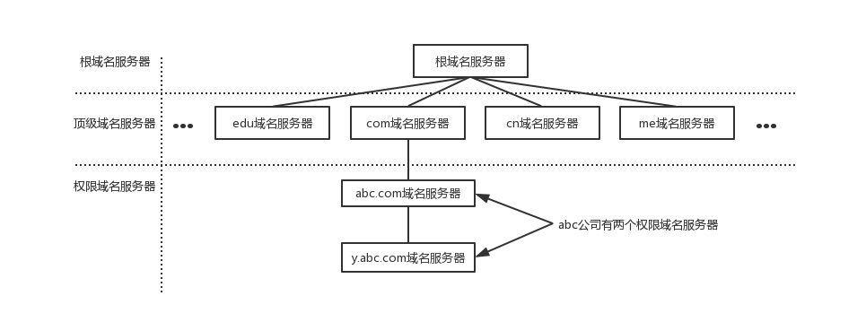

### 7.1.4 域名解析过程

1. 主机先向本地域名服务器进行递归查询
2. 本地域名服务器采用迭代查询，向一个根域名服务器进行查询
3. 根域名服务器告诉本地域名服务器，下一次应该查询的顶级域名服务器的IP地址
4. 本地域名服务器向顶级域名服务器进行查询
5. 顶级域名服务器告诉本地域名服务器，下一步查询权限服务器的IP地址
6. 本地域名服务器向权限服务器进行查询
7. 权限服务器告诉本地域名服务器所查询的主机的IP地址
8. 本地域名服务器最后把查询结果告诉主机 
  

## 7.2 HTTP协议

[博客1][https://blog.csdn.net/a19881029/article/details/14002273]

[博客2][https://www.cnblogs.com/EricaMIN1987_IT/p/3837436.html]

##### 7.2.1 概念

协议是指计算机通信网络中两台计算机之间进行通信所必须共同遵守的规定或规则，超文本传输协议(HTTP)是一种通信协议，它允许将超文本标记语言(HTML)文档从Web服务器传送到客户端的浏览器。 

HTTP是一个应用层协议，由请求和响应构成，是一个标准的客户端服务器模型。HTTP是一个无状态的协议。 

在Internet中所有的传输都是通过TCP/IP进行的。HTTP协议作为TCP/IP模型中应用层的协议也不例外。HTTP协议通常承载于TCP协议之上，有时也承载于TLS或SSL协议层之上，这个时候，就成了我们常说的HTTPS。如下图所示：

 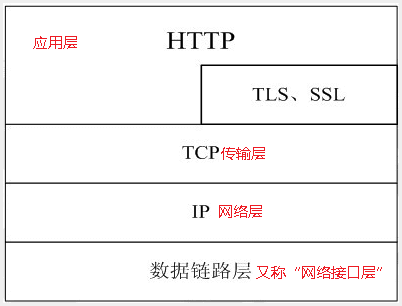

HTTP默认的端口号为80，HTTPS的端口号为443。 

浏览网页是HTTP的主要应用，但是这并不代表HTTP就只能应用于网页的浏览。HTTP是一种协议，只要通信的双方都遵守这个协议，HTTP就能有用武之地。比如咱们常用的QQ，迅雷这些软件，都会使用HTTP协议(还包括其他的协议)。

 

##### 7.2.2 特点

1.支持客户/服务器模式。

2.简单快速：客户向服务器请求服务时，只需传送请求方法和路径。请求方法常用的有GET、HEAD、POST。每种方法规定了客户与服务器联系的类型不同。由于HTTP协议简单，使得HTTP服务器的程序规模小，因而通信速度很快。

3.灵活：HTTP允许传输任意类型的数据对象。正在传输的类型由Content-Type（Content-Type是HTTP包中用来表示内容类型的标识）加以标记。

4.无连接：每次请求一次，释放一次连接。所以无连接表示每次连接只能处理一个请求。优点就是节省传输时间，实现简单。我们有时称这种无连接为短连接。对应的就有了长链接，长连接专门解决效率问题。当建立好了一个连接之后，可以多次请求。但是缺点就是容易造成占用资源不释放的问题。当HTTP协议头部中字段Connection：keep-alive表示支持长链接。

5.无状态：HTTP协议是无状态协议。无状态是指协议对于事务处理没有记忆能力。缺少状态意味着如果后续处理需要前面的信息，则它必须重传，这样可能导致每次连接传送的数据量增大。另一方面，在服务器不需要先前信息时它的应答就较快。为了解决HTTP协议无状态，于是，两种用于保持HTTP连接状态的技术就应运而生了，一个是Cookie，而另一个则是Session。

##### 7.2.3 Connection: keep-alive

无状态是指协议对于事务处理没有记忆能力，服务器不知道客户端是什么状态。从另一方面讲，打开一个服务器上的网页和你之前打开这个服务器上的网页之间没有任何联系。

从HTTP/1.1起，默认都开启了Keep-Alive，保持连接特性，简单地说，当一个网页打开完成后，客户端和服务器之间用于传输HTTP数据的TCP连接不会关闭，如果客户端再次访问这个服务器上的网页，会继续使用这一条已经建立的连接。

Keep-Alive不会永久保持连接，它有一个保持时间，可以在不同的服务器软件（如Apache）中设定这个时间。

 

 

##### 7.2.4 工作流程

一次HTTP操作称为一个事务，其工作过程可分为四步：

1. 首先客户机与服务器需要建立连接。只要单击某个超级链接，HTTP的工作开始。
2. 建立连接后，客户机发送一个请求给服务器，请求方式的格式为：统一资源标识符（URL）、协议版本号，后边是MIME信息包括请求修饰符、客户机信息和可能的内容。
3. 服务器接到请求后，给予相应的响应信息，其格式为一个状态行，包括信息的协议版本号、一个成功或错误的代码，后边是MIME信息包括服务器信息、实体信息和可能的内容。
4. 客户端接收服务器所返回的信息通过浏览器显示在用户的显示屏上，然后客户机与服务器断开连接。

如果在以上过程中的某一步出现错误，那么产生错误的信息将返回到客户端，有显示屏输出。

**HTTP是基于传输层的TCP协议，所以HTTP在开始传输之前，首先需要建立TCP连接，而TCP连接的过程需要所谓的三次握手和四次挥手。**

**在TCP三次握手之后，建立了TCP连接，此时HTTP就可以进行传输了。一个重要的概念是面向连接，既HTTP在传输完成之间并不断开TCP连接。在HTTP1.1中(通过Connection头设置)这是默认行为。**

 

##### 7.2.5 HTTP请求报文格式

HTTP请求报文主要由请求行、请求头部、请求正文3部分组成。

**1.请求行**

| 组成部分(之间由空格分隔) | 内容                                                         |
| ------------------------ | ------------------------------------------------------------ |
| 请求方法                 | 包括GET、HEAD、PUT、POST、TRACE、OPTIONS、DELETE以及扩展方法 当然并不是所有的服务器都实现了所有的方法，部分方法即便支持，处于安全性的考虑也是不可用的 |
| URL                      | ---                                                          |
| 以及协议版本             | HTTP/主版本号.次版本号，常用的有HTTP/1.0和HTTP/1.1           |

**2.请求头部**

请求头部为请求报文添加了一些附加信息，由“名/值”对组成，每行一对，名和值之间使用冒号分隔

常见请求头如下：

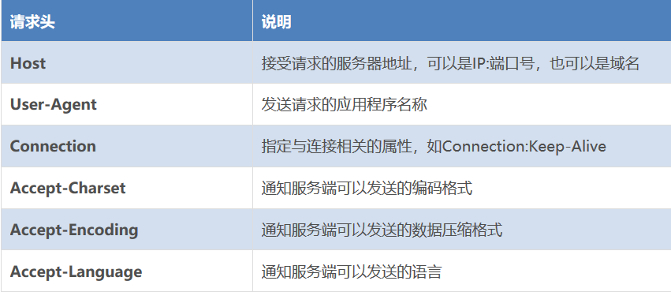

请求头部的最后会有一个空行，表示请求头部结束，接下来为请求正文，这一行非常重要，必不可少 

**3.请求正文**

可选部分，比如GET请求就没有请求正文

##### 7.2.6 HTTP响应报文格式

HTTP响应报文主要由状态行、响应头部、响应正文3部分组成

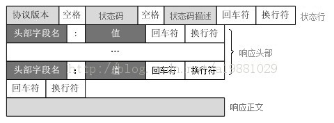

**1.状态行**

由3部分组成，分别为：协议版本，状态码，状态码描述，之间由空格分隔。

| 状态代码 | 含义                               |
| -------- | ---------------------------------- |
| 1xx      | HTTP/1.1向协议中引入了信息性状态码 |
| 2xx      | 表示成功                           |
| 3xx      | 指资源重定向                       |
| 4xx      | 指客户端请求出错                   |
| 5xx      | 指服务端出错                       |

这里列举几个常见的：

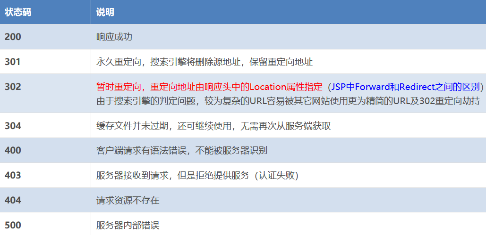

**2.响应头部**

与请求头部类似，为响应报文添加了一些附加信息

常见响应头部如下：

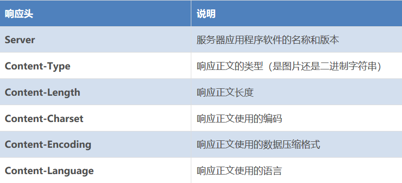

## 7.3 SMTP协议

[博客][https://blog.csdn.net/qq_35644234/article/details/68961603]

### 7.4 文件传输（TFTP简单文件传输协议）

## 7.5 远程登录（Telnet）

提供远程访问其它主机功能, 它允许用户登录internet主机，并在这台主机上执行命令；

## 7.6 网络管理（SNMP简单网络管理协议）

该协议提供了监控网络设备的方法， 以及配置管理,统计信息收集,性能管理及安全管理等；

# 8 总结

| OSI七层模型 | 功能                                                         | 对应的网络协议                                               | TCP/IP四层概念模型 |
| ----------- | ------------------------------------------------------------ | ------------------------------------------------------------ | ------------------ |
| 应用层      | 是最靠近用户的OSI层。这一层为用户的应用程序（例如电子邮件、文件传输和终端仿真）提供网络服务。 | HTTP、TFTP, FTP, NFS, WAIS、SMTP                             | 应用层             |
| 表示层      | 可确保一个系统的应用层所发送的信息可以被另一个系统的应用层读取。例如，PC程序与另一台计算机进行通信，其中一台计算机使用扩展二一十进制交换码（EBCDIC），而另一台则使用美国信息交换标准码（ASCII）来表示相同的字符。如有必要，表示层会通过使用一种通格式来实现多种数据格式之间的转换。 | Telnet, Rlogin, SNMP, Gopher                                 |                    |
| 会话层      | 通过传输层（端口号：传输端口与接收端口）建立数据传输的通路。主要在你的系统之间发起会话或者接受会话请求（设备之间需要互相认识可以是IP也可以是MAC或者是主机名） | SMTP, DNS                                                    |                    |
| 传输层      | 定义了一些传输数据的协议和端口号（WWW端口80等），如：TCP（传输控制协议，传输效率低，可靠性强，用于传输可靠性要求高，数据量大的数据），UDP（[用户数据报协议](http://baike.baidu.com/view/468464.htm)，与TCP特性恰恰相反，用于传输可靠性要求不高，数据量小的数据，如QQ聊天数据就是通过这种方式传输的）。 主要是将从下层接收的数据进行分段和传输，到达目的地址后再进行重组。常常把这一层数据叫做段。 | TCP, UDP                                                     | 传输层             |
| 网络层      | 在位于不同地理位置的网络中的两个主机系统之间提供连接和路径选择。Internet的发展使得从世界各站点访问信息的用户数大大增加，而网络层正是管理这种连接的层。 | IP, ICMP, ARP, RARP, AKP, UUCP                               | 网络层             |
| 数据链路层  | 定义了如何让格式化数据以进行传输，以及如何让控制对物理介质的访问。这一层通常还提供错误检测和纠正，以确保数据的可靠传输。 | FDDI, Ethernet, Arpanet, PDN,  SLIP, PPP，STP。HDLC,SDLC,帧中继 | 数据链路层         |
| 物理层      | 主要定义物理设备标准，如网线的接口类型、光纤的接口类型、各种传输介质的传输速率等。它的主要作用是传输比特流（就是由1、0转化为电流强弱来进行传输,到达目的地后在转化为1、0，也就是我们常说的数模转换与模数转换）。这一层的数据叫做比特。 | IEEE 802.1A, IEEE 802.2到IEEE  802.                          |                    |

[博客][https://blog.csdn.net/superjunjin/article/details/7841099]

