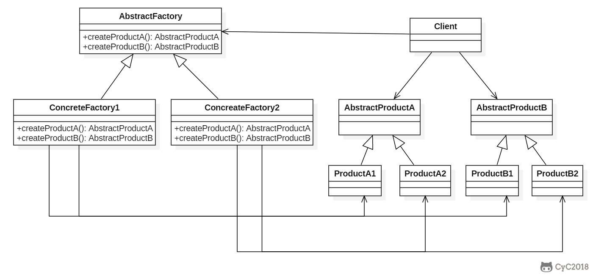
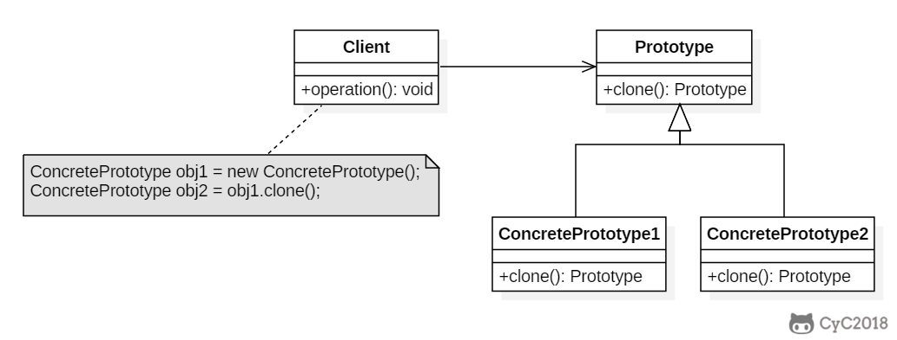

>  重点掌握：适配器模式，装饰模式，观察者模式，单例模式，工厂模式，策略模式，模板模式，代理模式


# 🎃 创建型

## 1 单例模式（Singleton）

单例模式有以下特点：  

1. 单例类只能有一个实例。  
2. 单例类必须自己创建自己的唯一实例。  
3. 单例类必须给所有其他对象提供这一实例。 


适用场景：

在计算机系统中，线程池、缓存、日志对象、对话框、打印机、显卡的驱动程序对象常被设计成单例。这些应用都或多或少具有资源管理器的功能。


### 

### 1.1 懒汉式

#### 1.1.1 线程不安全

以下实现中，私有静态变量 single被延迟实例化，这样做的好处是，如果没有用到该类，那么就不会实例化 single，从而节约资源。

这个实现在多线程环境下是不安全的，如果多个线程能够同时进入 `if (single== null)` ，并且此时 single为 null，那么会有多个线程执行 `single= new Singleton();` 语句，这将导致实例化多次 Singleton。

```java
public class Singleton {
    private Singleton() {}
    private static Singleton single=null;
    //静态工厂方法 
    public static Singleton getInstance() {
         if (single == null) {  
             single = new Singleton();
         }  
        return single;
    }
}
```


#### 1.1.2 synchronized-线程安全

但是当一个线程进入该方法之后，其它试图进入该方法的线程都必须等待，即使 single已经被实例化了。这会让线程阻塞时间过长，因此该方法有性能问题，不推荐使用。

```java
public class Singleton {
    private Singleton() {}
    private static Singleton single=null;
    //静态工厂方法 
    public static synchronized Singleton getInstance() {
         if (single == null) {  
             single = new Singleton();
         }  
        return single;
    }
}
```


#### 1.1.3 双重校验锁-线程安全

single只需要被实例化一次，之后就可以直接使用了。加锁操作只需要对实例化那部分的代码进行，只有当 single没有被实例化时，才需要进行加锁。

双重校验锁先判断 single是否已经被实例化，如果没有被实例化，那么才对实例化语句进行加锁。

```java
 public class Singleton {
    private Singleton() {}
    private static Singleton single=null;
     
   public static Singleton getInstance() {
        if (single == null) {  
            synchronized (Singleton.class) {  
               if (single == null) {  
                  single = new Singleton(); 
               }  
            }  
        }  
        return single; 
    }
}
```


考虑下面的实现，也就是只使用了一个 if 语句。在 single== null 的情况下，如果两个线程都执行了 if 语句，那么两个线程都会进入 if 语句块内。虽然在 if 语句块内有加锁操作，但是两个线程都会执行 `single= new Singleton();` 这条语句，只是先后的问题，那么就会进行两次实例化。因此必须使用双重校验锁，也就是需要使用两个 if 语句：第一个 if 语句用来避免 single已经被实例化之后的加锁操作，而第二个 if 语句进行了加锁，所以只能有一个线程进入，就不会出现 single== null 时两个线程同时进行实例化操作。

```java
if (single == null) {
    synchronized (Singleton.class) {
        single = new Singleton();
    }
}
```


single采用 **volatile** 关键字修饰也是很有必要的， `single= new Singleton();` 这段代码其实是分为三步执行：

1. 为 single分配内存空间
2. 初始化 single
3. 将 single指向分配的内存地址

但是由于 JVM 具有指令重排的特性，执行顺序有可能变成 1>3>2。指令重排在单线程环境下不会出现问题，但是在多线程环境下会导致一个线程获得还没有初始化的实例。例如，线程 T1 执行了 1 和 3，此时 T2 调用 getInstance() 后发现 single不为空，因此返回 single，但此时 single还未被初始化。

**使用 volatile 可以禁止 JVM 的指令重排，保证在多线程环境下也能正常运行。**


#### 1.1.4 静态内部类实现

当 Singleton 类被加载时，静态内部类 LazyHolder没有被加载进内存。只有当调用 `getInstance()` 方法从而触发 `LazyHolder.INSTANCE` 时 LazyHolder 才会被加载，此时初始化 INSTANCE 实例，并且 JVM 能确保 INSTANCE 只被实例化一次。

这种方式不仅具有延迟初始化的好处，而且由 JVM 提供了对线程安全的支持。

>这种比上面sychronized和双重检索锁方法都好一些，既实现了线程安全，又避免了同步带来的性能影响。 

```java
public class Singleton {  
    private static class LazyHolder {  
       private static final Singleton INSTANCE = new Singleton();  
    }  
    private Singleton (){}  
    public static final Singleton getInstance() {  
       return LazyHolder.INSTANCE;  
    }  
}  
```

#### 


### 1.2 饿汉式-线程安全

线程不安全问题主要是由于 single被实例化多次，采取直接实例化 single 的方式就不会产生线程不安全问题。

但是直接实例化的方式也丢失了延迟实例化带来的节约资源的好处。

```java
//饿汉式单例类.在类初始化时，已经自行实例化 
public class Singleton1 {
    private Singleton1() {}
    private static final Singleton1 single = new Singleton1();
    //静态工厂方法 
    public static Singleton1 getInstance() {
        return single;
    }
}
```


### 1.3 枚举实现单例

```java
public enum Singleton {

    INSTANCE;

    public void doSomething() {
        System.out.println("doSomething");
    }

}
```

```java
public class Main {
    public static void main(String[] args) {
        //调用方法
        Singleton.INSTANCE.doSomething();
    }

}
```

**该实现可以防止反射攻击。枚举是final修饰的。**


## 2 工厂模式

  工厂模式主要是为创建对象提供过渡接口，以便将创建对象的具体过程屏蔽隔离起来，达到提高灵活性的目的。 
工厂模式可以分为三类： 

1. 简单工厂模式（Simple Factory） 

2. 工厂方法模式（Factory Method） 
3. 抽象工厂模式（Abstract Factory） 

这三种模式从上到下逐步抽象，并且更具一般性。 
GOF在《设计模式》一书中将工厂模式分为两类：工厂方法模式与抽象工厂模式

将简单工厂模式看为工厂方法模式的一种特例，两者归为一类。 


**区别 ：**

* 工厂方法模式：

  一个抽象产品类，可以派生出多个具体产品类。   
  一个抽象工厂类，可以派生出多个具体工厂类。   
  每个具体工厂类只能创建一个具体产品类的实例。

* 抽象工厂模式：

  多个抽象产品类，每个抽象产品类可以派生出多个具体产品类。   
  一个抽象工厂类，可以派生出多个具体工厂类。   
  每个具体工厂类可以创建多个具体产品类的实例。   


### 2.1 简单工厂模式

简单工厂把实例化的操作单独放到一个类中，这个类就成为简单工厂类，让简单工厂类来决定应该用哪个具体子类来实例化。


产品类： 

```java
abstract class BMW {
	public BMW(){
		
	}
}
```

```java
public class BMW320 extends BMW {
	public BMW320() {
		System.out.println("制造-->BMW320");
	}
}
public class BMW523 extends BMW{
	public BMW523(){
		System.out.println("制造-->BMW523");
	}
}
```


工厂类： 

```java
public class Factory {
	public BMW createBMW(int type) {
		switch (type) {
		
		case 320:
			return new BMW320();
 
		case 523:
			return new BMW523();
 
		default:
			break;
		}
		return null;
	}
}
```

客户类： 

```java
public class Customer {
	public static void main(String[] args) {
		Factory factory = new Factory();
		BMW bmw320 = factory.createBMW(320);
		BMW bmw523 = factory.createBMW(523);
	}
}
```


### 2.2 工厂方法模式


定义了一个创建对象的工厂接口，工厂来实例化对象，但由子类决定要实例化哪个类。工厂方法把实例化操作推迟到子类。

与简单工厂不同，这里给工厂定义了一个接口，并且定义了多个不同工厂，每个工厂负责一款产品。


 产品类： 

```java
abstract class BMW {
	public BMW(){
		
	}
}
```

```java
public class BMW320 extends BMW {
	public BMW320() {
		System.out.println("制造-->BMW320");
	}
}
public class BMW523 extends BMW{
	public BMW523(){
		System.out.println("制造-->BMW523");
	}
}
```

  

创建工厂类： 

```java
interface FactoryBMW {
	BMW createBMW();
}
```


```java
public class FactoryBMW320 implements FactoryBMW{
 
	@Override
	public BMW320 createBMW() {
 
		return new BMW320();
	}
 
}
public class FactoryBMW523 implements FactoryBMW {
	@Override
	public BMW523 createBMW() {
 
		return new BMW523();
	}
}
```

客户类： 

```java
public class Customer {
	public static void main(String[] args) {
		FactoryBMW320 factoryBMW320 = new FactoryBMW320();
		BMW320 bmw320 = factoryBMW320.createBMW();
 
		FactoryBMW523 factoryBMW523 = new FactoryBMW523();
		BMW523 bmw523 = factoryBMW523.createBMW();
	}
}
```


### 2.3 抽象工厂模式 

抽象工厂模式创建的是对象家族，也就是很多对象而不是一个对象，并且这些对象是相关的，也就是说必须一起创建出来。而工厂方法模式只是用于创建一个对象，这和抽象工厂模式有很大不同。

但是在整体创建模式上，符合工厂方法模式的定义。



产品类： 

```java
//发动机以及型号  
public interface Engine {  
 
}  
public class EngineA extends Engine{  
    public EngineA(){  
        System.out.println("制造-->EngineA");  
    }  
}  
public class EngineBextends Engine{  
    public EngineB(){  
        System.out.println("制造-->EngineB");  
    }  
}  
 
//空调以及型号  
public interface Aircondition {  
 
}  
public class AirconditionA extends Aircondition{  
    public AirconditionA(){  
        System.out.println("制造-->AirconditionA");  
    }  
}  
public class AirconditionB extends Aircondition{  
    public AirconditionB(){  
        System.out.println("制造-->AirconditionB");  
    }  
} 
```


 创建工厂类： 

```java
//创建工厂的接口  
public interface AbstractFactory {  
    //制造发动机
    public Engine createEngine();
    //制造空调 
    public Aircondition createAircondition(); 
}  
 
 
//为宝马320系列生产配件  
public class FactoryBMW320 implements AbstractFactory{  
      
    @Override  
    public Engine createEngine() {    
        return new EngineA();  
    }  
    @Override  
    public Aircondition createAircondition() {  
        return new AirconditionA();  
    }  
}  
//宝马523系列
public class FactoryBMW523 implements AbstractFactory {  
  
     @Override  
    public Engine createEngine() {    
        return new EngineB();  
    }  
    @Override  
    public Aircondition createAircondition() {  
        return new AirconditionB();  
    }  
 
 
} 
```

客户: 

```java
public class Customer {  
    public static void main(String[] args){  
        //生产宝马320系列配件
        FactoryBMW320 factoryBMW320 = new FactoryBMW320();  
        factoryBMW320.createEngine();
        factoryBMW320.createAircondition();
          
        //生产宝马523系列配件  
        FactoryBMW523 factoryBMW523 = new FactoryBMW523();  
        factoryBMW320.createEngine();
        factoryBMW320.createAircondition();
    }  
}
```


## 3 生成器/建造者模式（Builder）


创建者模式又叫建造者模式，是将一个复杂的对象的**构建**与它的**表示**分离，使得同样的构建过程可以创建不同的表示。创建者模式隐藏了复杂对象的创建过程，它把复杂对象的创建过程加以抽象，通过子类继承或者重载的方式，动态的创建具有复合属性的对象。


 **建造者模式主要涉及几个角色：**

　1. 指挥者（Director），负责和客户（Client）对话

　2. 之后指挥者将客户的产品需求划分为比较稳定的建造过程（AbstractBuilder）

　3. 指挥者指挥具体的建造者（ConcreteBuilder）干活

　4. 获取建造者建造的产品给客户


### 3.1 示例代码

[示例](https://blog.csdn.net/u010102390/article/details/80179754)


### 3.2 实现简易StringBuilder 

以下是一个简易的 StringBuilder 实现，参考了 JDK 1.8 源码。

建造者：

```java
public class AbstractStringBuilder {
    protected char[] value;

    protected int count;

    public AbstractStringBuilder(int capacity) {
        count = 0;
        value = new char[capacity];
    }

    public AbstractStringBuilder append(char c) {
        ensureCapacityInternal(count + 1);
        value[count++] = c;
        return this;
    }

    private void ensureCapacityInternal(int minimumCapacity) {
        // overflow-conscious code
        if (minimumCapacity - value.length > 0)
            expandCapacity(minimumCapacity);
    }

    void expandCapacity(int minimumCapacity) {
        int newCapacity = value.length * 2 + 2;
        if (newCapacity - minimumCapacity < 0)
            newCapacity = minimumCapacity;
        if (newCapacity < 0) {
            if (minimumCapacity < 0) // overflow
                throw new OutOfMemoryError();
            newCapacity = Integer.MAX_VALUE;
        }
        value = Arrays.copyOf(value, newCapacity);
    }
}
```


指挥者：

```java
public class StringBuilder extends AbstractStringBuilder {
    public StringBuilder() {
        super(16);
    }

    @Override
    public String toString() {
        // Create a copy, don't share the array
        return new String(value, 0, count);
    }
}
```


```java
public class Client {
    public static void main(String[] args) {
        StringBuilder sb = new StringBuilder();
        final int count = 26;
        for (int i = 0; i < count; i++) {
            sb.append((char) ('a' + i));
        }
        System.out.println(sb.toString());
    }
}
```

```html
abcdefghijklmnopqrstuvwxyz
```


## 4  原型模式（Prototype）

使用原型实例指定要创建对象的类型，通过复制这个原型来创建新对象。




```java
public abstract class Prototype {
    abstract Prototype myClone();
}
```

```java
public class ConcretePrototype extends Prototype {

    private String filed;

    public ConcretePrototype(String filed) {
        this.filed = filed;
    }

    @Override
    Prototype myClone() {
        return new ConcretePrototype(filed);
    }

    @Override
    public String toString() {
        return filed;
    }
}
```

```java
public class Client {
    public static void main(String[] args) {
        Prototype prototype = new ConcretePrototype("abc");
        Prototype clone = prototype.myClone();
        //prototype!=clone,他们是两个不同的对象，只是内容一样。
    }
}
```


#### JDK

- [java.lang.Object#clone()](http://docs.oracle.com/javase/8/docs/api/java/lang/Object.html#clone%28%29)


# :christmas_tree: 行为型

## 1 责任链模式

使多个对象都有机会处理请求，从而避免请求的发送者和接收者之间的耦合关系。将这些对象连成一条链，并沿着这条链发送该请求，直到有一个对象处理它为止。


[推荐代码](https://www.cnblogs.com/fengyumeng/p/10839570.html)

Handle:负责判断successor（请求）的类型，然后调用合适的方法。

也就是负责请求转发

```java
public abstract class Handler {

    protected Handler successor;


    public Handler(Handler successor) {
        this.successor = successor;
    }


    protected abstract void handleRequest(Request request);
}
```


具体请求处理类：

```java
public class ConcreteHandler1 extends Handler {

    public ConcreteHandler1(Handler successor) {
        super(successor);
    }


    @Override
    protected void handleRequest(Request request) {
        if (request.getType() == RequestType.TYPE1) {
            System.out.println(request.getName() + " is handle by ConcreteHandler1");
            return;
        }
        if (successor != null) {
            successor.handleRequest(request);
        }
    }
}
```


```java
public class ConcreteHandler2 extends Handler {

    public ConcreteHandler2(Handler successor) {
        super(successor);
    }


    @Override
    protected void handleRequest(Request request) {
        if (request.getType() == RequestType.TYPE2) {
            System.out.println(request.getName() + " is handle by ConcreteHandler2");
            return;
        }
        if (successor != null) {
            successor.handleRequest(request);
        }
    }
}
```


请求类：

```java
public class Request {

    private RequestType type;
    private String name;


    public Request(RequestType type, String name) {
        this.type = type;
        this.name = name;
    }


    public RequestType getType() {
        return type;
    }


    public String getName() {
        return name;
    }
}

```


```java
public enum RequestType {
    TYPE1, TYPE2
}
```


客户端类：

```java
public class Client {

    public static void main(String[] args) {

        Handler handler1 = new ConcreteHandler1(null);
        Handler handler2 = new ConcreteHandler2(handler1);

        Request request1 = new Request(RequestType.TYPE1, "request1");
        handler2.handleRequest(request1);

        Request request2 = new Request(RequestType.TYPE2, "request2");
        handler2.handleRequest(request2);
    }
}
```


#### JDK

- [java.util.logging.Logger#log()](http://docs.oracle.com/javase/8/docs/api/java/util/logging/Logger.html#log%28java.util.logging.Level,%20java.lang.String%29)
- [Apache Commons Chain](https://commons.apache.org/proper/commons-chain/index.html)
- [javax.servlet.Filter#doFilter()](http://docs.oracle.com/javaee/7/api/javax/servlet/Filter.html#doFilter-javax.servlet.ServletRequest-javax.servlet.ServletResponse-javax.servlet.FilterChain-)


## 2 命令模式

**将命令封装成对象中，具有以下作用：**

- 使用命令来参数化其它对象
- 将命令放入队列中进行排队
- 将命令的操作记录到日志中
- 支持可撤销的操作


**模块说明：**

- Command:抽象命令接口.
- Receiver：命令接收者，也就是命令真正的执行者
- Invoker：通过它来调用命令
- Client：可以设置命令与命令的接收者


**优点:**

- 降低耦合度.
- 新增一个命令/一组命令简单.
- 调用同一方法实现不同功能.

**缺点：**

- 会产生过多具体命令类.


设计一个遥控器，可以控制电灯开关。

 


命令接口：

```java
public interface Command {
    void execute();
}
```

具体的单个功能实现：

```java
public class LightOnCommand implements Command {
    Light light;

    public LightOnCommand(Light light) {
        this.light = light;
    }

    @Override
    public void execute() {
        light.on();
    }
}
```

```java
public class LightOffCommand implements Command {
    Light light;

    public LightOffCommand(Light light) {
        this.light = light;
    }

    @Override
    public void execute() {
        light.off();
    }
}
```

所有功能的封装：

```java
public class Light {

    public void on() {
        System.out.println("Light is on!");
    }

    public void off() {
        System.out.println("Light is off!");
    }
}
```

调用命令实现功能：

```java
/**
 * 遥控器
 */
public class Invoker {
    private Command[] onCommands;
    private Command[] offCommands;
    private final int slotNum = 7;

    public Invoker() {
        this.onCommands = new Command[slotNum];
        this.offCommands = new Command[slotNum];
    }

    public void setOnCommand(Command command, int slot) {
        onCommands[slot] = command;
    }

    public void setOffCommand(Command command, int slot) {
        offCommands[slot] = command;
    }

    public void onButtonWasPushed(int slot) {
        onCommands[slot].execute();
    }

    public void offButtonWasPushed(int slot) {
        offCommands[slot].execute();
    }
}
```

客户端：

```java
public class Client {
    public static void main(String[] args) {
        Invoker invoker = new Invoker();
        Light light = new Light();
        Command lightOnCommand = new LightOnCommand(light);
        Command lightOffCommand = new LightOffCommand(light);
        invoker.setOnCommand(lightOnCommand, 0);
        invoker.setOffCommand(lightOffCommand, 0);
        invoker.onButtonWasPushed(0);
        invoker.offButtonWasPushed(0);
    }
}
```


### JDK

- [java.lang.Runnable](http://docs.oracle.com/javase/8/docs/api/java/lang/Runnable.html)
- [Netflix Hystrix](https://github.com/Netflix/Hystrix/wiki)
- [javax.swing.Action](http://docs.oracle.com/javase/8/docs/api/javax/swing/Action.html)


## 3 解释器模式

为语言创建解释器，通常由语言的语法和语法分析来定义。

**主要优点：**

-  **易于改变和扩展文法**。由于在解释器模式中使用类来表示语言的文法规则，因此可以通过继承等机制来改变或扩展文法。
- 每一条文法规则都可以表示为一个类，因此可以**方便地实现一个简单的语言**。
-  **实现文法较为容易**。在抽象语法树中每一个表达式节点类的实现方式都是相似的，这些类的代码编写都不会特别复杂，还可以通过一些工具自动生成节点类代码。
-  **增加新的解释表达式较为方便**。如果用户需要增加新的解释表达式只需要对应增加一个新的终结符表达式或非终结符表达式类，原有表达式类代码无须修改，符合 "开闭原则"。

**主要缺点：**

-  **对于复杂文法难以维护**。在解释器模式中，每一条规则至少需要定义一个类，因此如果一个语言包含太多文法规则，类的个数将会急剧增加，导致系统难以管理和维护，此时可以考虑使用语法分析程序等方式来取代解释器模式。
-  **执行效率较低**。由于在解释器模式中使用了大量的循环和递归调用，因此在解释较为复杂的句子时其速度很慢，而且代码的调试过程也比较麻烦。

**适用场景：**

- 可以将一个需要解释执行的语言中的句子表示为一个抽象语法树。
- 一些重复出现的问题可以用一种简单的语言来进行表达。
- 一个语言的文法较为简单。
- 对执行效率要求不高。

 

 以下是一个规则检验器实现，具有 and 和 or 规则，通过规则可以构建一颗解析树，用来检验一个文本是否满足解析树定义的规则。

例如一颗解析树为 D And (A Or (B C))，文本 "D A" 满足该解析树定义的规则。

这里的 Context 指的是 String。

```java
public abstract class Expression {
    public abstract boolean interpret(String str);
}
```

```java
public class TerminalExpression extends Expression {

    private String literal = null;

    public TerminalExpression(String str) {
        literal = str;
    }

    public boolean interpret(String str) {
        StringTokenizer st = new StringTokenizer(str);
        while (st.hasMoreTokens()) {
            String test = st.nextToken();
            if (test.equals(literal)) {
                return true;
            }
        }
        return false;
    }
}
```

```java
public class AndExpression extends Expression {

    private Expression expression1 = null;
    private Expression expression2 = null;

    public AndExpression(Expression expression1, Expression expression2) {
        this.expression1 = expression1;
        this.expression2 = expression2;
    }

    public boolean interpret(String str) {
        return expression1.interpret(str) && expression2.interpret(str);
    }
}
```

```java
public class OrExpression extends Expression {
    private Expression expression1 = null;
    private Expression expression2 = null;

    public OrExpression(Expression expression1, Expression expression2) {
        this.expression1 = expression1;
        this.expression2 = expression2;
    }

    public boolean interpret(String str) {
        return expression1.interpret(str) || expression2.interpret(str);
    }
}
```

```java
public class Client {

    /**
     * 构建解析树
     */
    public static Expression buildInterpreterTree() {
        // Literal
        Expression terminal1 = new TerminalExpression("A");
        Expression terminal2 = new TerminalExpression("B");
        Expression terminal3 = new TerminalExpression("C");
        Expression terminal4 = new TerminalExpression("D");
        // B C
        Expression alternation1 = new OrExpression(terminal2, terminal3);
        // A Or (B C)
        Expression alternation2 = new OrExpression(terminal1, alternation1);
        // D And (A Or (B C))
        return new AndExpression(terminal4, alternation2);
    }

    public static void main(String[] args) {
        Expression define = buildInterpreterTree();
        String context1 = "D A";
        String context2 = "A B";
        System.out.println(define.interpret(context1));
        System.out.println(define.interpret(context2));
    }
}
```

```html
true
false
```

### JDK

- [java.util.Pattern](http://docs.oracle.com/javase/8/docs/api/java/util/regex/Pattern.html)
- [java.text.Normalizer](http://docs.oracle.com/javase/8/docs/api/java/text/Normalizer.html)
- All subclasses of [java.text.Format](http://docs.oracle.com/javase/8/docs/api/java/text/Format.html)
- [javax.el.ELResolver](http://docs.oracle.com/javaee/7/api/javax/el/ELResolver.html)

 


## 4 迭代器

提供一种方法顺序访问一个集合对象中的各种元素，而又不暴露该对象的内部表示. 

- Aggregate 是聚合类，其中 createIterator() 方法可以产生一个 Iterator；
- Iterator 主要定义了 hasNext() 和 next() 方法。
- Client 组合了 Aggregate，为了迭代遍历 Aggregate，也需要组合 Iterator。


 

```java
public interface Aggregate {
    Iterator createIterator();
}
```

```java
public class ConcreteAggregate implements Aggregate {

    private Integer[] items;

    public ConcreteAggregate() {
        items = new Integer[10];
        for (int i = 0; i < items.length; i++) {
            items[i] = i;
        }
    }

    @Override
    public Iterator createIterator() {
        return new ConcreteIterator<Integer>(items);
    }
}
```

```java
public interface Iterator<Item> {

    Item next();

    boolean hasNext();
}
```

```java
public class ConcreteIterator<Item> implements Iterator {

    private Item[] items;
    private int position = 0;

    public ConcreteIterator(Item[] items) {
        this.items = items;
    }

    @Override
    public Object next() {
        return items[position++];
    }

    @Override
    public boolean hasNext() {
        return position < items.length;
    }
}
```

```java
public class Client {

    public static void main(String[] args) {
        Aggregate aggregate = new ConcreteAggregate();
        Iterator<Integer> iterator = aggregate.createIterator();
        while (iterator.hasNext()) {
            System.out.println(iterator.next());
        }
    }
}
```

### JDK

- [java.util.Iterator](http://docs.oracle.com/javase/8/docs/api/java/util/Iterator.html)
- [java.util.Enumeration](http://docs.oracle.com/javase/8/docs/api/java/util/Enumeration.html)

 

 

